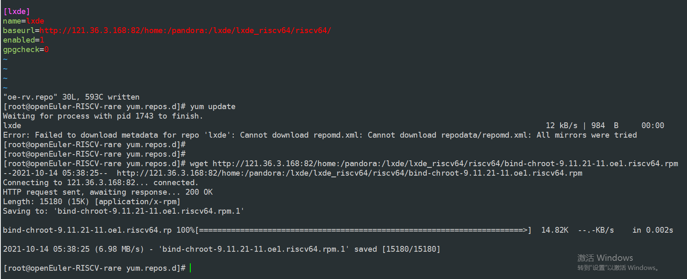
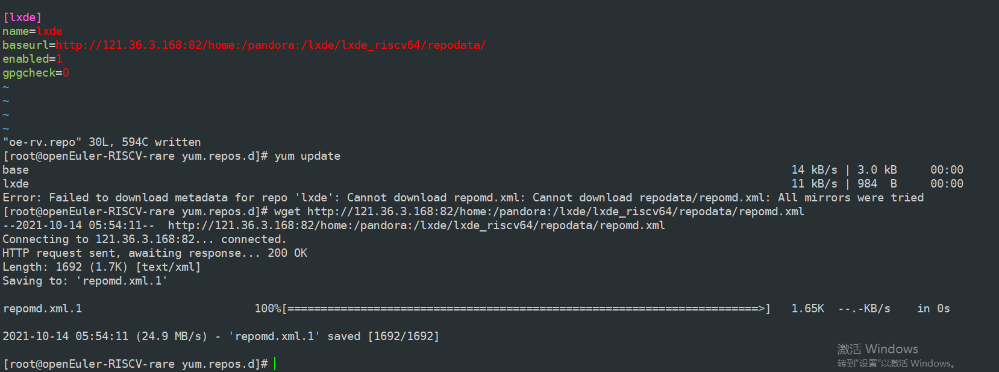
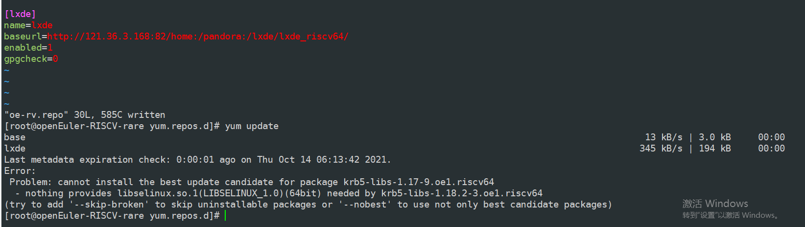

### 刷机

1. 下载openEuler for D1的镜像：https://mirror.iscas.ac.cn/plct/openEuler-D1-wifi-hdmi-20210817.img.bz2

   ```text
   $ wget https://mirror.iscas.ac.cn/plct/openEuler-D1-20210731.img.bz2
   ```


2. 查看sd卡的盘符：


```text
sudo fdisk -l
```

Disk /dev/sda：29.74 GiB，31914983424 字节，62333952 个扇区
Disk model: Storage Device  
单元：扇区 / 1 * 512 = 512 字节
扇区大小(逻辑/物理)：512 字节 / 512 字节
I/O 大小(最小/最佳)：512 字节 / 512 字节
磁盘标签类型：gpt
磁盘标识符：EACEFD8D-68B3-493F-868A-5364E0A693D8

设备         起点     末尾     扇区  大小 类型
/dev/sda1   34784    35039      256  128K Linux 文件系统
/dev/sda2   35040    35295      256  128K Linux 文件系统
/dev/sda3   35296   100831    65536   32M Linux 文件系统
/dev/sda4  100832 62333918 62233087 29.7G Linux 文件系统


3. 使用dd命令将镜像烧录到sd卡中：

   ```text
   bzcat openEuler-D1-wifi-hdmi-20210817.img.bz2 | sudo dd of=/dev/sda bs=1M iflag=fullblock oflag=direct conv=fsync status=progress
   
   1341128704字节（1.3 GB，1.2 GiB）已复制，215 s，6.2 MB/s 
   记录了1279+0 的读入
   记录了1279+0 的写出
   1341128704字节（1.3 GB，1.2 GiB）已复制，215.102 s，6.2 MB/s
   
   ```


4. 使用fdisk进行扩容

   ```
   xijing@xijing-S1-Series:~/oE/D1$ sudo fdisk /dev/sda
   
   欢迎使用 fdisk (util-linux 2.34)。
   更改将停留在内存中，直到您决定将更改写入磁盘。
   使用写入命令前请三思。
   
   检测到混合 GPT。您需要手动同步混合 MBR (用专家命令“M”)
   
   命令(输入 m 获取帮助)： p
   
   Disk /dev/sda：29.74 GiB，31914983424 字节，62333952 个扇区
   Disk model: Storage Device  
   单元：扇区 / 1 * 512 = 512 字节
   扇区大小(逻辑/物理)：512 字节 / 512 字节
   I/O 大小(最小/最佳)：512 字节 / 512 字节
   磁盘标签类型：gpt
   磁盘标识符：EACEFD8D-68B3-493F-868A-5364E0A693D8
   
   设备         起点    末尾    扇区  大小 类型
   /dev/sda1   34784   35039     256  128K Linux 文件系统
   /dev/sda2   35040   35295     256  128K Linux 文件系统
   /dev/sda3   35296  100831   65536   32M Linux 文件系统
   /dev/sda4  100832 2619391 2518560  1.2G Linux 文件系统
   
   命令(输入 m 获取帮助)： d
   分区号 (1-4, 默认  4): 4
   
   分区 4 已删除。
   
   命令(输入 m 获取帮助)： n
   分区号 (4-128, 默认  4): 4
   第一个扇区 (100832-62333918, 默认 102400): 100832
   Last sector, +/-sectors or +/-size{K,M,G,T,P} (100832-62333918, 默认 62333918): 
   
   创建了一个新分区 4，类型为“Linux filesystem”，大小为 29.7 GiB。
   分区 #4 包含一个 ext4 签名。
   
   您想移除该签名吗？ 是[Y]/否[N]： n
   
   命令(输入 m 获取帮助)： w
   该设备包含混合 MBR -- 将只写入 GPT。您需要手动同步 MBR。
   
   分区表已调整。
   正在同步磁盘。
   
   ```

5. 对第四个分区执行resize2fs命令：

   ```
   sudo e2fsck -f -y /dev/sda4
   
   如出现提示，一路y
   
   
   xijing@xijing-S1-Series:~/oE/D1$ sudo resize2fs /dev/sda4
   resize2fs 1.45.5 (07-Jan-2020)
   文件系统已经为 31116540 个块（每块 1k）。无需进一步处理！
   
   ```

   

6. 将sd卡放入D1并开机

   第一次未能成功启动，刷第2次后增加执行resize2fs时提示需要先执行e2fsck，然后有提示，一路y，完成后再次能正常启动了

   hdmi依然需要插拔2次才有显示。


### 使用

1. 登录

   用户名：root

   密码：openEuler12#$

2. 检查磁盘空间:/ 的可用空间接近扩容的磁盘容量。**32G的sd卡，基本上在29G左右算是正常，否则就是扩容没有成功，建议重新执行扩容操作，否则后续会存在 / 空间不足的情况。**同样的操作，我尝试过，有时候成功，有时候/只有1.2G;

   必要时，先对SD卡进行格式化操作后再烧录。——》目前大部分情况我没有格式化sd卡，有时候也是能扩容成功的，所以格式化不是必须的。

   df -h

   ```
   [root@openEuler-RISCV-rare ~]# df -h
   Filesystem      Size  Used Avail Use% Mounted on
   /dev/root        29G  1.1G   27G   4% /
   devtmpfs        492M     0  492M   0% /dev
   tmpfs           496M     0  496M   0% /dev/shm
   tmpfs           496M  1.7M  495M   1% /run
   tmpfs           496M     0  496M   0% /sys/fs/cgroup
   tmpfs           496M     0  496M   0% /tmp
   tmpfs           100M     0  100M   0% /run/user/0
   
   ```

   

3. 检查和设置网络

   配置无线网络：nmtui

   查看ip地址：ifconfig

4. 远程ssh登录（为了方便操作建议ssh登录D1linux系统）

   ssh root@hostip

5. 检查时间，日期时间不对则进行修改

   查日期：date

   修改日期： date -s "2021-10-14 13:21"

6. 设置源：vim /etc/oe-rv.repo 

   ```
   [base]
   name=base
   baseurl=https://isrc.iscas.ac.cn/mirror/openeuler-sig-riscv/oe-RISCV-repo/
   enabled=1
   gpgcheck=0
   
   [oe-noarch]
   name=oe-noarch
   baseurl=http://repo.openeuler.org/openEuler-20.03-LTS/everything/aarch64
   enabled=0
   gpgcheck=0
   
   [szx-base]
   name=base
   baseurl=https://isrc.iscas.ac.cn/mirror/openeuler-sig-riscv/oe-RISCV-repo/
   enabled=0
   gpgcheck=0
   
   [szx-everything]
   name=everything
   baseurl=https://repo.openeuler.org/openEuler-preview/RISC-V/everything/
   enabled=0
   gpgcheck=0
   
   
   [lxde]
   name=lxde
   baseurl=http://121.36.3.168:82/home:/pandora:/lxde/lxde_riscv64/repodata/
   enabled=1
   gpgcheck=0
   
   ```

   更新：yum update

   

   

   看了下，repomd.xml文件是在repodata目录下，修改baseurl为如下：


​		依然报错，理论上wget文件都没有问题，repomd.xml本身下载无问题。

​		对比观察其它不会报错的源，地址都是repodate的上一级目录，因此修改baseurl为上一级目录后不再报repomd.xml无法下载的错误了。




### lxde安装

对于lxde各软件包的用途、安装顺序、安装依赖都不太清楚，上网查都是安装现成的。

计划：

1. 第一轮：先根据感觉先安装，看提示信息。记录哪些能够成功安装，哪些需要其他依赖；
2. 第二轮：逐个补充所需的包


#### 第一轮

1. bind

   ```
   [root@openEuler-RISCV-rare yum.repos.d]# yum install bind
   Waiting for process with pid 1840 to finish.
   Last metadata expiration check: 0:15:57 ago on Thu Oct 14 06:13:42 2021.
   Error: 
    Problem: cannot install the best candidate for the job
     - nothing provides libjson-c.so.5()(64bit) needed by bind-32:9.11.21-11.oe1.riscv64
     - nothing provides libjson-c.so.5(JSONC_0.14)(64bit) needed by bind-32:9.11.21-11.oe1.riscv64
   (try to add '--skip-broken' to skip uninstallable packages or '--nobest' to use not only best candidate packages)
   [root@openEuler-RISCV-rare yum.repos.d]# 
   
   ```

   

2. libwnck

   ```
   [root@openEuler-RISCV-rare ~]# yum install libwnck
   Waiting for process with pid 1843 to finish.
   Last metadata expiration check: 0:19:09 ago on Thu Oct 14 06:13:42 2021.
   Error: 
    Problem: conflicting requests
     - nothing provides libXRes.so.1()(64bit) needed by libwnck-2.31.0-13.oe1.riscv64
     - nothing provides libstartup-notification-1.so.0()(64bit) needed by libwnck-2.31.0-13.oe1.riscv64
     - nothing provides startup-notification needed by libwnck-2.31.0-13.oe1.riscv64
   (try to add '--skip-broken' to skip uninstallable packages or '--nobest' to use not only best candidate packages)
   [root@openEuler-RISCV-rare ~]# 
   
   ```

   

3. libtdb

   ```
   [root@openEuler-RISCV-rare ~]# yum install libtdb
   Waiting for process with pid 1846 to finish.
   Last metadata expiration check: 0:20:57 ago on Thu Oct 14 06:13:42 2021.
   Dependencies resolved.
   ==========================================================================================================================================================================================================
    Package                                        Architecture                                    Version                                                Repository                                    Size
   ==========================================================================================================================================================================================================
   Installing:
    libtdb                                         riscv64                                         1.4.3-1.oe1                                            lxde                                          47 k
   
   Transaction Summary
   ==========================================================================================================================================================================================================
   Install  1 Package
   
   Total download size: 47 k
   Installed size: 95 k
   Is this ok [y/N]: 
   
   ```

   

4. libtalloc

   ```
   [root@openEuler-RISCV-rare ~]# yum install libtalloc
   Waiting for process with pid 1852 to finish.
   Last metadata expiration check: 0:23:01 ago on Thu Oct 14 06:13:42 2021.
   Dependencies resolved.
   ==========================================================================================
    Package                                           Architecture                           
   ==========================================================================================
   Installing:
    libtalloc                                         riscv64                                
   
   Transaction Summary
   ==========================================================================================
   Install  1 Package
   
   Total download size: 30 k
   Installed size: 54 k
   Is this ok [y/N]: y
   Downloading Packages:
   libtalloc-2.3.1-1.oe1.riscv64.rpm                        462 kB/s |  30 kB     00:00    
   -----------------------------------------------------------------------------------------
   Total                                                    343 kB/s |  30 kB     00:00     
   Running transaction check
   Transaction check succeeded.
   Running transaction test
   Transaction test succeeded.
   Running transaction
     Preparing        :                                                                 1/1 
     Installing       : libtalloc-2.3.1-1.oe1.riscv64                                   1/1 
     Running scriptlet: libtalloc-2.3.1-1.oe1.riscv64                                   1/1 
     Verifying        : libtalloc-2.3.1-1.oe1.riscv64                                   1/1 
   
   Installed:
     libtalloc-2.3.1-1.oe1.riscv64                                                          
   
   Complete!
   
   ```

   

5. libstoragemgmt

   ```
   [root@openEuler-RISCV-rare ~]# yum install libstoragemgmt
   Waiting for process with pid 1856 to finish.
   Last metadata expiration check: 0:24:58 ago on Thu Oct 14 06:13:42 2021.
   Error: 
    Problem: conflicting requests
     - nothing provides libconfig.so.11()(64bit) needed by libstoragemgmt-1.8.0-6.oe1.riscv64
   (try to add '--skip-broken' to skip uninstallable packages or '--nobest' to use not only best candidate packages)
   [root@openEuler-RISCV-rare ~]# 
   
   ```

   

6. libldb

   ```
   [root@openEuler-RISCV-rare ~]# yum install libldb        
   Waiting for process with pid 1859 to finish.
   Last metadata expiration check: 0:28:28 ago on Thu Oct 14 06:13:42 2021.
   Error: 
    Problem: conflicting requests
     - nothing provides libtevent.so.0()(64bit) needed by libldb-2.1.4-2.oe1.riscv64
     - nothing provides libtevent.so.0(TEVENT_0.9.9)(64bit) needed by libldb-2.1.4-2.oe1.riscv64
     - nothing provides libtevent(riscv-64) >= 0.10.2 needed by libldb-2.1.4-2.oe1.riscv64
   (try to add '--skip-broken' to skip uninstallable packages or '--nobest' to use not only best candidate packages)
   
   ```

   

   

7. libfm

   ```
   [root@openEuler-RISCV-rare ~]# yum install libfm      
   Waiting for process with pid 1864 to finish.
   Last metadata expiration check: 0:31:26 ago on Thu Oct 14 06:13:42 2021.
   Error: 
    Problem: conflicting requests
     - nothing provides libexif.so.12()(64bit) needed by libfm-1.3.1-1.oe1.riscv64
   (try to add '--skip-broken' to skip uninstallable packages or '--nobest' to use not only best candidate packages)
   [root@openEuler-RISCV-rare ~]# 
   
   ```

   

8. libfm-extra

   ```
   [root@openEuler-RISCV-rare ~]# yum install libfm-extra
   Waiting for process with pid 1866 to finish.
   Last metadata expiration check: 0:34:19 ago on Thu Oct 14 06:13:42 2021.
   No match for argument: libfm-extra
   Error: Unable to find a match: libfm-extra
   [root@openEuler-RISCV-rare ~]# 
   
   ```

   

9. krb5

   ```
   [root@openEuler-RISCV-rare ~]# yum install krb5       
   Waiting for process with pid 1870 to finish.
   Last metadata expiration check: 0:35:10 ago on Thu Oct 14 06:13:42 2021.
   Error: 
    Problem: package krb5-1.18.2-3.oe1.riscv64 requires libkdb5.so.10()(64bit), but none of the providers can be installed
     - package krb5-1.18.2-3.oe1.riscv64 requires libkdb5.so.10(kdb5_10_MIT)(64bit), but none of the providers can be installed
     - cannot install the best candidate for the job
     - nothing provides libselinux.so.1(LIBSELINUX_1.0)(64bit) needed by krb5-libs-1.18.2-3.oe1.riscv64
   (try to add '--skip-broken' to skip uninstallable packages or '--nobest' to use not only best candidate packages)
   [root@openEuler-RISCV-rare ~]# 
   
   ```

   

10. lxappearance

    ```
    [root@openEuler-RISCV-rare ~]# yum install lxappearance
    Last metadata expiration check: 0:36:53 ago on Thu Oct 14 06:13:42 2021.
    Error: 
     Problem: package lxappearance-0.6.3-1.oe1.riscv64 requires lxsession >= 0.4.0, but none of the providers can be installed
      - conflicting requests
      - nothing provides libnotify.so.4()(64bit) needed by lxsession-0.5.5-5.oe1.riscv64
      - nothing provides libappindicator.so.1()(64bit) needed by lxsession-0.5.5-5.oe1.riscv64
      - nothing provides libindicator.so.7()(64bit) needed by lxsession-0.5.5-5.oe1.riscv64
      - nothing provides upower needed by lxsession-0.5.5-5.oe1.riscv64
    (try to add '--skip-broken' to skip uninstallable packages or '--nobest' to use not only best candidate packages)
    [root@openEuler-RISCV-rare ~]# 
    ```

    

11. lxde-common

```
[root@openEuler-RISCV-rare ~]# yum install lxde-common 
Last metadata expiration check: 0:37:59 ago on Thu Oct 14 06:13:42 2021.

Error: 
 Problem: conflicting requests
  - nothing provides xorg-x11-xinit needed by lxde-common-0.99.2-1.oe1.noarch
  - nothing provides openbox needed by lxde-common-0.99.2-1.oe1.noarch
  - nothing provides xdg-utils needed by lxde-common-0.99.2-1.oe1.noarch
  - nothing provides xorg-x11-utils needed by lxde-common-0.99.2-1.oe1.noarch
(try to add '--skip-broken' to skip uninstallable packages or '--nobest' to use not only best candidate packages)
[root@openEuler-RISCV-rare ~]# 

```

12. lxmenu-data

```
[root@openEuler-RISCV-rare ~]# yum install lxmenu-data
Waiting for process with pid 1878 to finish.
Last metadata expiration check: 0:39:33 ago on Thu Oct 14 06:13:42 2021.
Error: 
 Problem: conflicting requests
  - nothing provides openEuler-menus needed by lxmenu-data-0.1.5-1.oe1.noarch
(try to add '--skip-broken' to skip uninstallable packages or '--nobest' to use not only best candidate packages)
[root@openEuler-RISCV-rare ~]# 
```

13. lxpanel

    ```
    [root@openEuler-RISCV-rare ~]# yum install lxpanel    
    Waiting for process with pid 1881 to finish.
    Last metadata expiration check: 0:40:20 ago on Thu Oct 14 06:13:42 2021.
    Error: 
     Problem: conflicting requests
      - nothing provides libkeybinder-3.0.so.0()(64bit) needed by lxpanel-0.10.0-1.oe1.riscv64
      - nothing provides libwnck-3.so.0()(64bit) needed by lxpanel-0.10.0-1.oe1.riscv64
      - nothing provides zenity needed by lxpanel-0.10.0-1.oe1.riscv64
    (try to add '--skip-broken' to skip uninstallable packages or '--nobest' to use not only best candidate packages)
    [root@openEuler-RISCV-rare ~]#
    ```

    

14. lxsession

```
[root@openEuler-RISCV-rare ~]# yum install lxsession
Waiting for process with pid 1883 to finish.
Last metadata expiration check: 0:40:55 ago on Thu Oct 14 06:13:42 2021.
Error: 
 Problem: conflicting requests
  - nothing provides libnotify.so.4()(64bit) needed by lxsession-0.5.5-5.oe1.riscv64
  - nothing provides libappindicator.so.1()(64bit) needed by lxsession-0.5.5-5.oe1.riscv64
  - nothing provides libindicator.so.7()(64bit) needed by lxsession-0.5.5-5.oe1.riscv64
  - nothing provides upower needed by lxsession-0.5.5-5.oe1.riscv64
(try to add '--skip-broken' to skip uninstallable packages or '--nobest' to use not only best candidate packages)
[root@openEuler-RISCV-rare ~]# 

```


15. menu-cache

    ```
    [root@openEuler-RISCV-rare ~]# yum install menu-cache
    Last metadata expiration check: 0:41:47 ago on Thu Oct 14 06:13:42 2021.
    Error: 
     Problem: package menu-cache-1.1.0-1.oe1.riscv64 requires libfm-extra.so.4()(64bit), but none of the providers can be installed
      - conflicting requests
      - nothing provides libexif.so.12()(64bit) needed by libfm-1.3.1-1.oe1.riscv64
    (try to add '--skip-broken' to skip uninstallable packages or '--nobest' to use not only best candidate packages)
    [root@openEuler-RISCV-rare ~]#
    ```

    

16. mozjs60

```
[root@openEuler-RISCV-rare ~]# yum install mozjs60
Waiting for process with pid 1890 to finish.
Last metadata expiration check: 0:42:52 ago on Thu Oct 14 06:13:42 2021.
Dependencies resolved.
=========================================================================================
 Package             Architecture        Version                  Repository        Size
=========================================================================================
Installing:
 mozjs60             riscv64             60.2.2-5.oe1             lxde             6.1 M

Transaction Summary
=========================================================================================
Install  1 Package

Total download size: 6.1 M
Installed size: 23 M
Is this ok [y/N]: y
Downloading Packages:
Waiting for process with pid 1890 to finish.
[SKIPPED] mozjs60-60.2.2-5.oe1.riscv64.rpm: Already downloaded                          
Running transaction check
Waiting for process with pid 1890 to finish.
Transaction check succeeded.
Running transaction test
The downloaded packages were saved in cache until the next successful transaction.
You can remove cached packages by executing 'yum clean packages'.
Error: Transaction test error:
  package mozjs60-60.2.2-5.oe1.riscv64 is already installed

[root@openEuler-RISCV-rare ~]# 
```


17. ndctl

    ```
    [root@openEuler-RISCV-rare ~]# yum install ndctl  
    Last metadata expiration check: 0:44:20 ago on Thu Oct 14 06:13:42 2021.
    Error: 
     Problem: conflicting requests
      - nothing provides libjson-c.so.5()(64bit) needed by ndctl-71.1-1.oe1.riscv64
      - nothing provides libjson-c.so.5(JSONC_0.14)(64bit) needed by ndctl-71.1-1.oe1.riscv64
      - nothing provides libjson-c.so.5(JSONC_PRIVATE)(64bit) needed by ndctl-71.1-1.oe1.riscv64
    (try to add '--skip-broken' to skip uninstallable packages or '--nobest' to use not only best candidate packages)
    [root@openEuler-RISCV-rare ~]#
    ```

    

18. pcmanfm

    ```
    [root@openEuler-RISCV-rare ~]# yum install pcmanfm
    Waiting for process with pid 1897 to finish.
    Last metadata expiration check: 0:44:59 ago on Thu Oct 14 06:13:42 2021.
    Error: 
     Problem: package pcmanfm-1.3.1-1.oe1.riscv64 requires libfm-gtk-utils, but none of the providers can be installed
      - conflicting requests
      - nothing provides libexif.so.12()(64bit) needed by libfm-gtk-utils-1.3.1-1.oe1.riscv64
    (try to add '--skip-broken' to skip uninstallable packages or '--nobest' to use not only best candidate packages)
    
    ```

    

19. policycoreutils

    ```
    [root@openEuler-RISCV-rare ~]# yum install policycoreutils
    Waiting for process with pid 1901 to finish.
    Last metadata expiration check: 0:51:28 ago on Thu Oct 14 06:13:42 2021.
    Error: 
     Problem: cannot install the best candidate for the job
      - nothing provides libselinux.so.1(LIBSELINUX_1.0)(64bit) needed by policycoreutils-3.1-8.oe1.riscv64
      - nothing provides libsepol >= 3.1 needed by policycoreutils-3.1-8.oe1.riscv64
    (try to add '--skip-broken' to skip uninstallable packages or '--nobest' to use not only best candidate packages)
    [root@openEuler-RISCV-rare ~]# 
    
    ```

    

20. python-cov-core

    ```
    [root@openEuler-RISCV-rare ~]# yum install python-cov-core  
    Waiting for process with pid 1904 to finish.
    Last metadata expiration check: 0:52:57 ago on Thu Oct 14 06:13:42 2021.
    Dependencies resolved.
    =========================================================================================
     Package                     Architecture     Version                Repository     Size
    =========================================================================================
    Installing:
     python3-cov-core            noarch           1.15.0-1.oe1           lxde           17 k
    Installing dependencies:
     python3-coverage            riscv64          4.5.3-1                base          250 k
     python3-setuptools          noarch           40.4.3-4               base          480 k
    
    Transaction Summary
    =========================================================================================
    Install  3 Packages
    
    Total download size: 747 k
    Installed size: 3.3 M
    Is this ok [y/N]: y
    Downloading Packages:
    Waiting for process with pid 1904 to finish.
    [SKIPPED] python3-coverage-4.5.3-1.riscv64.rpm: Already downloaded                      
    [SKIPPED] python3-setuptools-40.4.3-4.noarch.rpm: Already downloaded                    
    [SKIPPED] python3-cov-core-1.15.0-1.oe1.noarch.rpm: Already downloaded                  
    Running transaction check
    Waiting for process with pid 1904 to finish.
    Transaction check succeeded.
    Running transaction test
    The downloaded packages were saved in cache until the next successful transaction.
    You can remove cached packages by executing 'yum clean packages'.
    Error: Transaction test error:
      package python3-setuptools-40.4.3-4.noarch is already installed
      package python3-coverage-4.5.3-1.riscv64 is already installed
      package python3-cov-core-1.15.0-1.oe1.noarch is already installed
    
    [root@openEuler-RISCV-rare ~]# 
    
    ```

    

21. python-nose2

    ```
    [root@openEuler-RISCV-rare ~]# yum install python-nose2
    Last metadata expiration check: 0:54:22 ago on Thu Oct 14 06:13:42 2021.
    Dependencies resolved.
    =========================================================================================
     Package                  Architecture      Version                Repository       Size
    =========================================================================================
    Installing:
     python3-nose2            noarch            0.9.2-1.oe1            lxde            250 k
    
    Transaction Summary
    =========================================================================================
    Install  1 Package
    
    Total download size: 250 k
    Installed size: 989 k
    Is this ok [y/N]: y
    Downloading Packages:
    Waiting for process with pid 1911 to finish.
    [SKIPPED] python3-nose2-0.9.2-1.oe1.noarch.rpm: Already downloaded                      
    Running transaction check
    Waiting for process with pid 1911 to finish.
    Transaction check succeeded.
    Running transaction test
    The downloaded packages were saved in cache until the next successful transaction.
    You can remove cached packages by executing 'yum clean packages'.
    Error: Transaction test error:
      package python3-nose2-0.9.2-1.oe1.noarch is already installed
    
    [root@openEuler-RISCV-rare ~]# 
    
    ```

    

22. python-parameterized

    ```
    [root@openEuler-RISCV-rare ~]# yum install python-parameterized
    Waiting for process with pid 1917 to finish.
    Last metadata expiration check: 1:01:22 ago on Thu Oct 14 06:13:42 2021.
    Dependencies resolved.
    =========================================================================================
     Package                        Architecture    Version              Repository     Size
    =========================================================================================
    Installing:
     python3-parameterized          noarch          0.7.4-1.oe1          lxde           41 k
    
    Transaction Summary
    =========================================================================================
    Install  1 Package
    
    Total download size: 41 k
    Installed size: 149 k
    Is this ok [y/N]: y
    Downloading Packages:
    Waiting for process with pid 1917 to finish.
    [SKIPPED] python3-parameterized-0.7.4-1.oe1.noarch.rpm: Already downloaded              
    Running transaction check
    Waiting for process with pid 1917 to finish.
    Transaction check succeeded.
    Running transaction test
    The downloaded packages were saved in cache until the next successful transaction.
    You can remove cached packages by executing 'yum clean packages'.
    Error: Transaction test error:
      package python3-parameterized-0.7.4-1.oe1.noarch is already installed
    
    [root@openEuler-RISCV-rare ~]# 
    
    ```

    

23. samba

    ```
    [root@openEuler-RISCV-rare ~]# yum install samba               
    Waiting for process with pid 1923 to finish.
    Last metadata expiration check: 1:03:44 ago on Thu Oct 14 06:13:42 2021.
    Error: 
     Problem: conflicting requests
      - nothing provides libtevent.so.0()(64bit) needed by samba-4.12.5-6.oe1.riscv64
      - nothing provides libtevent.so.0(TEVENT_0.9.9)(64bit) needed by samba-4.12.5-6.oe1.riscv64
      - nothing provides libtevent.so.0(TEVENT_0.9.16)(64bit) needed by samba-4.12.5-6.oe1.riscv64
      - nothing provides libtevent.so.0(TEVENT_0.9.21)(64bit) needed by samba-4.12.5-6.oe1.riscv64
    (try to add '--skip-broken' to skip uninstallable packages or '--nobest' to use not only best candidate packages)
    [root@openEuler-RISCV-rare ~]# 
    
    ```

    

24. selinux-policy

    ```
    [root@openEuler-RISCV-rare ~]# yum install selinux-policy      
    Last metadata expiration check: 1:04:28 ago on Thu Oct 14 06:13:42 2021.
    Error: 
     Problem: package selinux-policy-3.14.2-69.oe1.noarch requires policycoreutils >= 3.0-5, but none of the providers can be installed
      - conflicting requests
      - nothing provides libselinux.so.1(LIBSELINUX_1.0)(64bit) needed by policycoreutils-3.1-8.oe1.riscv64
      - nothing provides libsepol >= 3.1 needed by policycoreutils-3.1-8.oe1.riscv64
    (try to add '--skip-broken' to skip uninstallable packages or '--nobest' to use not only best candidate packages)
    [root@openEuler-RISCV-rare ~]#
    ```

    

25. setools

    ```
    [root@openEuler-RISCV-rare ~]# yum install setools       
    Waiting for process with pid 1927 to finish.
    Last metadata expiration check: 1:05:30 ago on Thu Oct 14 06:13:42 2021.
    Dependencies resolved.
    =========================================================================================
     Package             Architecture        Version                  Repository        Size
    =========================================================================================
    Installing:
     setools             riscv64             4.3.0-5.oe1              lxde             7.6 k
    
    Transaction Summary
    =========================================================================================
    Install  1 Package
    
    Total download size: 7.6 k
    Installed size: 0  
    Is this ok [y/N]: y
    Downloading Packages:
    Waiting for process with pid 1927 to finish.
    [SKIPPED] setools-4.3.0-5.oe1.riscv64.rpm: Already downloaded                           
    Running transaction check
    Waiting for process with pid 1927 to finish.
    Transaction check succeeded.
    Running transaction test
    The downloaded packages were saved in cache until the next successful transaction.
    You can remove cached packages by executing 'yum clean packages'.
    Error: Transaction test error:
      package setools-4.3.0-5.oe1.riscv64 is already installed
    
    [root@openEuler-RISCV-rare ~]# 
    ```

    

26. udisks2

    ```
    [root@openEuler-RISCV-rare ~]# yum install udisks2
    Waiting for process with pid 1929 to finish.
    Last metadata expiration check: 1:06:37 ago on Thu Oct 14 06:13:42 2021.
    Error: 
     Problem: conflicting requests
      - nothing provides libblockdev.so.2()(64bit) needed by udisks2-2.9.1-1.oe1.riscv64
      - nothing provides gdisk needed by udisks2-2.9.1-1.oe1.riscv64
      - nothing provides libatasmart.so.4()(64bit) needed by udisks2-2.9.1-1.oe1.riscv64
      - nothing provides libbd_utils.so.2()(64bit) needed by udisks2-2.9.1-1.oe1.riscv64
      - nothing provides libblockdev-swap >= 2.19 needed by udisks2-2.9.1-1.oe1.riscv64
      - nothing provides libatasmart >= 0.17 needed by udisks2-2.9.1-1.oe1.riscv64
      - nothing provides libblockdev >= 2.19 needed by udisks2-2.9.1-1.oe1.riscv64
      - nothing provides libblockdev-crypto >= 2.19 needed by udisks2-2.9.1-1.oe1.riscv64
      - nothing provides libblockdev-fs >= 2.19 needed by udisks2-2.9.1-1.oe1.riscv64
      - nothing provides libblockdev-loop >= 2.19 needed by udisks2-2.9.1-1.oe1.riscv64
      - nothing provides libblockdev-mdraid >= 2.19 needed by udisks2-2.9.1-1.oe1.riscv64
      - nothing provides libblockdev-part >= 2.19 needed by udisks2-2.9.1-1.oe1.riscv64
    (try to add '--skip-broken' to skip uninstallable packages or '--nobest' to use not only best candidate packages)
    [root@openEuler-RISCV-rare ~]# 
    
    ```

    

27. userspace-rcu

    ```
    [root@openEuler-RISCV-rare ~]# yum install userspace-rcu
    Waiting for process with pid 1932 to finish.
    Last metadata expiration check: 1:07:34 ago on Thu Oct 14 06:13:42 2021.
    Dependencies resolved.
    =========================================================================================
     Package                 Architecture      Version                  Repository      Size
    =========================================================================================
    Installing:
     userspace-rcu           riscv64           0.12.1-1.oe1             lxde            88 k
    
    Transaction Summary
    =========================================================================================
    Install  1 Package
    
    Total download size: 88 k
    Installed size: 340 k
    Is this ok [y/N]: y
    Downloading Packages:
    Waiting for process with pid 1932 to finish.
    [SKIPPED] userspace-rcu-0.12.1-1.oe1.riscv64.rpm: Already downloaded                    
    Running transaction check
    Waiting for process with pid 1932 to finish.
    Transaction check succeeded.
    Running transaction test
    The downloaded packages were saved in cache until the next successful transaction.
    You can remove cached packages by executing 'yum clean packages'.
    Error: Transaction test error:
      package userspace-rcu-0.12.1-1.oe1.riscv64 is already installed
    
    [root@openEuler-RISCV-rare ~]# 
    
    ```

    

28. volume_key

    ```
    [root@openEuler-RISCV-rare ~]# yum install volume_key   
    Last metadata expiration check: 1:08:39 ago on Thu Oct 14 06:13:42 2021.
    Dependencies resolved.
    =========================================================================================
     Package                Architecture       Version                 Repository       Size
    =========================================================================================
    Installing:
     volume_key             riscv64            0.3.12-3.oe1            lxde            141 k
    Installing dependencies:
     libpipeline            riscv64            1.5.0-6                 base             46 k
     man-db                 riscv64            2.8.7-5                 base            1.1 M
     nspr                   riscv64            4.20.0-4                base            129 k
     nss                    riscv64            3.40.1-11               base            572 k
     nss-help               riscv64            3.40.1-11               base             69 k
     nss-softokn            riscv64            3.40.1-11               base            534 k
     nss-util               riscv64            3.40.1-11               base            439 k
    
    Transaction Summary
    =========================================================================================
    Install  8 Packages
    
    Total download size: 2.9 M
    Installed size: 8.4 M
    Is this ok [y/N]: y
    Downloading Packages:
    Waiting for process with pid 1939 to finish.
    [SKIPPED] libpipeline-1.5.0-6.riscv64.rpm: Already downloaded                           
    [SKIPPED] man-db-2.8.7-5.riscv64.rpm: Already downloaded                                
    [SKIPPED] nspr-4.20.0-4.riscv64.rpm: Already downloaded                                 
    [SKIPPED] nss-3.40.1-11.riscv64.rpm: Already downloaded                                 
    [SKIPPED] nss-help-3.40.1-11.riscv64.rpm: Already downloaded                            
    [SKIPPED] nss-softokn-3.40.1-11.riscv64.rpm: Already downloaded                         
    [SKIPPED] nss-util-3.40.1-11.riscv64.rpm: Already downloaded                            
    [SKIPPED] volume_key-0.3.12-3.oe1.riscv64.rpm: Already downloaded                       
    Running transaction check
    Waiting for process with pid 1939 to finish.
    error: rpmdbNextIterator: skipping h#      15 
    Header V3 RSA/SHA1 Signature, key ID b25e7f66: BAD
    Header SHA256 digest: BAD (Expected 11bf3c667d445cd87c61100303ed7b163f94926774b1de41ef1eb61ffa7f7c2c != 117fd2952cf437124be4aacadcf0638643ac14011b0bfb645f39a0770bfbc9bd)
    Header SHA1 digest: BAD (Expected 254bb67394744bbb59a1297f42ddbbd05545a7b3 != 5a0bcbe2e25cfde14826da1b81ca0f8f595a95f1)
    Transaction check succeeded.
    Running transaction test
    Error: Cannot open file /var/cache/dnf/base-cc65202f14b49502/packages/nss-softokn-3.40.1-11.riscv64.rpm: [Errno 2] No such file or directory: '/var/cache/dnf/base-cc65202f14b49502/packages/nss-softokn-3.40.1-11.riscv64.rpm'
    TypeError: an integer is required (got type NoneType)
    FATAL ERROR: python callback ??? failed, aborting!
    [root@openEuler-RISCV-rare ~]# 
    
    ```

    

29. wireless-tools

    ```
    [root@openEuler-RISCV-rare ~]# yum install wireless-tools
    Waiting for process with pid 3184 to finish.
    Last metadata expiration check: 0:00:23 ago on Thu Oct 14 07:23:37 2021.
    Error: 
     Problem: conflicting requests
      - nothing provides crda needed by wireless-tools-1:29-23.oe1.riscv64
    (try to add '--skip-broken' to skip uninstallable packages or '--nobest' to use not only best candidate packages)
    [root@openEuler-RISCV-rare ~]# 
    
    ```


#### 第二轮

按照https://www.linuxfromscratch.org/blfs/view/svn/lxde/lxde.html  这个网页中包顺序安装，并补足依赖。

更新源：

```
[base]
name=base
baseurl=https://isrc.iscas.ac.cn/mirror/openeuler-sig-riscv/oe-RISCV-repo/
enabled=1
gpgcheck=0

[oe-noarch]
name=oe-noarch
baseurl=http://repo.openeuler.org/openEuler-20.03-LTS/everything/aarch64
enabled=1
gpgcheck=0

[oe2109]
name=oe2109
baseurl=http://repo.openeuler.org/openEuler-21.09/everything/aarch64
enabled=1
gpgcheck=0


[preview]
name=preview
baseurl=https://repo.openeuler.org/openEuler-preview/RISC-V/everything/
enabled=1
gpgcheck=0


[lxde]
name=lxde
baseurl=http://121.36.3.168:82/home:/pandora:/lxde/lxde_riscv64/
enabled=1
gpgcheck=0


```


yum update

```
[root@openEuler-RISCV-rare ~]# yum update
Waiting for process with pid 3215 to finish.
Last metadata expiration check: 0:00:23 ago on Thu Oct 14 08:23:09 2021.
Error: 
 Problem 1: cannot install the best update candidate for package dnf-4.2.15-8.oe1.noarch
  - nothing provides python(abi) = 3.8 needed by dnf-4.2.23-6.oe1.noarch
 Problem 2: cannot install the best update candidate for package krb5-libs-1.17-9.oe1.riscv64
  - nothing provides libselinux.so.1(LIBSELINUX_1.0)(64bit) needed by krb5-libs-1.18.2-3.oe1.riscv64
 Problem 3: cannot install the best update candidate for package perl-Algorithm-Diff-1.1903-14.oe1.noarch
  - nothing provides perl(:MODULE_COMPAT_5.32.0) needed by perl-Algorithm-Diff-1:1.201-1.oe1.noarch
 Problem 4: cannot install the best update candidate for package perl-Archive-Tar-2.30-421.oe1.noarch
  - nothing provides perl(:MODULE_COMPAT_5.32.0) needed by perl-Archive-Tar-2.38-2.oe1.noarch
 Problem 5: cannot install the best update candidate for package perl-Config-Perl-V-0.30-5.oe1.noarch
  - nothing provides perl(:MODULE_COMPAT_5.32.0) needed by perl-Config-Perl-V-0.33-1.oe1.noarch
 Problem 6: cannot install the best update candidate for package perl-Error-1:0.17026-4.oe1.noarch
  - nothing provides perl(:MODULE_COMPAT_5.32.0) needed by perl-Error-1:0.17029-2.oe1.noarch
 Problem 7: cannot install the best update candidate for package perl-Exporter-5.73-420.oe1.noarch
  - nothing provides perl(:MODULE_COMPAT_5.32.0) needed by perl-Exporter-5.74-1.oe1.noarch
 Problem 8: cannot install the best update candidate for package perl-ExtUtils-Command-1:7.42-2.oe1.noarch
  - nothing provides perl(:MODULE_COMPAT_5.32.0) needed by perl-ExtUtils-Command-1:7.60-1.oe1.noarch
 Problem 9: cannot install the best update candidate for package perl-ExtUtils-Install-2.14-419.oe1.noarch
  - nothing provides perl(:MODULE_COMPAT_5.32.0) needed by perl-ExtUtils-Install-2.20-1.oe1.noarch
 Problem 10: cannot install the best update candidate for package perl-ExtUtils-MakeMaker-1:7.42-2.oe1.noarch
  - nothing provides perl(:MODULE_COMPAT_5.32.0) needed by perl-ExtUtils-MakeMaker-1:7.60-1.oe1.noarch
 Problem 11: cannot install the best update candidate for package perl-ExtUtils-Manifest-1:1.71-4.oe1.noarch
  - nothing provides perl(:MODULE_COMPAT_5.32.0) needed by perl-ExtUtils-Manifest-1:1.72-1.oe1.noarch
 Problem 12: cannot install the best update candidate for package perl-File-Fetch-0.56-4.oe1.noarch
  - nothing provides perl(:MODULE_COMPAT_5.32.0) needed by perl-File-Fetch-1.00-1.oe1.noarch
 Problem 13: cannot install the best update candidate for package perl-File-HomeDir-1.004-4.oe1.noarch
  - nothing provides perl(:MODULE_COMPAT_5.32.0) needed by perl-File-HomeDir-1.006-2.oe1.noarch
 Problem 14: cannot install the best update candidate for package perl-File-Path-2.16-4.oe1.noarch
  - nothing provides perl(:MODULE_COMPAT_5.32.0) needed by perl-File-Path-2.17-1.oe1.noarch
 Problem 15: cannot install the best update candidate for package perl-File-Temp-1:0.230.800-4.oe1.noarch
  - nothing provides perl(:MODULE_COMPAT_5.32.0) needed by perl-File-Temp-1:0.2311-2.oe1.noarch
 Problem 16: cannot install the best update candidate for package perl-File-Which-1.22-6.oe1.noarch
  - nothing provides perl(:MODULE_COMPAT_5.32.0) needed by perl-File-Which-1.23-1.oe1.noarch
 Problem 17: cannot install the best update candidate for package perl-Getopt-Long-2.50-419.oe1.noarch
  - nothing provides perl(:MODULE_COMPAT_5.32.0) needed by perl-Getopt-Long-1:2.52-1.oe1.noarch
 Problem 18: cannot install the best update candidate for package perl-Git-2.23.0-12.oe1.noarch
  - nothing provides perl(:MODULE_COMPAT_5.32.0) needed by perl-Git-2.30.0-6.oe1.noarch
  - nothing provides git = 2.30.0-6.oe1 needed by perl-Git-2.30.0-6.oe1.noarch
 Problem 19: cannot install the best update candidate for package perl-IO-Compress-2.081-6.oe1.noarch
  - nothing provides perl(Compress::Raw::Bzip2) >= 2.100 needed by perl-IO-Compress-2.100-1.oe1.noarch
  - nothing provides perl(Compress::Raw::Zlib) >= 2.100 needed by perl-IO-Compress-2.100-1.oe1.noarch
  - nothing provides perl(:MODULE_COMPAT_5.32.0) needed by perl-IO-Compress-2.100-1.oe1.noarch
 Problem 20: cannot install the best update candidate for package perl-IO-Socket-IP-0.39-420.oe1.noarch
  - nothing provides perl(:MODULE_COMPAT_5.32.0) needed by perl-IO-Socket-IP-0.41-2.oe1.noarch
 Problem 21: cannot install the best update candidate for package perl-IPC-System-Simple-1.25-19.oe1.noarch
  - nothing provides perl(:MODULE_COMPAT_5.32.0) needed by perl-IPC-System-Simple-1.30-2.oe1.noarch
 Problem 22: cannot install the best update candidate for package perl-JSON-PP-1:4.04-2.oe1.noarch
  - nothing provides perl(:MODULE_COMPAT_5.32.0) needed by perl-JSON-PP-1:4.05-1.oe1.noarch
 Problem 23: cannot install the best update candidate for package perl-Locale-Codes-3.58-2.oe1.noarch
  - nothing provides perl(:MODULE_COMPAT_5.32.0) needed by perl-Locale-Codes-3.66-1.oe1.noarch
 Problem 24: cannot install the best update candidate for package perl-Locale-Maketext-1:1.28-1.oe1.noarch
  - nothing provides perl(:MODULE_COMPAT_5.32.0) needed by perl-Locale-Maketext-1:1.29-1.oe1.noarch
 Problem 25: cannot install the best update candidate for package perl-Math-BigInt-1:1.9998.13-5.oe1.noarch
  - nothing provides perl(:MODULE_COMPAT_5.32.0) needed by perl-Math-BigInt-1:1.9998.18-1.oe1.noarch
 Problem 26: cannot install the best update candidate for package perl-Module-CoreList-1:5.20180920-2.oe1.noarch
  - nothing provides perl(:MODULE_COMPAT_5.32.0) needed by perl-Module-CoreList-1:5.20201220-1.oe1.noarch
 Problem 27: cannot install the best update candidate for package perl-Module-Load-1:0.32-418.oe1.noarch
  - nothing provides perl(:MODULE_COMPAT_5.32.0) needed by perl-Module-Load-1:0.36-1.oe1.noarch
 Problem 28: cannot install the best update candidate for package perl-Module-Load-Conditional-0.68-418.oe1.noarch
  - nothing provides perl(:MODULE_COMPAT_5.32.0) needed by perl-Module-Load-Conditional-0.74-1.oe1.noarch
 Problem 29: cannot install the best update candidate for package perl-PerlIO-via-QuotedPrint-0.08-397.oe1.noarch
  - nothing provides perl(:MODULE_COMPAT_5.32.0) needed by perl-PerlIO-via-QuotedPrint-0.09-1.oe1.noarch
 Problem 30: cannot install the best update candidate for package perl-Pod-Checker-4:1.73-398.oe1.noarch
  - nothing provides perl(:MODULE_COMPAT_5.32.0) needed by perl-Pod-Checker-4:1.74-1.oe1.noarch
 Problem 31: cannot install the best update candidate for package perl-Pod-Escapes-1:1.07-419.oe1.noarch
  - nothing provides perl(:MODULE_COMPAT_5.32.0) needed by perl-Pod-Escapes-1:1.07-420.oe1.noarch
 Problem 32: cannot install the best update candidate for package perl-Pod-Parser-1.63-397.oe1.noarch
  - nothing provides perl(:MODULE_COMPAT_5.32.0) needed by perl-Pod-Parser-1.63-398.oe1.noarch
 Problem 33: cannot install the best update candidate for package perl-Pod-Perldoc-1:3.28-3.oe1.noarch
  - nothing provides perl(:MODULE_COMPAT_5.32.0) needed by perl-Pod-Perldoc-1:3.28-4.oe1.noarch
 Problem 34: cannot install the best update candidate for package perl-Pod-Simple-1:3.35-418.oe1.noarch
  - nothing provides perl(:MODULE_COMPAT_5.32.0) needed by perl-Pod-Simple-1:3.42-2.oe1.noarch
 Problem 35: cannot install the best update candidate for package perl-Pod-Usage-4:1.69-418.oe1.noarch
  - nothing provides perl(:MODULE_COMPAT_5.32.0) needed by perl-Pod-Usage-4:2.01-2.oe1.noarch
 Problem 36: cannot install the best update candidate for package perl-Term-ANSIColor-4.06-511.oe1.noarch
  - nothing provides perl(:MODULE_COMPAT_5.32.0) needed by perl-Term-ANSIColor-5.01-1.oe1.noarch
 Problem 37: cannot install the best update candidate for package perl-Test-Harness-1:3.43_01-3.oe1.noarch
  - nothing provides perl(:MODULE_COMPAT_5.32.0) needed by perl-Test-Harness-1:3.43_02-1.oe1.noarch
 Problem 38: cannot install the best update candidate for package perl-Test-Simple-2:1.302140-3.oe1.noarch
  - nothing provides perl(:MODULE_COMPAT_5.32.0) needed by perl-Test-Simple-2:1.302175-2.oe1.noarch
 Problem 39: cannot install the best update candidate for package perl-Text-Balanced-2.03-420.oe1.noarch
  - nothing provides perl(:MODULE_COMPAT_5.32.0) needed by perl-Text-Balanced-2.04-1.oe1.noarch
 Problem 40: cannot install the best update candidate for package perl-Time-Local-2:1.280-6.oe1.noarch
  - nothing provides perl(:MODULE_COMPAT_5.32.0) needed by perl-Time-Local-2:1.300-1.oe1.noarch
 Problem 41: cannot install the best update candidate for package perl-Unicode-EastAsianWidth-1.33-15.noarch
  - nothing provides perl(:MODULE_COMPAT_5.32.0) needed by perl-Unicode-EastAsianWidth-12.0-1.oe1.noarch
 Problem 42: cannot install the best update candidate for package perl-autodie-2.29-398.oe1.noarch
  - nothing provides perl(:MODULE_COMPAT_5.32.0) needed by perl-autodie-2.32-1.oe1.noarch
 Problem 43: cannot install the best update candidate for package perl-bignum-0.50-4.oe1.noarch
  - nothing provides perl(:MODULE_COMPAT_5.32.0) needed by perl-bignum-0.51-1.oe1.noarch
 Problem 44: cannot install the best update candidate for package perl-experimental-0.020-2.oe1.noarch
  - nothing provides perl(:MODULE_COMPAT_5.32.0) needed by perl-experimental-0.022-2.oe1.noarch
 Problem 45: cannot install the best update candidate for package perl-libnet-3.11-420.oe1.noarch
  - nothing provides perl(:MODULE_COMPAT_5.32.0) needed by perl-libnet-3.13-1.oe1.noarch
 Problem 46: cannot install the best update candidate for package perl-parent-1:0.237-4.oe1.noarch
  - nothing provides perl(:MODULE_COMPAT_5.32.0) needed by perl-parent-1:0.238-1.oe1.noarch
 Problem 47: cannot install the best update candidate for package perl-perlfaq-5.20180915-5.oe1.noarch
  - nothing provides perl(:MODULE_COMPAT_5.32.0) needed by perl-perlfaq-5.20200523-2.oe1.noarch
 Problem 48: cannot install the best update candidate for package perl-podlators-1:4.11-5.oe1.noarch
  - nothing provides perl(:MODULE_COMPAT_5.32.0) needed by perl-podlators-1:4.14-1.oe1.noarch
 Problem 49: cannot install the best update candidate for package python3-dateutil-1:2.7.0-7.oe1.noarch
  - nothing provides python(abi) = 3.8 needed by python3-dateutil-1:2.8.1-3.oe1.noarch
 Problem 50: cannot install the best update candidate for package python3-distro-1.3.0-5.noarch
  - nothing provides python(abi) = 3.8 needed by python3-distro-1.5.0-2.oe1.noarch
 Problem 51: cannot install the best update candidate for package python3-dnf-4.2.15-8.oe1.noarch
  - nothing provides python(abi) = 3.8 needed by python3-dnf-4.2.23-6.oe1.noarch
  - nothing provides python3-hawkey >= 0.48.0 needed by python3-dnf-4.2.23-6.oe1.noarch
  - nothing provides python3-libdnf >= 0.48.0-3 needed by python3-dnf-4.2.23-6.oe1.noarch
 Problem 52: cannot install the best update candidate for package python3-dnf-plugins-core-4.0.11-5.oe1.noarch
  - nothing provides python(abi) = 3.8 needed by python3-dnf-plugins-core-4.0.17-3.oe1.noarch
  - nothing provides python3-hawkey >= 0.46.1 needed by python3-dnf-plugins-core-4.0.17-3.oe1.noarch
 Problem 53: cannot install the best update candidate for package python3-iniparse-0.4-36.oe1.noarch
  - nothing provides python(abi) = 3.8 needed by python3-iniparse-0.5-1.oe1.noarch
 Problem 54: cannot install the best update candidate for package python3-pyparsing-2.2.0-4.oe1.noarch
  - nothing provides python(abi) = 3.8 needed by python3-pyparsing-2.4.7-3.oe1.noarch
 Problem 55: cannot install the best update candidate for package python3-setuptools-40.4.3-4.noarch
  - nothing provides python(abi) = 3.8 needed by python3-setuptools-54.2.0-1.oe1.noarch
 Problem 56: cannot install the best update candidate for package python3-six-1.12.0-1.noarch
  - nothing provides python(abi) = 3.8 needed by python3-six-1.15.0-3.oe1.noarch
 Problem 57: package dnf-plugins-core-4.0.17-3.oe1.noarch requires python3-dnf-plugins-core = 4.0.17-3.oe1, but none of the providers can be installed
  - cannot install the best update candidate for package dnf-plugins-core-4.0.11-5.oe1.noarch
  - nothing provides python(abi) = 3.8 needed by python3-dnf-plugins-core-4.0.17-3.oe1.noarch
  - nothing provides python3-hawkey >= 0.46.1 needed by python3-dnf-plugins-core-4.0.17-3.oe1.noarch
 Problem 58: package yum-4.2.23-6.oe1.noarch requires dnf = 4.2.23-6.oe1, but none of the providers can be installed
  - cannot install the best update candidate for package yum-4.2.15-8.oe1.noarch
  - nothing provides python(abi) = 3.8 needed by dnf-4.2.23-6.oe1.noarch
 Problem 59: package dbus-daemon-1:1.12.16-13.oe1.riscv64 requires dbus-common = 1:1.12.16-13.oe1, but none of the providers can be installed
  - cannot install both dbus-common-1:1.12.20-4.oe1.noarch and dbus-common-1:1.12.16-13.oe1.noarch
  - cannot install both dbus-common-1:1.12.16-13.oe1.noarch and dbus-common-1:1.12.20-4.oe1.noarch
  - cannot install the best update candidate for package dbus-daemon-1:1.12.16-13.oe1.riscv64
  - cannot install the best update candidate for package dbus-common-1:1.12.16-13.oe1.noarch
 Problem 60: package ncurses-libs-6.1-14.oe1.riscv64 requires ncurses-base = 6.1-14.oe1, but none of the providers can be installed
  - cannot install both ncurses-base-6.2-2.oe1.noarch and ncurses-base-6.1-14.oe1.noarch
  - cannot install both ncurses-base-6.1-14.oe1.noarch and ncurses-base-6.2-2.oe1.noarch
  - cannot install the best update candidate for package ncurses-libs-6.1-14.oe1.riscv64
  - cannot install the best update candidate for package ncurses-base-6.1-14.oe1.noarch
(try to add '--allowerasing' to command line to replace conflicting packages or '--skip-broken' to skip uninstallable packages or '--nobest' to use not only best candidate packages)
[root@openEuler-RISCV-rare ~]#
```


1. lxmenu-data

```
[root@openEuler-RISCV-rare ~]# yum install lxmenu-data
Waiting for process with pid 3234 to finish.
Last metadata expiration check: 0:04:28 ago on Thu Oct 14 08:23:09 2021.
Error: 
 Problem: conflicting requests
  - nothing provides openEuler-menus needed by lxmenu-data-0.1.5-1.oe1.noarch
(try to add '--skip-broken' to skip uninstallable packages or '--nobest' to use not only best candidate packages)

[root@openEuler-RISCV-rare ~]# yum install openEuler-menus
Waiting for process with pid 3240 to finish.
Last metadata expiration check: 0:17:05 ago on Thu Oct 14 08:23:09 2021.
No match for argument: openEuler-menus
Error: Unable to find a match: openEuler-menus


```

在openeuler官方的各个版本的源里面没有找到 openEuler-menus rpm包；obs中也没有，倒是src-openeuler中有这个仓库，可在个人obs工程中加入这个包构建：https://build.openeuler.org/package/show/home:pandora:lxde/openEuler-menus

然后再更新源缓存：yum clean all && yum makecache

```
[root@openEuler-RISCV-rare ~]# yum clean all && yum makecache
Waiting for process with pid 3252 to finish.
0 files removed
Waiting for process with pid 3254 to finish.
base                                                     8.8 kB/s | 3.0 kB     00:00    
oe-noarch                                                 28 kB/s | 3.8 kB     00:00    
oe2109                                                    26 kB/s | 3.8 kB     00:00    
preview                                                  5.8 kB/s | 2.9 kB     00:00    
lxde                                                      49 kB/s | 1.7 kB     00:00    
Metadata cache created.

[root@openEuler-RISCV-rare ~]# yum install lxmenu-data              
Waiting for process with pid 3275 to finish.
Last metadata expiration check: 0:01:15 ago on Thu Oct 14 08:59:11 2021.
Dependencies resolved.
=========================================================================================
 Package                   Architecture     Version                 Repository      Size
=========================================================================================
Installing:
 lxmenu-data               noarch           0.1.5-1.oe1             lxde            67 k
Installing dependencies:
 openEuler-menus           noarch           1.0.0-1.oe1             lxde           139 k

Transaction Summary
=========================================================================================
Install  2 Packages

Total download size: 206 k
Installed size: 857 k
Is this ok [y/N]: y
Downloading Packages:
Waiting for process with pid 3275 to finish.
[SKIPPED] lxmenu-data-0.1.5-1.oe1.noarch.rpm: Already downloaded                        
[SKIPPED] openEuler-menus-1.0.0-1.oe1.noarch.rpm: Already downloaded                    
Running transaction check
Waiting for process with pid 3275 to finish.
Transaction check succeeded.
Running transaction test
The downloaded packages were saved in cache until the next successful transaction.
You can remove cached packages by executing 'yum clean packages'.
Error: Transaction test error:
  package openEuler-menus-1.0.0-1.oe1.noarch is already installed
  package lxmenu-data-0.1.5-1.oe1.noarch is already installed

[root@openEuler-RISCV-rare ~]# 

```


2. libfm-extra

   ```
   [root@openEuler-RISCV-rare ~]# yum install libfm-extra
   Waiting for process with pid 3282 to finish.
   Last metadata expiration check: 0:03:22 ago on Thu Oct 14 08:59:11 2021.
   No match for argument: libfm-extra
   Error: Unable to find a match: libfm-extra
   
   ```

   源码仓：无该包

   fedora仓库有：https://pkgs.org/download/pkgconfig(libfm-extra)  但是版本1.3.1？

3. menu-cache

   ```
   [root@openEuler-RISCV-rare ~]# yum install menu-cache 
   Waiting for process with pid 3287 to finish.
   Last metadata expiration check: 0:13:01 ago on Thu Oct 14 08:59:11 2021.
   Dependencies resolved.
   =========================================================================================
    Package              Architecture      Version                  Repository         Size
   =========================================================================================
   Installing:
    menu-cache           riscv64           1.1.0-1.oe1              lxde               57 k
   Installing dependencies:
    dbus-glib            riscv64           0.110-5.oe1              preview            86 k
    libexif              riscv64           0.6.21-20.oe1            preview           334 k
    libfm                riscv64           1.3.1-1.oe1              lxde              424 k
   
   Transaction Summary
   =========================================================================================
   Install  4 Packages
   
   Total download size: 902 k
   Installed size: 4.1 M
   Is this ok [y/N]: y
   Downloading Packages:
   Waiting for process with pid 3287 to finish.
   [SKIPPED] dbus-glib-0.110-5.oe1.riscv64.rpm: Already downloaded                         
   [SKIPPED] libexif-0.6.21-20.oe1.riscv64.rpm: Already downloaded                         
   [SKIPPED] libfm-1.3.1-1.oe1.riscv64.rpm: Already downloaded                             
   [SKIPPED] menu-cache-1.1.0-1.oe1.riscv64.rpm: Already downloaded                        
   Running transaction check
   Waiting for process with pid 3287 to finish.
   Transaction check succeeded.
   Running transaction test
   The downloaded packages were saved in cache until the next successful transaction.
   You can remove cached packages by executing 'yum clean packages'.
   Error: Transaction test error:
     package libexif-0.6.21-20.oe1.riscv64 is already installed
     package dbus-glib-0.110-5.oe1.riscv64 is already installed
     package menu-cache-1.1.0-1.oe1.riscv64 is already installed
     package libfm-1.3.1-1.oe1.riscv64 is already installed
   
   [root@openEuler-RISCV-rare ~]# 
   
   ```

   

4. libfm

   ```
   [root@openEuler-RISCV-rare ~]# yum install libfm     
   Waiting for process with pid 3299 to finish.
   Last metadata expiration check: 0:15:16 ago on Thu Oct 14 08:59:11 2021.
   Package libfm-1.3.1-1.oe1.riscv64 is already installed.
   Dependencies resolved.
   Nothing to do.
   Complete!
   
   ```

   

5. PCManFM

   ```
   [root@openEuler-RISCV-rare ~]# yum install pcmanfm
   Last metadata expiration check: 0:16:56 ago on Thu Oct 14 08:59:11 2021.
   Error: 
    Problem: package libfm-gtk-1.3.1-1.oe1.riscv64 requires gvfs, but none of the providers can be installed
     - package pcmanfm-1.3.1-1.oe1.riscv64 requires libfm-gtk3.so.4()(64bit), but none of the providers can be installed
     - package gvfs-1.40.2-6.oe1.riscv64 requires udisks2 >= 1.97, but none of the providers can be installed
     - conflicting requests
     - nothing provides libblockdev.so.2()(64bit) needed by udisks2-2.9.1-1.oe1.riscv64
     - nothing provides libbd_utils.so.2()(64bit) needed by udisks2-2.9.1-1.oe1.riscv64
     - nothing provides libblockdev-swap >= 2.19 needed by udisks2-2.9.1-1.oe1.riscv64
     - nothing provides libblockdev-crypto >= 2.19 needed by udisks2-2.9.1-1.oe1.riscv64
     - nothing provides libblockdev-fs >= 2.19 needed by udisks2-2.9.1-1.oe1.riscv64
     - nothing provides libblockdev-loop >= 2.19 needed by udisks2-2.9.1-1.oe1.riscv64
     - nothing provides libblockdev-mdraid >= 2.19 needed by udisks2-2.9.1-1.oe1.riscv64
     - nothing provides libblockdev-part >= 2.19 needed by udisks2-2.9.1-1.oe1.riscv64
     - nothing provides libblockdev >= 2.19 needed by udisks2-2.9.1-1.oe1.riscv64
   (try to add '--skip-broken' to skip uninstallable packages or '--nobest' to use not only best candidate packages)
   [root@openEuler-RISCV-rare ~]# 
   
   ```

mainline中有构建成功的libblockdev包，因此增加源：http://119.3.219.20:82/openEuler:/Mainline:/RISC-V/standard_riscv64/

```
[mainline]
name=mainline
baseurl=http://119.3.219.20:82/openEuler:/Mainline:/RISC-V/standard_riscv64/
enabled=1
gpgcheck=0
```

yum clean all && yum makecache

```
[root@openEuler-RISCV-rare ~]# yum clean all && yum makecache
27 files removed
base                                                     888 kB/s | 6.8 MB     00:07    
oe-noarch                                                822 kB/s | 9.0 MB     00:11    
oe2109                                                   540 kB/s |  16 MB     00:29    
preview                                                  262 kB/s | 7.9 MB     00:30    
lxde                                                     775 kB/s | 195 kB     00:00    
mainline                                                 2.7 MB/s | 9.5 MB     00:03    
Last metadata expiration check: 0:00:03 ago on Fri Oct 15 04:12:00 2021.
Metadata cache created.
[root@openEuler-RISCV-rare ~]# yum install pcmanfm
Last metadata expiration check: 0:01:18 ago on Fri Oct 15 04:13:05 2021.
Error: 
 Problem: package libfm-gtk-1.3.1-1.oe1.riscv64 requires gvfs, but none of the providers can be installed
  - package pcmanfm-1.3.1-1.oe1.riscv64 requires libfm-gtk3.so.4()(64bit), but none of the providers can be installed
  - package gvfs-1.40.2-6.oe1.riscv64 requires libgoa-1.0.so.0()(64bit), but none of the providers can be installed
  - conflicting requests
  - nothing provides webkit2gtk3(riscv-64) >= 2.12.0 needed by gnome-online-accounts-3.30.0-5.oe1.riscv64
  - nothing provides libjavascriptcoregtk-4.0.so.18()(64bit) needed by gnome-online-accounts-3.30.0-5.oe1.riscv64
  - nothing provides libwebkit2gtk-4.0.so.37()(64bit) needed by gnome-online-accounts-3.30.0-5.oe1.riscv64
  - nothing provides webkit2gtk3(riscv-64) >= 2.12.0 needed by gnome-online-accounts-3.38.2-1.oe1.riscv64
  - nothing provides libjavascriptcoregtk-4.0.so.18()(64bit) needed by gnome-online-accounts-3.38.2-1.oe1.riscv64
  - nothing provides libwebkit2gtk-4.0.so.37()(64bit) needed by gnome-online-accounts-3.38.2-1.oe1.riscv64
(try to add '--skip-broken' to skip uninstallable packages or '--nobest' to use not only best candidate packages)
[root@openEuler-RISCV-rare ~]# 

```


gvfs构建状态unresolvable   一次都没有构建成功过


6. libwnck

```
[root@openEuler-RISCV-rare ~]# yum install libwnck
Waiting for process with pid 3732 to finish.
Last metadata expiration check: 0:02:38 ago on Fri Oct 15 04:34:29 2021.
Dependencies resolved.
=========================================================================================
 Package                     Architecture   Version                 Repository      Size
=========================================================================================
Installing:
 libwnck                     riscv64        2.31.0-13.oe1           lxde           344 k
Installing dependencies:
 libXres                     riscv64        1.2.0-7.oe1             preview         12 k
 startup-notification        riscv64        0.12-17.oe1             preview         28 k
 xcb-util                    riscv64        0.4.0-13.oe1            preview         14 k

Transaction Summary
=========================================================================================
Install  4 Packages

Total download size: 398 k
Installed size: 2.0 M
Is this ok [y/N]: y
Downloading Packages:
Waiting for process with pid 3732 to finish.
[SKIPPED] libXres-1.2.0-7.oe1.riscv64.rpm: Already downloaded                           
[SKIPPED] startup-notification-0.12-17.oe1.riscv64.rpm: Already downloaded              
[SKIPPED] xcb-util-0.4.0-13.oe1.riscv64.rpm: Already downloaded                         
[SKIPPED] libwnck-2.31.0-13.oe1.riscv64.rpm: Already downloaded                         
Running transaction check
Waiting for process with pid 3732 to finish.
Transaction check succeeded.
Running transaction test
The downloaded packages were saved in cache until the next successful transaction.
You can remove cached packages by executing 'yum clean packages'.
Error: Transaction test error:
  package xcb-util-0.4.0-13.oe1.riscv64 is already installed
  package startup-notification-0.12-17.oe1.riscv64 is already installed
  package libXres-1.2.0-7.oe1.riscv64 is already installed
  package libwnck-2.31.0-13.oe1.riscv64 is already installed

[root@openEuler-RISCV-rare ~]# 

```

7. LXPanel

   ```
   [root@openEuler-RISCV-rare ~]# yum install lxpanel
   Waiting for process with pid 3742 to finish.
   Last metadata expiration check: 0:05:25 ago on Fri Oct 15 04:34:29 2021.
   Error: 
    Problem: package libfm-gtk-1.3.1-1.oe1.riscv64 requires gvfs, but none of the providers can be installed
     - package lxpanel-0.10.0-1.oe1.riscv64 requires libfm-gtk3.so.4()(64bit), but none of the providers can be installed
     - package gvfs-1.40.2-6.oe1.riscv64 requires libgoa-1.0.so.0()(64bit), but none of the providers can be installed
     - conflicting requests
     - nothing provides webkit2gtk3(riscv-64) >= 2.12.0 needed by gnome-online-accounts-3.30.0-5.oe1.riscv64
     - nothing provides libjavascriptcoregtk-4.0.so.18()(64bit) needed by gnome-online-accounts-3.30.0-5.oe1.riscv64
     - nothing provides libwebkit2gtk-4.0.so.37()(64bit) needed by gnome-online-accounts-3.30.0-5.oe1.riscv64
     - nothing provides webkit2gtk3(riscv-64) >= 2.12.0 needed by gnome-online-accounts-3.38.2-1.oe1.riscv64
     - nothing provides libjavascriptcoregtk-4.0.so.18()(64bit) needed by gnome-online-accounts-3.38.2-1.oe1.riscv64
     - nothing provides libwebkit2gtk-4.0.so.37()(64bit) needed by gnome-online-accounts-3.38.2-1.oe1.riscv64
   (try to add '--skip-broken' to skip uninstallable packages or '--nobest' to use not only best candidate packages)
   [root@openEuler-RISCV-rare ~]# 
   
   ```

   

8. LXAppearance

   ```
   [root@openEuler-RISCV-rare ~]# yum install lxappearance
   Waiting for process with pid 3749 to finish.
   Last metadata expiration check: 0:11:45 ago on Fri Oct 15 04:34:29 2021.
   Dependencies resolved.
   =========================================================================================
    Package                  Architecture    Version                 Repository        Size
   =========================================================================================
   Installing:
    lxappearance             riscv64         0.6.3-1.oe1             lxde             103 k
   Installing dependencies:
    libindicator             riscv64         12.10.1-15.oe1          preview           64 k
    upower                   riscv64         0.99.8-5.oe1            preview          134 k
    lxsession                riscv64         0.5.5-5.oe1             lxde             317 k
    libappindicator          riscv64         12.10.0-27.oe1          mainline          38 k
    libdbusmenu              riscv64         16.04.0-12.oe1          mainline          76 k
    libdbusmenu-gtk2         riscv64         16.04.0-12.oe1          mainline          34 k
    libgudev                 riscv64         234-1.oe1               mainline          30 k
    libimobiledevice         riscv64         1.3.0-1.oe1             mainline         174 k
    libnotify                riscv64         0.7.9-1.oe1             mainline          34 k
    libplist                 riscv64         2.2.0-2.oe1             mainline          85 k
    libusbmuxd               riscv64         2.0.2-2.oe1             mainline          54 k
   
   Transaction Summary
   =========================================================================================
   Install  12 Packages
   
   Total download size: 1.1 M
   Installed size: 4.2 M
   Is this ok [y/N]: y
   Downloading Packages:
   Waiting for process with pid 3749 to finish.
   [SKIPPED] libindicator-12.10.1-15.oe1.riscv64.rpm: Already downloaded                   
   [SKIPPED] upower-0.99.8-5.oe1.riscv64.rpm: Already downloaded                           
   [SKIPPED] lxappearance-0.6.3-1.oe1.riscv64.rpm: Already downloaded                      
   [SKIPPED] lxsession-0.5.5-5.oe1.riscv64.rpm: Already downloaded                         
   [SKIPPED] libappindicator-12.10.0-27.oe1.riscv64.rpm: Already downloaded                
   [SKIPPED] libdbusmenu-16.04.0-12.oe1.riscv64.rpm: Already downloaded                    
   [SKIPPED] libdbusmenu-gtk2-16.04.0-12.oe1.riscv64.rpm: Already downloaded               
   [SKIPPED] libgudev-234-1.oe1.riscv64.rpm: Already downloaded                            
   [SKIPPED] libimobiledevice-1.3.0-1.oe1.riscv64.rpm: Already downloaded                  
   [SKIPPED] libnotify-0.7.9-1.oe1.riscv64.rpm: Already downloaded                         
   [SKIPPED] libplist-2.2.0-2.oe1.riscv64.rpm: Already downloaded                          
   [SKIPPED] libusbmuxd-2.0.2-2.oe1.riscv64.rpm: Already downloaded                        
   Running transaction check
   Waiting for process with pid 3749 to finish.
   Transaction check succeeded.
   Running transaction test
   The downloaded packages were saved in cache until the next successful transaction.
   You can remove cached packages by executing 'yum clean packages'.
   Error: Transaction test error:
     package libplist-2.2.0-2.oe1.riscv64 is already installed
     package libdbusmenu-16.04.0-12.oe1.riscv64 is already installed
     package libindicator-12.10.1-15.oe1.riscv64 is already installed
     package libdbusmenu-gtk2-16.04.0-12.oe1.riscv64 is already installed
     package libappindicator-12.10.0-27.oe1.riscv64 is already installed
     package libusbmuxd-2.0.2-2.oe1.riscv64 is already installed
     package libimobiledevice-1.3.0-1.oe1.riscv64 is already installed
     package libnotify-0.7.9-1.oe1.riscv64 is already installed
     package libgudev-234-1.oe1.riscv64 is already installed
     package upower-0.99.8-5.oe1.riscv64 is already installed
     package lxsession-0.5.5-5.oe1.riscv64 is already installed
     package lxappearance-0.6.3-1.oe1.riscv64 is already installed
   
   [root@openEuler-RISCV-rare ~]# 
   
   ```

   

9. LXSession

   ```
   [root@openEuler-RISCV-rare ~]# yum install lxsession   
   Waiting for process with pid 3846 to finish.
   Last metadata expiration check: 0:15:49 ago on Fri Oct 15 04:34:29 2021.
   Package lxsession-0.5.5-5.oe1.riscv64 is already installed.
   Dependencies resolved.
   Nothing to do.
   Complete!
   
   ```

   

10. lxde-common

    ```
    [root@openEuler-RISCV-rare ~]# yum install lxde-common
    Waiting for process with pid 3849 to finish.
    Last metadata expiration check: 0:18:51 ago on Fri Oct 15 04:34:29 2021.
    Error: 
     Problem: conflicting requests
      - nothing provides openbox needed by lxde-common-0.99.2-1.oe1.noarch
    (try to add '--skip-broken' to skip uninstallable packages or '--nobest' to use not only best candidate packages)
    [root@openEuler-RISCV-rare ~]# 
    
    ```

    src-openeuler有源码，obs mainline没有该包；

    

总结：

|      | LXDE Desktop       |                                     |
| ---- | ------------------ | ----------------------------------- |
| 1    | lxmenu-data-0.1.5  | ok                                  |
| 2    | libfm-extra-1.3.2  | Unable to find a match: libfm-extra |
| 3    | menu-cache-1.1.0   | ok                                  |
| 4    | libfm-1.3.2        | ok                                  |
| 5    | PCManFM-1.3.2      | gvfs                                |
| 6    | libwnck-2.30.7     | ok                                  |
| 7    | LXPanel-0.10.1     | gvfs                                |
| 8    | LXAppearance-0.6.3 | ok                                  |
| 9    | LXSession-0.5.5    | ok                                  |
| 10   | lxde-common-0.99.2 | openbox                             |


增加源：http://121.36.3.168:82/home:/pandora:/unresolvable2/standard_riscv64/

```
[unresolvable2]
name=unresolvable2
baseurl=http://121.36.3.168:82/home:/pandora:/unresolvable2/standard_riscv64/
enabled=1
gpgcheck=0
```

```
[root@openEuler-RISCV-rare ~]# yum clean all && yum makecache
32 files removed
base                                                                                      
oe-noarch                                                                                 
oe2109                                                                                    
preview                                                                                   
lxde                                                                                      
mainline                                                                                  
unresolvable2                                                                             
Last metadata expiration check: 0:00:02 ago on Fri Oct 15 07:20:33 2021.
Metadata cache created.


[root@openEuler-RISCV-rare ~]# yum install lxde-common
Last metadata expiration check: 0:07:12 ago on Fri Oct 15 07:20:33 2021.
Error: 
 Problem: package lxpanel-0.10.0-1.oe1.riscv64 requires libfm-gtk3.so.4()(64bit), but none of the providers can be installed
  - package libfm-gtk-1.3.1-1.oe1.riscv64 requires gvfs, but none of the providers can be installed
  - package lxde-common-0.99.2-1.oe1.noarch requires lxpanel, but none of the providers can be installed
  - package gvfs-1.40.2-6.oe1.riscv64 requires libgoa-1.0.so.0()(64bit), but none of the providers can be installed
  - package gvfs-1.40.2-8.oe1.riscv64 requires libgoa-1.0.so.0()(64bit), but none of the providers can be installed
  - conflicting requests
  - nothing provides webkit2gtk3(riscv-64) >= 2.12.0 needed by gnome-online-accounts-3.30.0-5.oe1.riscv64
  - nothing provides libjavascriptcoregtk-4.0.so.18()(64bit) needed by gnome-online-accounts-3.30.0-5.oe1.riscv64
  - nothing provides libwebkit2gtk-4.0.so.37()(64bit) needed by gnome-online-accounts-3.30.0-5.oe1.riscv64
  - nothing provides webkit2gtk3(riscv-64) >= 2.12.0 needed by gnome-online-accounts-3.38.2-1.oe1.riscv64
  - nothing provides libjavascriptcoregtk-4.0.so.18()(64bit) needed by gnome-online-accounts-3.38.2-1.oe1.riscv64
  - nothing provides libwebkit2gtk-4.0.so.37()(64bit) needed by gnome-online-accounts-3.38.2-1.oe1.riscv64
(try to add '--skip-broken' to skip uninstallable packages or '--nobest' to use not only best candidate packages)
[root@openEuler-RISCV-rare ~]#

[root@openEuler-RISCV-rare ~]# yum install gvfs       
Last metadata expiration check: 0:10:40 ago on Fri Oct 15 07:20:33 2021.
Error: 
 Problem: package gvfs-1.40.2-8.oe1.riscv64 requires libgoa-1.0.so.0()(64bit), but none of the providers can be installed
  - cannot install the best candidate for the job
  - nothing provides webkit2gtk3(riscv-64) >= 2.12.0 needed by gnome-online-accounts-3.30.0-5.oe1.riscv64
  - nothing provides libjavascriptcoregtk-4.0.so.18()(64bit) needed by gnome-online-accounts-3.30.0-5.oe1.riscv64
  - nothing provides libwebkit2gtk-4.0.so.37()(64bit) needed by gnome-online-accounts-3.30.0-5.oe1.riscv64
  - nothing provides webkit2gtk3(riscv-64) >= 2.12.0 needed by gnome-online-accounts-3.38.2-1.oe1.riscv64
  - nothing provides libjavascriptcoregtk-4.0.so.18()(64bit) needed by gnome-online-accounts-3.38.2-1.oe1.riscv64
  - nothing provides libwebkit2gtk-4.0.so.37()(64bit) needed by gnome-online-accounts-3.38.2-1.oe1.riscv64
(try to add '--skip-broken' to skip uninstallable packages or '--nobest' to use not only best candidate packages)
[root@openEuler-RISCV-rare ~]# 


[root@openEuler-RISCV-rare ~]# yum install lxpanel
Waiting for process with pid 4007 to finish.
Last metadata expiration check: 0:10:31 ago on Fri Oct 15 08:01:08 2021.
Error: 
 Problem: package libfm-gtk-1.3.1-1.oe1.riscv64 requires gvfs, but none of the providers can be installed
  - package lxpanel-0.10.0-1.oe1.riscv64 requires libfm-gtk3.so.4()(64bit), but none of the providers can be installed
  - package gvfs-1.40.2-8.oe1.riscv64 requires libgoa-1.0.so.0()(64bit), but none of the providers can be installed
  - package gvfs-1.40.2-6.oe1.riscv64 requires libgoa-1.0.so.0()(64bit), but none of the providers can be installed
  - conflicting requests
  - nothing provides libwebkit2gtk-4.0.so.37()(64bit) needed by gnome-online-accounts-3.38.2-1.oe1.riscv64
  - nothing provides libjavascriptcoregtk-4.0.so.18()(64bit) needed by gnome-online-accounts-3.38.2-1.oe1.riscv64
  - nothing provides webkit2gtk3(riscv-64) >= 2.12.0 needed by gnome-online-accounts-3.38.2-1.oe1.riscv64
  - nothing provides libwebkit2gtk-4.0.so.37()(64bit) needed by gnome-online-accounts-3.30.0-5.oe1.riscv64
  - nothing provides libjavascriptcoregtk-4.0.so.18()(64bit) needed by gnome-online-accounts-3.30.0-5.oe1.riscv64
  - nothing provides webkit2gtk3(riscv-64) >= 2.12.0 needed by gnome-online-accounts-3.30.0-5.oe1.riscv64
(try to add '--skip-broken' to skip uninstallable packages or '--nobest' to use not only best candidate packages)


[root@openEuler-RISCV-rare ~]# yum install pcmanfm
Waiting for process with pid 4012 to finish.
Last metadata expiration check: 0:14:12 ago on Fri Oct 15 08:01:08 2021.
Error: 
 Problem: package libfm-gtk-1.3.1-1.oe1.riscv64 requires gvfs, but none of the providers can be installed
  - package pcmanfm-1.3.1-1.oe1.riscv64 requires libfm-gtk3.so.4()(64bit), but none of the providers can be installed
  - package gvfs-1.40.2-8.oe1.riscv64 requires libgoa-1.0.so.0()(64bit), but none of the providers can be installed
  - package gvfs-1.40.2-6.oe1.riscv64 requires libgoa-1.0.so.0()(64bit), but none of the providers can be installed
  - conflicting requests
  - nothing provides libwebkit2gtk-4.0.so.37()(64bit) needed by gnome-online-accounts-3.38.2-1.oe1.riscv64
  - nothing provides libjavascriptcoregtk-4.0.so.18()(64bit) needed by gnome-online-accounts-3.38.2-1.oe1.riscv64
  - nothing provides webkit2gtk3(riscv-64) >= 2.12.0 needed by gnome-online-accounts-3.38.2-1.oe1.riscv64
  - nothing provides libwebkit2gtk-4.0.so.37()(64bit) needed by gnome-online-accounts-3.30.0-5.oe1.riscv64
  - nothing provides libjavascriptcoregtk-4.0.so.18()(64bit) needed by gnome-online-accounts-3.30.0-5.oe1.riscv64
  - nothing provides webkit2gtk3(riscv-64) >= 2.12.0 needed by gnome-online-accounts-3.30.0-5.oe1.riscv64
(try to add '--skip-broken' to skip uninstallable packages or '--nobest' to use not only best candidate packages)
[root@openEuler-RISCV-rare ~]# 


```

pcmanfm——》gvfs——》libgoa

lxpanel——》gvfs——》libgoa

lxde-common——》lxpanel


```
[root@openEuler-RISCV-rare ~]# curl https://ftp.lysator.liu.se/pub/opensuse/ports/aarch64/tumbleweed/repo/oss/aarch64/libfm-extra-devel-1.3.1-1.12.aarch64.rpm --output libfm-extra-devel-1.3.1-1.12.aarch64.rpm
  % Total    % Received % Xferd  Average Speed   Time    Time     Time  Current
                                 Dload  Upload   Total   Spent    Left  Speed
100 26138  100 26138    0     0  20994      0  0:00:01  0:00:01 --:--:-- 20994

[root@openEuler-RISCV-rare ~]# ls
libfm-extra-devel-1.3.1-1.12.aarch64.rpm

[root@openEuler-RISCV-rare ~]# rpm -ivh libfm-extra-devel-1.3.1-1.12.aarch64.rpm 
warning: libfm-extra-devel-1.3.1-1.12.aarch64.rpm: Header V3 RSA/SHA256 Signature, key ID 3dbdc284: NOKEY
error: Failed dependencies:
	libfm-extra4 = 1.3.1 is needed by libfm-extra-devel-1.3.1-1.12.aarch64
	pkgconfig(glib-2.0) >= 2.22.0 is needed by libfm-extra-devel-1.3.1-1.12.aarch64
[root@openEuler-RISCV-rare ~]# 

```


```
[root@openEuler-RISCV-rare ~]# yum install libfm-devel
Waiting for process with pid 4065 to finish.
Last metadata expiration check: 0:43:08 ago on Fri Oct 15 08:01:08 2021.
Dependencies resolved.
=========================================================================================
 Package                  Architecture    Version                  Repository       Size
=========================================================================================
Installing:
 libfm-devel              riscv64         1.3.1-1.oe1              lxde             41 k
Installing dependencies:
 glib2-devel              riscv64         2.62.1-1.oe1             preview         5.1 M
 libffi-devel             riscv64         3.3-9.oe1                preview          13 k
 libselinux-devel         riscv64         2.9-1.oe1                preview         196 k
 libsepol-devel           riscv64         2.9-1.oe1                preview         853 k
 pcre-devel               riscv64         8.43-5.oe1               preview         619 k
 pcre2-devel              riscv64         10.33-4.oe1              preview         774 k
 util-linux-devel         riscv64         2.35.2-1.oe1             preview          30 k
 zlib-devel               riscv64         1.2.11-17.oe1            preview         130 k

Transaction Summary
=========================================================================================
Install  9 Packages

Total download size: 7.7 M
Installed size: 61 M
Is this ok [y/N]: y
Downloading Packages:
Waiting for process with pid 4065 to finish.
[SKIPPED] libfm-devel-1.3.1-1.oe1.riscv64.rpm: Already downloaded                       
[SKIPPED] glib2-devel-2.62.1-1.oe1.riscv64.rpm: Already downloaded                      
[SKIPPED] libffi-devel-3.3-9.oe1.riscv64.rpm: Already downloaded                        
[SKIPPED] libselinux-devel-2.9-1.oe1.riscv64.rpm: Already downloaded                    
[SKIPPED] libsepol-devel-2.9-1.oe1.riscv64.rpm: Already downloaded                      
[SKIPPED] pcre-devel-8.43-5.oe1.riscv64.rpm: Already downloaded                         
[SKIPPED] pcre2-devel-10.33-4.oe1.riscv64.rpm: Already downloaded                       
[SKIPPED] util-linux-devel-2.35.2-1.oe1.riscv64.rpm: Already downloaded                 
[SKIPPED] zlib-devel-1.2.11-17.oe1.riscv64.rpm: Already downloaded                      
Running transaction check
Waiting for process with pid 4065 to finish.
Transaction check succeeded.
Running transaction test
The downloaded packages were saved in cache until the next successful transaction.
You can remove cached packages by executing 'yum clean packages'.
Error: Transaction test error:
  package zlib-devel-1.2.11-17.oe1.riscv64 is already installed
  package pcre2-devel-10.33-4.oe1.riscv64 is already installed
  package pcre-devel-8.43-5.oe1.riscv64 is already installed
  package libsepol-devel-2.9-1.oe1.riscv64 is already installed
  package libselinux-devel-2.9-1.oe1.riscv64 is already installed
  package util-linux-devel-2.35.2-1.oe1.riscv64 is already installed
  package libffi-devel-3.3-9.oe1.riscv64 is already installed
  package glib2-devel-2.62.1-1.oe1.riscv64 is already installed
  package libfm-devel-1.3.1-1.oe1.riscv64 is already installed

[root@openEuler-RISCV-rare ~]# 
[root@openEuler-RISCV-rare ~]# yum install gnome-online-accounts
Waiting for process with pid 4078 to finish.
Last metadata expiration check: 0:47:24 ago on Fri Oct 15 08:01:08 2021.
Error: 
 Problem: cannot install the best candidate for the job
  - nothing provides libwebkit2gtk-4.0.so.37()(64bit) needed by gnome-online-accounts-3.38.2-1.oe1.riscv64
  - nothing provides libjavascriptcoregtk-4.0.so.18()(64bit) needed by gnome-online-accounts-3.38.2-1.oe1.riscv64
  - nothing provides webkit2gtk3(riscv-64) >= 2.12.0 needed by gnome-online-accounts-3.38.2-1.oe1.riscv64
(try to add '--skip-broken' to skip uninstallable packages or '--nobest' to use not only best candidate packages)
[root@openEuler-RISCV-rare ~]# yum install lxpanel
Waiting for process with pid 4080 to finish.
Last metadata expiration check: 0:48:57 ago on Fri Oct 15 08:01:08 2021.
Error: 
 Problem: package libfm-gtk-1.3.1-1.oe1.riscv64 requires gvfs, but none of the providers can be installed
  - package lxpanel-0.10.0-1.oe1.riscv64 requires libfm-gtk3.so.4()(64bit), but none of the providers can be installed
  - package gvfs-1.40.2-8.oe1.riscv64 requires libgoa-1.0.so.0()(64bit), but none of the providers can be installed
  - package gvfs-1.40.2-6.oe1.riscv64 requires libgoa-1.0.so.0()(64bit), but none of the providers can be installed
  - conflicting requests
  - nothing provides libwebkit2gtk-4.0.so.37()(64bit) needed by gnome-online-accounts-3.38.2-1.oe1.riscv64
  - nothing provides libjavascriptcoregtk-4.0.so.18()(64bit) needed by gnome-online-accounts-3.38.2-1.oe1.riscv64
  - nothing provides webkit2gtk3(riscv-64) >= 2.12.0 needed by gnome-online-accounts-3.38.2-1.oe1.riscv64
  - nothing provides libwebkit2gtk-4.0.so.37()(64bit) needed by gnome-online-accounts-3.30.0-5.oe1.riscv64
  - nothing provides libjavascriptcoregtk-4.0.so.18()(64bit) needed by gnome-online-accounts-3.30.0-5.oe1.riscv64
  - nothing provides webkit2gtk3(riscv-64) >= 2.12.0 needed by gnome-online-accounts-3.30.0-5.oe1.riscv64
(try to add '--skip-broken' to skip uninstallable packages or '--nobest' to use not only best candidate packages)
[root@openEuler-RISCV-rare ~]# 

```

http://121.36.3.168:82/home:/pandora:/webkit2gtk3/standard_riscv64/

```
[root@openEuler-RISCV-rare ~]#  yum clean all && yum makecache
37 files removed
webkit2gtk3                                              655 kB/s | 104 kB     00:00    
unresolvable2                                            1.1 MB/s | 235 kB     00:00    
lxde                                                     1.0 MB/s | 208 kB     00:00    
mainline                                                 2.6 MB/s | 9.5 MB     00:03    
preview                                                  442 kB/s | 7.9 MB     00:18    
base                                                     1.4 MB/s | 6.8 MB     00:04    
oe-noarch                                                739 kB/s | 9.0 MB     00:12    
oe2109                                                   495 kB/s |  16 MB     00:32    
Last metadata expiration check: 0:00:01 ago on Fri Oct 15 09:01:20 2021.
Metadata cache created.


[root@openEuler-RISCV-rare ~]# yum install lxpanel
Last metadata expiration check: 0:00:58 ago on Fri Oct 15 09:03:12 2021.
Error: 
 Problem: package libfm-gtk-1.3.1-1.oe1.riscv64 requires gvfs, but none of the providers can be installed
  - package gvfs-1.40.2-8.oe1.riscv64 requires udisks2 >= 1.97, but none of the providers can be installed
  - package gvfs-1.40.2-6.oe1.riscv64 requires udisks2 >= 1.97, but none of the providers can be installed
  - package udisks2-2.9.1-1.oe1.riscv64 requires libblockdev.so.2()(64bit), but none of the providers can be installed
  - package udisks2-2.9.1-1.oe1.riscv64 requires libbd_utils.so.2()(64bit), but none of the providers can be installed
  - package udisks2-2.9.1-1.oe1.riscv64 requires libblockdev-swap >= 2.19, but none of the providers can be installed
  - package udisks2-2.9.1-1.oe1.riscv64 requires libblockdev >= 2.19, but none of the providers can be installed
  - package udisks2-2.9.1-1.oe1.riscv64 requires libblockdev-crypto >= 2.19, but none of the providers can be installed
  - package udisks2-2.9.1-1.oe1.riscv64 requires libblockdev-fs >= 2.19, but none of the providers can be installed
  - package udisks2-2.9.1-1.oe1.riscv64 requires libblockdev-loop >= 2.19, but none of the providers can be installed
  - package udisks2-2.9.1-1.oe1.riscv64 requires libblockdev-mdraid >= 2.19, but none of the providers can be installed
  - package udisks2-2.9.1-1.oe1.riscv64 requires libblockdev-part >= 2.19, but none of the providers can be installed
  - package lxpanel-0.10.0-1.oe1.riscv64 requires libfm-gtk3.so.4()(64bit), but none of the providers can be installed
  - package libblockdev-2.24-5.oe1.riscv64 requires device-mapper-multipath, but none of the providers can be installed
  - conflicting requests
  - nothing provides libjson-c.so.5()(64bit) needed by multipath-tools-0.8.5-1.oe1.riscv64
  - nothing provides libjson-c.so.5(JSONC_0.14)(64bit) needed by multipath-tools-0.8.5-1.oe1.riscv64
(try to add '--skip-broken' to skip uninstallable packages or '--nobest' to use not only best candidate packages)
[root@openEuler-RISCV-rare ~]# 

```


```
[root@openEuler-RISCV-rare ~]# yum install webkit2gtk3
Last metadata expiration check: 0:24:04 ago on Fri Oct 15 09:03:12 2021.
Dependencies resolved.
==========================================================================================================================
 Package                              Architecture         Version                         Repository                Size
==========================================================================================================================
Installing:
 webkit2gtk3                          riscv64              2.32.1-2.oe1                    webkit2gtk3               15 M
Installing dependencies:
 gstreamer1-plugins-base              riscv64              1.16.2-2.oe1                    webkit2gtk3              1.7 M
 hunspell                             riscv64              1.7.0-8.oe1                     webkit2gtk3              408 k
 webkit2gtk3-jsc                      riscv64              2.32.1-2.oe1                    webkit2gtk3              3.2 M
 alsa-lib                             riscv64              1.2.4-1.oe1                     mainline                 432 k
 cdparanoia-libs                      riscv64              10.2-31.oe1                     mainline                  46 k
 enchant2                             riscv64              2.2.15-2.oe1                    mainline                  52 k
 geoclue2                             riscv64              2.5.7-1.oe1                     mainline                 146 k
 gstreamer1                           riscv64              1.16.2-3.oe1                    mainline                 1.2 M
 hunspell-en                          noarch               2020.12.07-1.oe1                mainline                 208 k
 hyphen                               riscv64              2.8.8-14.oe1                    mainline                  43 k
 iso-codes                            noarch               4.5.0-1.oe1                     mainline                 3.7 M
 libXv                                riscv64              1.0.11-11.oe1                   mainline                  16 k
 libXxf86vm                           riscv64              1.1.4-13.oe1                    mainline                  16 k
 libdrm                               riscv64              2.4.103-1.oe1                   mainline                  84 k
 libglvnd                             riscv64              1:1.3.2-2.oe1                   mainline                 242 k
 libogg                               riscv64              2:1.3.4-3.oe1                   mainline                  30 k
 libtheora                            riscv64              1:1.1.1-24.oe1                  mainline                 173 k
 libvisual                            riscv64              1:0.4.0-27.oe1                  mainline                 144 k
 libvorbis                            riscv64              1:1.3.7-1.oe1                   mainline                 174 k
 libwebp                              riscv64              1.1.0-3.oe1                     mainline                 214 k
 libwpe                               riscv64              1.6.0-1.oe1                     mainline                  22 k
 libxshmfence                         riscv64              1.3-6.oe1                       mainline                  11 k
 libxslt                              riscv64              1.1.34-4.oe1                    mainline                 226 k
 mesa-libEGL                          riscv64              20.1.4-2.oe1                    mainline                 103 k
 mesa-libGL                           riscv64              20.1.4-2.oe1                    mainline                 160 k
 mesa-libgbm                          riscv64              20.1.4-2.oe1                    mainline                  36 k
 mesa-libglapi                        riscv64              20.1.4-2.oe1                    mainline                  39 k
 openjpeg2                            riscv64              2.3.1-6.oe1                     mainline                 193 k
 opus                                 riscv64              1.3.1-1.oe1                     mainline                 200 k
 orc                                  riscv64              0.4.32-1.oe1                    mainline                 163 k
 sgml-common                          noarch               0.6.3-51.oe1                    mainline                  52 k
 woff2                                riscv64              1.0.2-6.oe1                     mainline                  53 k
 wpebackend-fdo                       riscv64              1.6.1-1.oe1                     mainline                  28 k
 xdg-dbus-proxy                       riscv64              0.1.2-1.oe1                     mainline                  33 k
 avahi-glib                           riscv64              0.7-21.oe1                      preview                   12 k
 bubblewrap                           riscv64              0.3.3-1.oe1                     preview                   36 k

Transaction Summary
==========================================================================================================================
Install  37 Packages

Total download size: 29 M
Installed size: 115 M
Is this ok [y/N]: y
Downloading Packages:
(1/37): hunspell-1.7.0-8.oe1.riscv64.rpm                                                  596 kB/s | 408 kB     00:00    
(2/37): gstreamer1-plugins-base-1.16.2-2.oe1.riscv64.rpm                                  793 kB/s | 1.7 MB     00:02    
(3/37): alsa-lib-1.2.4-1.oe1.riscv64.rpm                                                  693 kB/s | 432 kB     00:00    
(4/37): cdparanoia-libs-10.2-31.oe1.riscv64.rpm                                           622 kB/s |  46 kB     00:00    
(5/37): enchant2-2.2.15-2.oe1.riscv64.rpm                                                 201 kB/s |  52 kB     00:00    
(6/37): geoclue2-2.5.7-1.oe1.riscv64.rpm                                                  308 kB/s | 146 kB     00:00    
(7/37): webkit2gtk3-jsc-2.32.1-2.oe1.riscv64.rpm                                          809 kB/s | 3.2 MB     00:04    
(8/37): hunspell-en-2020.12.07-1.oe1.noarch.rpm                                           528 kB/s | 208 kB     00:00    
(9/37): hyphen-2.8.8-14.oe1.riscv64.rpm                                                   344 kB/s |  43 kB     00:00    
(10/37): gstreamer1-1.16.2-3.oe1.riscv64.rpm                                              626 kB/s | 1.2 MB     00:01    
(11/37): libXv-1.0.11-11.oe1.riscv64.rpm                                                  266 kB/s |  16 kB     00:00    
(12/37): libXxf86vm-1.1.4-13.oe1.riscv64.rpm                                              225 kB/s |  16 kB     00:00    
(13/37): libdrm-2.4.103-1.oe1.riscv64.rpm                                                 460 kB/s |  84 kB     00:00    
(14/37): libglvnd-1.3.2-2.oe1.riscv64.rpm                                                 649 kB/s | 242 kB     00:00    
(15/37): libogg-1.3.4-3.oe1.riscv64.rpm                                                   318 kB/s |  30 kB     00:00    
(16/37): libtheora-1.1.1-24.oe1.riscv64.rpm                                               705 kB/s | 173 kB     00:00    
(17/37): libvisual-0.4.0-27.oe1.riscv64.rpm                                               942 kB/s | 144 kB     00:00    
(18/37): libvorbis-1.3.7-1.oe1.riscv64.rpm                                                942 kB/s | 174 kB     00:00    
(19/37): libwebp-1.1.0-3.oe1.riscv64.rpm                                                  906 kB/s | 214 kB     00:00    
(20/37): libwpe-1.6.0-1.oe1.riscv64.rpm                                                   406 kB/s |  22 kB     00:00    
(21/37): libxshmfence-1.3-6.oe1.riscv64.rpm                                               415 kB/s |  11 kB     00:00    
(22/37): libxslt-1.1.34-4.oe1.riscv64.rpm                                                 1.0 MB/s | 226 kB     00:00    
(23/37): mesa-libEGL-20.1.4-2.oe1.riscv64.rpm                                             988 kB/s | 103 kB     00:00    
(24/37): mesa-libGL-20.1.4-2.oe1.riscv64.rpm                                              1.2 MB/s | 160 kB     00:00    
(25/37): mesa-libgbm-20.1.4-2.oe1.riscv64.rpm                                             768 kB/s |  36 kB     00:00    
(26/37): mesa-libglapi-20.1.4-2.oe1.riscv64.rpm                                           677 kB/s |  39 kB     00:00    
(27/37): openjpeg2-2.3.1-6.oe1.riscv64.rpm                                                1.2 MB/s | 193 kB     00:00    
(28/37): opus-1.3.1-1.oe1.riscv64.rpm                                                     1.1 MB/s | 200 kB     00:00    
(29/37): iso-codes-4.5.0-1.oe1.noarch.rpm                                                 1.1 MB/s | 3.7 MB     00:03    
(30/37): orc-0.4.32-1.oe1.riscv64.rpm                                                     331 kB/s | 163 kB     00:00    
(31/37): sgml-common-0.6.3-51.oe1.noarch.rpm                                              449 kB/s |  52 kB     00:00    
(32/37): wpebackend-fdo-1.6.1-1.oe1.riscv64.rpm                                           256 kB/s |  28 kB     00:00    
(33/37): woff2-1.0.2-6.oe1.riscv64.rpm                                                    287 kB/s |  53 kB     00:00    
(34/37): xdg-dbus-proxy-0.1.2-1.oe1.riscv64.rpm                                           435 kB/s |  33 kB     00:00    
(35/37): avahi-glib-0.7-21.oe1.riscv64.rpm                                                 18 kB/s |  12 kB     00:00    
(36/37): bubblewrap-0.3.3-1.oe1.riscv64.rpm                                                49 kB/s |  36 kB     00:00    
(37/37): webkit2gtk3-2.32.1-2.oe1.riscv64.rpm                                             1.2 MB/s |  15 MB     00:12    
--------------------------------------------------------------------------------------------------------------------------
Total                                                                                     2.3 MB/s |  29 MB     00:12     
Running transaction check
Transaction check succeeded.
Running transaction test
Transaction test succeeded.
Running transaction
  Preparing        :                                                                                                  1/1 
  Installing       : libogg-2:1.3.4-3.oe1.riscv64                                                                    1/37 
  Running scriptlet: libogg-2:1.3.4-3.oe1.riscv64                                                                    1/37 
  Installing       : libdrm-2.4.103-1.oe1.riscv64                                                                    2/37 
  Installing       : hunspell-en-2020.12.07-1.oe1.noarch                                                             3/37 
  Installing       : hunspell-1.7.0-8.oe1.riscv64                                                                    4/37 
  Installing       : mesa-libglapi-20.1.4-2.oe1.riscv64                                                              5/37 
  Installing       : libxshmfence-1.3-6.oe1.riscv64                                                                  6/37 
  Installing       : libwpe-1.6.0-1.oe1.riscv64                                                                      7/37 
  Installing       : gstreamer1-1.16.2-3.oe1.riscv64                                                                 8/37 
  Installing       : enchant2-2.2.15-2.oe1.riscv64                                                                   9/37 
  Running scriptlet: enchant2-2.2.15-2.oe1.riscv64                                                                   9/37 
/sbin/ldconfig: /lib64/lp64d/libhunspell-1.6.so.0 is not a symbolic link


  Installing       : mesa-libgbm-20.1.4-2.oe1.riscv64                                                               10/37 
  Installing       : libtheora-1:1.1.1-24.oe1.riscv64                                                               11/37 
  Installing       : libvorbis-1:1.3.7-1.oe1.riscv64                                                                12/37 
  Installing       : bubblewrap-0.3.3-1.oe1.riscv64                                                                 13/37 
  Installing       : avahi-glib-0.7-21.oe1.riscv64                                                                  14/37 
  Running scriptlet: avahi-glib-0.7-21.oe1.riscv64                                                                  14/37 
/sbin/ldconfig: /lib64/lp64d/libhunspell-1.6.so.0 is not a symbolic link


  Running scriptlet: geoclue2-2.5.7-1.oe1.riscv64                                                                   15/37 
  Installing       : geoclue2-2.5.7-1.oe1.riscv64                                                                   15/37 
  Running scriptlet: geoclue2-2.5.7-1.oe1.riscv64                                                                   15/37 
/sbin/ldconfig: /lib64/lp64d/libhunspell-1.6.so.0 is not a symbolic link


  Installing       : xdg-dbus-proxy-0.1.2-1.oe1.riscv64                                                             16/37 
  Installing       : woff2-1.0.2-6.oe1.riscv64                                                                      17/37 
  Running scriptlet: sgml-common-0.6.3-51.oe1.noarch                                                                18/37 
  Installing       : sgml-common-0.6.3-51.oe1.noarch                                                                18/37 
  Installing       : iso-codes-4.5.0-1.oe1.noarch                                                                   19/37 
  Installing       : orc-0.4.32-1.oe1.riscv64                                                                       20/37 
  Running scriptlet: orc-0.4.32-1.oe1.riscv64                                                                       20/37 
/sbin/ldconfig: /lib64/lp64d/libhunspell-1.6.so.0 is not a symbolic link


  Installing       : opus-1.3.1-1.oe1.riscv64                                                                       21/37 
  Installing       : openjpeg2-2.3.1-6.oe1.riscv64                                                                  22/37 
  Installing       : libxslt-1.1.34-4.oe1.riscv64                                                                   23/37 
  Running scriptlet: libxslt-1.1.34-4.oe1.riscv64                                                                   23/37 
/sbin/ldconfig: /lib64/lp64d/libhunspell-1.6.so.0 is not a symbolic link


  Installing       : libwebp-1.1.0-3.oe1.riscv64                                                                    24/37 
  Installing       : libvisual-1:0.4.0-27.oe1.riscv64                                                               25/37 
  Installing       : libXxf86vm-1.1.4-13.oe1.riscv64                                                                26/37 
  Installing       : mesa-libEGL-20.1.4-2.oe1.riscv64                                                               27/37 
  Installing       : libglvnd-1:1.3.2-2.oe1.riscv64                                                                 28/37 
  Installing       : mesa-libGL-20.1.4-2.oe1.riscv64                                                                29/37 
  Installing       : wpebackend-fdo-1.6.1-1.oe1.riscv64                                                             30/37 
  Installing       : libXv-1.0.11-11.oe1.riscv64                                                                    31/37 
  Installing       : hyphen-2.8.8-14.oe1.riscv64                                                                    32/37 
  Installing       : cdparanoia-libs-10.2-31.oe1.riscv64                                                            33/37 
  Installing       : alsa-lib-1.2.4-1.oe1.riscv64                                                                   34/37 
  Installing       : gstreamer1-plugins-base-1.16.2-2.oe1.riscv64                                                   35/37 
  Installing       : webkit2gtk3-jsc-2.32.1-2.oe1.riscv64                                                           36/37 
  Installing       : webkit2gtk3-2.32.1-2.oe1.riscv64                                                               37/37 
  Running scriptlet: webkit2gtk3-2.32.1-2.oe1.riscv64                                                               37/37 
/sbin/ldconfig: /lib64/lp64d/libhunspell-1.6.so.0 is not a symbolic link


  Verifying        : gstreamer1-plugins-base-1.16.2-2.oe1.riscv64                                                    1/37 
  Verifying        : hunspell-1.7.0-8.oe1.riscv64                                                                    2/37 
  Verifying        : webkit2gtk3-2.32.1-2.oe1.riscv64                                                                3/37 
  Verifying        : webkit2gtk3-jsc-2.32.1-2.oe1.riscv64                                                            4/37 
  Verifying        : alsa-lib-1.2.4-1.oe1.riscv64                                                                    5/37 
  Verifying        : cdparanoia-libs-10.2-31.oe1.riscv64                                                             6/37 
  Verifying        : enchant2-2.2.15-2.oe1.riscv64                                                                   7/37 
  Verifying        : geoclue2-2.5.7-1.oe1.riscv64                                                                    8/37 
  Verifying        : gstreamer1-1.16.2-3.oe1.riscv64                                                                 9/37 
  Verifying        : hunspell-en-2020.12.07-1.oe1.noarch                                                            10/37 
  Verifying        : hyphen-2.8.8-14.oe1.riscv64                                                                    11/37 
  Verifying        : iso-codes-4.5.0-1.oe1.noarch                                                                   12/37 
  Verifying        : libXv-1.0.11-11.oe1.riscv64                                                                    13/37 
  Verifying        : libXxf86vm-1.1.4-13.oe1.riscv64                                                                14/37 
  Verifying        : libdrm-2.4.103-1.oe1.riscv64                                                                   15/37 
  Verifying        : libglvnd-1:1.3.2-2.oe1.riscv64                                                                 16/37 
  Verifying        : libogg-2:1.3.4-3.oe1.riscv64                                                                   17/37 
  Verifying        : libtheora-1:1.1.1-24.oe1.riscv64                                                               18/37 
  Verifying        : libvisual-1:0.4.0-27.oe1.riscv64                                                               19/37 
  Verifying        : libvorbis-1:1.3.7-1.oe1.riscv64                                                                20/37 
  Verifying        : libwebp-1.1.0-3.oe1.riscv64                                                                    21/37 
  Verifying        : libwpe-1.6.0-1.oe1.riscv64                                                                     22/37 
  Verifying        : libxshmfence-1.3-6.oe1.riscv64                                                                 23/37 
  Verifying        : libxslt-1.1.34-4.oe1.riscv64                                                                   24/37 
  Verifying        : mesa-libEGL-20.1.4-2.oe1.riscv64                                                               25/37 
  Verifying        : mesa-libGL-20.1.4-2.oe1.riscv64                                                                26/37 
  Verifying        : mesa-libgbm-20.1.4-2.oe1.riscv64                                                               27/37 
  Verifying        : mesa-libglapi-20.1.4-2.oe1.riscv64                                                             28/37 
  Verifying        : openjpeg2-2.3.1-6.oe1.riscv64                                                                  29/37 
  Verifying        : opus-1.3.1-1.oe1.riscv64                                                                       30/37 
  Verifying        : orc-0.4.32-1.oe1.riscv64                                                                       31/37 
  Verifying        : sgml-common-0.6.3-51.oe1.noarch                                                                32/37 
  Verifying        : woff2-1.0.2-6.oe1.riscv64                                                                      33/37 
  Verifying        : wpebackend-fdo-1.6.1-1.oe1.riscv64                                                             34/37 
  Verifying        : xdg-dbus-proxy-0.1.2-1.oe1.riscv64                                                             35/37 
  Verifying        : avahi-glib-0.7-21.oe1.riscv64                                                                  36/37 
  Verifying        : bubblewrap-0.3.3-1.oe1.riscv64                                                                 37/37 

Installed:
  webkit2gtk3-2.32.1-2.oe1.riscv64      gstreamer1-plugins-base-1.16.2-2.oe1.riscv64  hunspell-1.7.0-8.oe1.riscv64        
  webkit2gtk3-jsc-2.32.1-2.oe1.riscv64  alsa-lib-1.2.4-1.oe1.riscv64                  cdparanoia-libs-10.2-31.oe1.riscv64 
  enchant2-2.2.15-2.oe1.riscv64         geoclue2-2.5.7-1.oe1.riscv64                  gstreamer1-1.16.2-3.oe1.riscv64     
  hunspell-en-2020.12.07-1.oe1.noarch   hyphen-2.8.8-14.oe1.riscv64                   iso-codes-4.5.0-1.oe1.noarch        
  libXv-1.0.11-11.oe1.riscv64           libXxf86vm-1.1.4-13.oe1.riscv64               libdrm-2.4.103-1.oe1.riscv64        
  libglvnd-1:1.3.2-2.oe1.riscv64        libogg-2:1.3.4-3.oe1.riscv64                  libtheora-1:1.1.1-24.oe1.riscv64    
  libvisual-1:0.4.0-27.oe1.riscv64      libvorbis-1:1.3.7-1.oe1.riscv64               libwebp-1.1.0-3.oe1.riscv64         
  libwpe-1.6.0-1.oe1.riscv64            libxshmfence-1.3-6.oe1.riscv64                libxslt-1.1.34-4.oe1.riscv64        
  mesa-libEGL-20.1.4-2.oe1.riscv64      mesa-libGL-20.1.4-2.oe1.riscv64               mesa-libgbm-20.1.4-2.oe1.riscv64    
  mesa-libglapi-20.1.4-2.oe1.riscv64    openjpeg2-2.3.1-6.oe1.riscv64                 opus-1.3.1-1.oe1.riscv64            
  orc-0.4.32-1.oe1.riscv64              sgml-common-0.6.3-51.oe1.noarch               woff2-1.0.2-6.oe1.riscv64           
  wpebackend-fdo-1.6.1-1.oe1.riscv64    xdg-dbus-proxy-0.1.2-1.oe1.riscv64            avahi-glib-0.7-21.oe1.riscv64       
  bubblewrap-0.3.3-1.oe1.riscv64       

Complete!
[root@openEuler-RISCV-rare ~]# 

[root@openEuler-RISCV-rare ~]# yum install lxpanel
Last metadata expiration check: 0:29:47 ago on Fri Oct 15 09:03:12 2021.
Error: 
 Problem: package libfm-gtk-1.3.1-1.oe1.riscv64 requires gvfs, but none of the providers can be installed
  - package gvfs-1.40.2-8.oe1.riscv64 requires udisks2 >= 1.97, but none of the providers can be installed
  - package gvfs-1.40.2-6.oe1.riscv64 requires udisks2 >= 1.97, but none of the providers can be installed
  - package udisks2-2.9.1-1.oe1.riscv64 requires libblockdev.so.2()(64bit), but none of the providers can be installed
  - package udisks2-2.9.1-1.oe1.riscv64 requires libbd_utils.so.2()(64bit), but none of the providers can be installed
  - package udisks2-2.9.1-1.oe1.riscv64 requires libblockdev-swap >= 2.19, but none of the providers can be installed
  - package udisks2-2.9.1-1.oe1.riscv64 requires libblockdev >= 2.19, but none of the providers can be installed
  - package udisks2-2.9.1-1.oe1.riscv64 requires libblockdev-crypto >= 2.19, but none of the providers can be installed
  - package udisks2-2.9.1-1.oe1.riscv64 requires libblockdev-fs >= 2.19, but none of the providers can be installed
  - package udisks2-2.9.1-1.oe1.riscv64 requires libblockdev-loop >= 2.19, but none of the providers can be installed
  - package udisks2-2.9.1-1.oe1.riscv64 requires libblockdev-mdraid >= 2.19, but none of the providers can be installed
  - package udisks2-2.9.1-1.oe1.riscv64 requires libblockdev-part >= 2.19, but none of the providers can be installed
  - package lxpanel-0.10.0-1.oe1.riscv64 requires libfm-gtk3.so.4()(64bit), but none of the providers can be installed
  - package libblockdev-2.24-5.oe1.riscv64 requires device-mapper-multipath, but none of the providers can be installed
  - conflicting requests
  - nothing provides libjson-c.so.5()(64bit) needed by multipath-tools-0.8.5-1.oe1.riscv64
  - nothing provides libjson-c.so.5(JSONC_0.14)(64bit) needed by multipath-tools-0.8.5-1.oe1.riscv64
(try to add '--skip-broken' to skip uninstallable packages or '--nobest' to use not only best candidate packages)
[root@openEuler-RISCV-rare ~]# 


[root@openEuler-RISCV-rare ~]# yum install libblockdev
Last metadata expiration check: 0:33:35 ago on Fri Oct 15 09:03:12 2021.
Error: 
 Problem: package libblockdev-2.24-5.oe1.riscv64 requires device-mapper-multipath, but none of the providers can be installed
  - cannot install the best candidate for the job
  - nothing provides libjson-c.so.5()(64bit) needed by multipath-tools-0.8.5-1.oe1.riscv64
  - nothing provides libjson-c.so.5(JSONC_0.14)(64bit) needed by multipath-tools-0.8.5-1.oe1.riscv64
(try to add '--skip-broken' to skip uninstallable packages or '--nobest' to use not only best candidate packages)


[root@openEuler-RISCV-rare ~]# yum install json-c     
Last metadata expiration check: 0:34:50 ago on Fri Oct 15 09:03:12 2021.
Package json-c-0.13.1-6.oe1.riscv64 is already installed.
Dependencies resolved.
==========================================================================================================================
 Package                    Architecture                Version                        Repository                    Size
==========================================================================================================================
Upgrading:
 json-c                     riscv64                     0.13.1-8                       mainline                      36 k

Transaction Summary
==========================================================================================================================
Upgrade  1 Package

Total download size: 36 k
Is this ok [y/N]: y
Downloading Packages:
json-c-0.13.1-8.riscv64.rpm                                                               576 kB/s |  36 kB     00:00    
--------------------------------------------------------------------------------------------------------------------------
Total                                                                                     468 kB/s |  36 kB     00:00     
Running transaction check
Transaction check succeeded.
Running transaction test
Transaction test succeeded.
Running transaction
  Preparing        :                                                                                                  1/1 
  Upgrading        : json-c-0.13.1-8.riscv64                                                                          1/2 
  Cleanup          : json-c-0.13.1-6.oe1.riscv64                                                                      2/2 
  Running scriptlet: json-c-0.13.1-6.oe1.riscv64                                                                      2/2 
/sbin/ldconfig: /lib64/lp64d/libhunspell-1.6.so.0 is not a symbolic link


/sbin/ldconfig: /lib64/lp64d/libhunspell-1.6.so.0 is not a symbolic link


  Verifying        : json-c-0.13.1-8.riscv64                                                                          1/2 
  Verifying        : json-c-0.13.1-6.oe1.riscv64                                                                      2/2 

Upgraded:
  json-c-0.13.1-8.riscv64                                                                                                 

Complete!


```


obs  lxde中的包扩展到了38个，补充了json-c等包： 

```
[root@openEuler-RISCV-rare ~]# yum install libblockdev
Last metadata expiration check: 0:29:26 ago on Tue Oct 19 01:07:24 2021.
Dependencies resolved.
==========================================================================================================================
 Package                                  Architecture        Version                          Repository            Size
==========================================================================================================================
Installing:
 libblockdev                              riscv64             2.24-5.oe1                       mainline             203 k
Upgrading:
 json-c                                   riscv64             0.15-1.oe1                       lxde                  46 k
 readline                                 riscv64             8.0-2.oe1                        mainline             188 k
Installing dependencies:
 daxctl-libs                              riscv64             71.1-1.oe1                       lxde                  35 k
 ndctl                                    riscv64             71.1-1.oe1                       lxde                 173 k
 ndctl-libs                               riscv64             71.1-1.oe1                       lxde                  70 k
 btrfs-progs                              riscv64             5.7-3.oe1                        mainline             779 k
 dmraid                                   riscv64             1.0.0.rc16-53.oe1                mainline             141 k
 dmraid-events                            riscv64             1.0.0.rc16-53.oe1                mainline              13 k
 gdisk                                    riscv64             1.0.5-4.oe1                      mainline             184 k
 kpartx                                   riscv64             0.8.5-1.oe1                      mainline              37 k
 libaio                                   riscv64             0.3.112-1.oe1                    mainline              21 k
 lzo                                      riscv64             2.10-1.oe1                       mainline              62 k
 mdadm                                    riscv64             4.1-5.oe1                        mainline             328 k
 multipath-tools                          riscv64             0.8.5-1.oe1                      mainline             261 k
 parted                                   riscv64             3.3-7.oe1                        mainline             554 k
 python3-dbus                             riscv64             1.2.16-2.oe1                     mainline             112 k
 python3-pyudev                           noarch              0.22.0-2.oe1                     mainline              80 k
 sgpio                                    riscv64             1.2.1-2.oe1                      mainline              22 k
 thin-provisioning-tools                  riscv64             0.9.0-2.oe1                      mainline             442 k
 boost-iostreams                          riscv64             1.66.0-18.oe1                    preview               33 k
 device-mapper-event                      riscv64             8:1.02.150-8.oe1                 preview               40 k
 libbytesize                              riscv64             1.4-8.oe1                        preview               45 k
 lvm2                                     riscv64             8:2.02.181-8.oe1                 preview              1.3 M
 lvm2-dbusd                               riscv64             8:2.02.181-8.oe1                 preview              106 k
Installing weak dependencies:
 thin-provisioning-tools-help             noarch              0.9.0-2.oe1                      mainline              26 k

Transaction Summary
==========================================================================================================================
Install  24 Packages
Upgrade   2 Packages

Total download size: 5.2 M
Is this ok [y/N]: y
Downloading Packages:
(1/26): daxctl-libs-71.1-1.oe1.riscv64.rpm                                                355 kB/s |  35 kB     00:00    
(2/26): ndctl-libs-71.1-1.oe1.riscv64.rpm                                                 414 kB/s |  70 kB     00:00    
(3/26): ndctl-71.1-1.oe1.riscv64.rpm                                                      647 kB/s | 173 kB     00:00    
(4/26): dmraid-events-1.0.0.rc16-53.oe1.riscv64.rpm                                       268 kB/s |  13 kB     00:00    
(5/26): dmraid-1.0.0.rc16-53.oe1.riscv64.rpm                                              242 kB/s | 141 kB     00:00    
(6/26): gdisk-1.0.5-4.oe1.riscv64.rpm                                                     330 kB/s | 184 kB     00:00    
(7/26): kpartx-0.8.5-1.oe1.riscv64.rpm                                                    216 kB/s |  37 kB     00:00    
(8/26): libaio-0.3.112-1.oe1.riscv64.rpm                                                  203 kB/s |  21 kB     00:00    
(9/26): lzo-2.10-1.oe1.riscv64.rpm                                                        504 kB/s |  62 kB     00:00    
(10/26): libblockdev-2.24-5.oe1.riscv64.rpm                                               582 kB/s | 203 kB     00:00    
(11/26): btrfs-progs-5.7-3.oe1.riscv64.rpm                                                579 kB/s | 779 kB     00:01    
(12/26): mdadm-4.1-5.oe1.riscv64.rpm                                                      665 kB/s | 328 kB     00:00    
(13/26): multipath-tools-0.8.5-1.oe1.riscv64.rpm                                          533 kB/s | 261 kB     00:00    
(14/26): python3-dbus-1.2.16-2.oe1.riscv64.rpm                                            495 kB/s | 112 kB     00:00    
(15/26): sgpio-1.2.1-2.oe1.riscv64.rpm                                                    349 kB/s |  22 kB     00:00    
(16/26): python3-pyudev-0.22.0-2.oe1.noarch.rpm                                           513 kB/s |  80 kB     00:00    
(17/26): thin-provisioning-tools-help-0.9.0-2.oe1.noarch.rpm                              622 kB/s |  26 kB     00:00    
(18/26): parted-3.3-7.oe1.riscv64.rpm                                                     807 kB/s | 554 kB     00:00    
(19/26): thin-provisioning-tools-0.9.0-2.oe1.riscv64.rpm                                  731 kB/s | 442 kB     00:00    
(20/26): boost-iostreams-1.66.0-18.oe1.riscv64.rpm                                         28 kB/s |  33 kB     00:01    
(21/26): device-mapper-event-1.02.150-8.oe1.riscv64.rpm                                    34 kB/s |  40 kB     00:01    
(22/26): libbytesize-1.4-8.oe1.riscv64.rpm                                                 42 kB/s |  45 kB     00:01    
(23/26): json-c-0.15-1.oe1.riscv64.rpm                                                    461 kB/s |  46 kB     00:00    
(24/26): readline-8.0-2.oe1.riscv64.rpm                                                   1.3 MB/s | 188 kB     00:00    
(25/26): lvm2-2.02.181-8.oe1.riscv64.rpm                                                  221 kB/s | 1.3 MB     00:05    
(26/26): lvm2-dbusd-2.02.181-8.oe1.riscv64.rpm                                             18 kB/s | 106 kB     00:05    
--------------------------------------------------------------------------------------------------------------------------
Total                                                                                     564 kB/s | 5.2 MB     00:09     
Running transaction check
Transaction check succeeded.
Running transaction test
Transaction test succeeded.
Running transaction
  Preparing        :                                                                                                  1/1 
  Upgrading        : readline-8.0-2.oe1.riscv64                                                                      1/28 
  Installing       : device-mapper-event-8:1.02.150-8.oe1.riscv64                                                    2/28 
  Running scriptlet: device-mapper-event-8:1.02.150-8.oe1.riscv64                                                    2/28 
/sbin/ldconfig: /lib64/lp64d/libhunspell-1.6.so.0 is not a symbolic link

Created symlink /etc/systemd/system/sockets.target.wants/dm-event.socket → /usr/lib/systemd/system/dm-event.socket.

  Installing       : libaio-0.3.112-1.oe1.riscv64                                                                    3/28 
  Upgrading        : json-c-0.15-1.oe1.riscv64                                                                       4/28 
  Installing       : kpartx-0.8.5-1.oe1.riscv64                                                                      5/28 
  Installing       : daxctl-libs-71.1-1.oe1.riscv64                                                                  6/28 
  Running scriptlet: daxctl-libs-71.1-1.oe1.riscv64                                                                  6/28 
/sbin/ldconfig: /lib64/lp64d/libhunspell-1.6.so.0 is not a symbolic link


  Installing       : ndctl-libs-71.1-1.oe1.riscv64                                                                   7/28 
  Running scriptlet: ndctl-libs-71.1-1.oe1.riscv64                                                                   7/28 
/sbin/ldconfig: /lib64/lp64d/libhunspell-1.6.so.0 is not a symbolic link


  Installing       : ndctl-71.1-1.oe1.riscv64                                                                        8/28 
  Installing       : multipath-tools-0.8.5-1.oe1.riscv64                                                             9/28 
  Running scriptlet: multipath-tools-0.8.5-1.oe1.riscv64                                                             9/28 
/sbin/ldconfig: /lib64/lp64d/libhunspell-1.6.so.0 is not a symbolic link


  Installing       : parted-3.3-7.oe1.riscv64                                                                       10/28 
  Running scriptlet: parted-3.3-7.oe1.riscv64                                                                       10/28 
  Installing       : libbytesize-1.4-8.oe1.riscv64                                                                  11/28 
  Running scriptlet: libbytesize-1.4-8.oe1.riscv64                                                                  11/28 
/sbin/ldconfig: /lib64/lp64d/libhunspell-1.6.so.0 is not a symbolic link


  Installing       : boost-iostreams-1.66.0-18.oe1.riscv64                                                          12/28 
  Installing       : thin-provisioning-tools-help-0.9.0-2.oe1.noarch                                                13/28 
  Installing       : thin-provisioning-tools-0.9.0-2.oe1.riscv64                                                    14/28 
  Installing       : lvm2-8:2.02.181-8.oe1.riscv64                                                                  15/28 
  Running scriptlet: lvm2-8:2.02.181-8.oe1.riscv64                                                                  15/28 
/sbin/ldconfig: /lib64/lp64d/libhunspell-1.6.so.0 is not a symbolic link

Created symlink /etc/systemd/system/sysinit.target.wants/lvm2-monitor.service → /usr/lib/systemd/system/lvm2-monitor.service.
Created symlink /etc/systemd/system/sysinit.target.wants/lvm2-lvmetad.socket → /usr/lib/systemd/system/lvm2-lvmetad.socket.
Created symlink /etc/systemd/system/sysinit.target.wants/lvm2-lvmpolld.socket → /usr/lib/systemd/system/lvm2-lvmpolld.socket.

  Running scriptlet: sgpio-1.2.1-2.oe1.riscv64                                                                      16/28 
  Installing       : sgpio-1.2.1-2.oe1.riscv64                                                                      16/28 
  Running scriptlet: sgpio-1.2.1-2.oe1.riscv64                                                                      16/28 
  Installing       : dmraid-events-1.0.0.rc16-53.oe1.riscv64                                                        17/28 
  Installing       : dmraid-1.0.0.rc16-53.oe1.riscv64                                                               18/28 
  Running scriptlet: dmraid-1.0.0.rc16-53.oe1.riscv64                                                               18/28 
/sbin/ldconfig: /lib64/lp64d/libhunspell-1.6.so.0 is not a symbolic link


  Installing       : python3-pyudev-0.22.0-2.oe1.noarch                                                             19/28 
  Installing       : python3-dbus-1.2.16-2.oe1.riscv64                                                              20/28 
  Installing       : lvm2-dbusd-8:2.02.181-8.oe1.riscv64                                                            21/28 
  Running scriptlet: lvm2-dbusd-8:2.02.181-8.oe1.riscv64                                                            21/28 
  Installing       : mdadm-4.1-5.oe1.riscv64                                                                        22/28 
  Running scriptlet: mdadm-4.1-5.oe1.riscv64                                                                        22/28 
Created symlink /etc/systemd/system/multi-user.target.wants/mdmonitor.service → /usr/lib/systemd/system/mdmonitor.service.

  Installing       : lzo-2.10-1.oe1.riscv64                                                                         23/28 
  Running scriptlet: lzo-2.10-1.oe1.riscv64                                                                         23/28 
/sbin/ldconfig: /lib64/lp64d/libhunspell-1.6.so.0 is not a symbolic link


  Installing       : btrfs-progs-5.7-3.oe1.riscv64                                                                  24/28 
  Installing       : gdisk-1.0.5-4.oe1.riscv64                                                                      25/28 
  Installing       : libblockdev-2.24-5.oe1.riscv64                                                                 26/28 
  Cleanup          : readline-7.0-13.oe1.riscv64                                                                    27/28 
  Cleanup          : json-c-0.13.1-8.riscv64                                                                        28/28 
  Running scriptlet: json-c-0.13.1-8.riscv64                                                                        28/28 
/sbin/ldconfig: /lib64/lp64d/libhunspell-1.6.so.0 is not a symbolic link


/sbin/ldconfig: /lib64/lp64d/libhunspell-1.6.so.0 is not a symbolic link


  Verifying        : daxctl-libs-71.1-1.oe1.riscv64                                                                  1/28 
  Verifying        : ndctl-71.1-1.oe1.riscv64                                                                        2/28 
  Verifying        : ndctl-libs-71.1-1.oe1.riscv64                                                                   3/28 
  Verifying        : btrfs-progs-5.7-3.oe1.riscv64                                                                   4/28 
  Verifying        : dmraid-1.0.0.rc16-53.oe1.riscv64                                                                5/28 
  Verifying        : dmraid-events-1.0.0.rc16-53.oe1.riscv64                                                         6/28 
  Verifying        : gdisk-1.0.5-4.oe1.riscv64                                                                       7/28 
  Verifying        : kpartx-0.8.5-1.oe1.riscv64                                                                      8/28 
  Verifying        : libaio-0.3.112-1.oe1.riscv64                                                                    9/28 
  Verifying        : libblockdev-2.24-5.oe1.riscv64                                                                 10/28 
  Verifying        : lzo-2.10-1.oe1.riscv64                                                                         11/28 
  Verifying        : mdadm-4.1-5.oe1.riscv64                                                                        12/28 
  Verifying        : multipath-tools-0.8.5-1.oe1.riscv64                                                            13/28 
  Verifying        : parted-3.3-7.oe1.riscv64                                                                       14/28 
  Verifying        : python3-dbus-1.2.16-2.oe1.riscv64                                                              15/28 
  Verifying        : python3-pyudev-0.22.0-2.oe1.noarch                                                             16/28 
  Verifying        : sgpio-1.2.1-2.oe1.riscv64                                                                      17/28 
  Verifying        : thin-provisioning-tools-0.9.0-2.oe1.riscv64                                                    18/28 
  Verifying        : thin-provisioning-tools-help-0.9.0-2.oe1.noarch                                                19/28 
  Verifying        : boost-iostreams-1.66.0-18.oe1.riscv64                                                          20/28 
  Verifying        : device-mapper-event-8:1.02.150-8.oe1.riscv64                                                   21/28 
  Verifying        : libbytesize-1.4-8.oe1.riscv64                                                                  22/28 
  Verifying        : lvm2-8:2.02.181-8.oe1.riscv64                                                                  23/28 
  Verifying        : lvm2-dbusd-8:2.02.181-8.oe1.riscv64                                                            24/28 
  Verifying        : json-c-0.15-1.oe1.riscv64                                                                      25/28 
  Verifying        : json-c-0.13.1-8.riscv64                                                                        26/28 
  Verifying        : readline-8.0-2.oe1.riscv64                                                                     27/28 
  Verifying        : readline-7.0-13.oe1.riscv64                                                                    28/28 

Upgraded:
  json-c-0.15-1.oe1.riscv64                                   readline-8.0-2.oe1.riscv64                                  

Installed:
  libblockdev-2.24-5.oe1.riscv64                             thin-provisioning-tools-help-0.9.0-2.oe1.noarch              
  daxctl-libs-71.1-1.oe1.riscv64                             ndctl-71.1-1.oe1.riscv64                                     
  ndctl-libs-71.1-1.oe1.riscv64                              btrfs-progs-5.7-3.oe1.riscv64                                
  dmraid-1.0.0.rc16-53.oe1.riscv64                           dmraid-events-1.0.0.rc16-53.oe1.riscv64                      
  gdisk-1.0.5-4.oe1.riscv64                                  kpartx-0.8.5-1.oe1.riscv64                                   
  libaio-0.3.112-1.oe1.riscv64                               lzo-2.10-1.oe1.riscv64                                       
  mdadm-4.1-5.oe1.riscv64                                    multipath-tools-0.8.5-1.oe1.riscv64                          
  parted-3.3-7.oe1.riscv64                                   python3-dbus-1.2.16-2.oe1.riscv64                            
  python3-pyudev-0.22.0-2.oe1.noarch                         sgpio-1.2.1-2.oe1.riscv64                                    
  thin-provisioning-tools-0.9.0-2.oe1.riscv64                boost-iostreams-1.66.0-18.oe1.riscv64                        
  device-mapper-event-8:1.02.150-8.oe1.riscv64               libbytesize-1.4-8.oe1.riscv64                                
  lvm2-8:2.02.181-8.oe1.riscv64                              lvm2-dbusd-8:2.02.181-8.oe1.riscv64                          

Complete!
[root@openEuler-RISCV-rare ~]# 


[root@openEuler-RISCV-rare ~]# yum install pcmanfm
Last metadata expiration check: 0:35:22 ago on Tue Oct 19 01:07:24 2021.
Dependencies resolved.
==========================================================================================================================
 Package                            Architecture         Version                         Repository                  Size
==========================================================================================================================
Installing:
 pcmanfm                            riscv64              1.3.1-1.oe1                     lxde                       310 k
Upgrading:
 nettle                             riscv64              3.6-7.oe1                       webkit2gtk3                1.1 M
 krb5-libs                          riscv64              1.18.2-3.oe1                    lxde                       626 k
 gnutls                             riscv64              3.6.15-3.oe1                    mainline                   975 k
 libselinux                         riscv64              3.1-3.oe1                       mainline                   109 k
 libselinux-devel                   riscv64              3.1-3.oe1                       mainline                   201 k
 libsepol                           riscv64              3.1-4.oe1                       mainline                   265 k
 libsepol-devel                     riscv64              3.1-4.oe1                       mainline                   898 k
 p11-kit                            riscv64              0.23.22-1.oe1                   mainline                   335 k
 p11-kit-trust                      riscv64              0.23.22-1.oe1                   mainline                   117 k
Installing dependencies:
 gvfs                               riscv64              1.40.2-8.oe1                    unresolvable2              409 k
 gvfs-client                        riscv64              1.40.2-8.oe1                    unresolvable2              732 k
 gnome-online-accounts              riscv64              3.38.2-1.oe1                    lxde                       430 k
 libfm-gtk                          riscv64              1.3.1-1.oe1                     lxde                       154 k
 libfm-gtk-utils                    riscv64              1.3.1-1.oe1                     lxde                        21 k
 libldb                             riscv64              2.1.4-2.oe1                     lxde                       163 k
 libsmbclient                       riscv64              4.12.5-6.oe1                    lxde                        59 k
 libudisks2                         riscv64              2.9.1-1.oe1                     lxde                       162 k
 libwbclient                        riscv64              4.12.5-6.oe1                    lxde                        37 k
 samba-client                       riscv64              4.12.5-6.oe1                    lxde                       5.3 M
 samba-common                       riscv64              4.12.5-6.oe1                    lxde                        84 k
 udisks2                            riscv64              2.9.1-1.oe1                     lxde                       447 k
 desktop-file-utils                 riscv64              0.26-2.oe1                      mainline                    52 k
 dosfstools                         riscv64              4.1-9.oe1                       mainline                    96 k
 gcr                                riscv64              3.38.1-1.oe1                    mainline                   644 k
 libatasmart                        riscv64              0.19-18.oe1                     mainline                    40 k
 libcdio                            riscv64              2.1.0-2.oe1                     mainline                   168 k
 libcdio-paranoia                   riscv64              10.2+2.0.0-2.oe1                mainline                    67 k
 libgdata                           riscv64              0.18.1-1.oe1                    mainline                   428 k
 libtevent                          riscv64              0.10.2-1.oe1                    mainline                    36 k
 lmdb                               riscv64              0.9.27-1.oe1                    mainline                    67 k
 xfsprogs                           riscv64              5.9.0-1.oe1                     mainline                   964 k
Installing weak dependencies:
 trousers                           riscv64              0.3.15-1.oe1                    mainline                   272 k
 xfsprogs-xfs_scrub                 riscv64              5.9.0-1.oe1                     mainline                    66 k

Transaction Summary
==========================================================================================================================
Install  25 Packages
Upgrade   9 Packages

Total download size: 16 M
Is this ok [y/N]: y
Downloading Packages:
(1/34): gvfs-1.40.2-8.oe1.riscv64.rpm                                                     457 kB/s | 409 kB     00:00    
(2/34): gnome-online-accounts-3.38.2-1.oe1.riscv64.rpm                                    399 kB/s | 430 kB     00:01    
(3/34): libfm-gtk-1.3.1-1.oe1.riscv64.rpm                                                 562 kB/s | 154 kB     00:00    
(4/34): libfm-gtk-utils-1.3.1-1.oe1.riscv64.rpm                                           235 kB/s |  21 kB     00:00    
(5/34): gvfs-client-1.40.2-8.oe1.riscv64.rpm                                              547 kB/s | 732 kB     00:01    
(6/34): libsmbclient-4.12.5-6.oe1.riscv64.rpm                                             364 kB/s |  59 kB     00:00    
(7/34): libldb-2.1.4-2.oe1.riscv64.rpm                                                    619 kB/s | 163 kB     00:00    
(8/34): libwbclient-4.12.5-6.oe1.riscv64.rpm                                              297 kB/s |  37 kB     00:00    
(9/34): libudisks2-2.9.1-1.oe1.riscv64.rpm                                                828 kB/s | 162 kB     00:00    
(10/34): samba-common-4.12.5-6.oe1.riscv64.rpm                                            710 kB/s |  84 kB     00:00    
(11/34): pcmanfm-1.3.1-1.oe1.riscv64.rpm                                                  507 kB/s | 310 kB     00:00    
(12/34): udisks2-2.9.1-1.oe1.riscv64.rpm                                                  701 kB/s | 447 kB     00:00    
(13/34): desktop-file-utils-0.26-2.oe1.riscv64.rpm                                        182 kB/s |  52 kB     00:00    
(14/34): dosfstools-4.1-9.oe1.riscv64.rpm                                                 176 kB/s |  96 kB     00:00    
(15/34): libatasmart-0.19-18.oe1.riscv64.rpm                                              248 kB/s |  40 kB     00:00    
(16/34): gcr-3.38.1-1.oe1.riscv64.rpm                                                     707 kB/s | 644 kB     00:00    
(17/34): libcdio-2.1.0-2.oe1.riscv64.rpm                                                  468 kB/s | 168 kB     00:00    
(18/34): libcdio-paranoia-10.2+2.0.0-2.oe1.riscv64.rpm                                    341 kB/s |  67 kB     00:00    
(19/34): libtevent-0.10.2-1.oe1.riscv64.rpm                                               238 kB/s |  36 kB     00:00    
(20/34): lmdb-0.9.27-1.oe1.riscv64.rpm                                                    219 kB/s |  67 kB     00:00    
(21/34): trousers-0.3.15-1.oe1.riscv64.rpm                                                325 kB/s | 272 kB     00:00    
(22/34): libgdata-0.18.1-1.oe1.riscv64.rpm                                                280 kB/s | 428 kB     00:01    
(23/34): xfsprogs-xfs_scrub-5.9.0-1.oe1.riscv64.rpm                                       389 kB/s |  66 kB     00:00    
(24/34): xfsprogs-5.9.0-1.oe1.riscv64.rpm                                                 834 kB/s | 964 kB     00:01    
(25/34): samba-client-4.12.5-6.oe1.riscv64.rpm                                            934 kB/s | 5.3 MB     00:05    
(26/34): krb5-libs-1.18.2-3.oe1.riscv64.rpm                                               408 kB/s | 626 kB     00:01    
(27/34): nettle-3.6-7.oe1.riscv64.rpm                                                     405 kB/s | 1.1 MB     00:02    
(28/34): libselinux-3.1-3.oe1.riscv64.rpm                                                 333 kB/s | 109 kB     00:00    
(29/34): libselinux-devel-3.1-3.oe1.riscv64.rpm                                           913 kB/s | 201 kB     00:00    
(30/34): libsepol-3.1-4.oe1.riscv64.rpm                                                   917 kB/s | 265 kB     00:00    
(31/34): gnutls-3.6.15-3.oe1.riscv64.rpm                                                  837 kB/s | 975 kB     00:01    
(32/34): p11-kit-0.23.22-1.oe1.riscv64.rpm                                                767 kB/s | 335 kB     00:00    
(33/34): p11-kit-trust-0.23.22-1.oe1.riscv64.rpm                                          788 kB/s | 117 kB     00:00    
(34/34): libsepol-devel-3.1-4.oe1.riscv64.rpm                                             1.2 MB/s | 898 kB     00:00    
--------------------------------------------------------------------------------------------------------------------------
Total                                                                                     1.7 MB/s |  16 MB     00:08     
Running transaction check
error: rpmdbNextIterator: skipping h#      15 
Header V3 RSA/SHA1 Signature, key ID b25e7f66: BAD
Header SHA256 digest: BAD (Expected 11bf3c667d445cd87c61100303ed7b163f94926774b1de41ef1eb61ffa7f7c2c != 117fd2952cf437124be4aacadcf0638643ac14011b0bfb645f39a0770bfbc9bd)
Header SHA1 digest: BAD (Expected 254bb67394744bbb59a1297f42ddbbd05545a7b3 != 5a0bcbe2e25cfde14826da1b81ca0f8f595a95f1)
Transaction check succeeded.
Running transaction test
Transaction test succeeded.
Running transaction
  Preparing        :                                                                                                  1/1 
  Upgrading        : p11-kit-0.23.22-1.oe1.riscv64                                                                   1/43 
  Running scriptlet: p11-kit-0.23.22-1.oe1.riscv64                                                                   1/43 
/sbin/ldconfig: /lib64/lp64d/libhunspell-1.6.so.0 is not a symbolic link


  Installing       : gcr-3.38.1-1.oe1.riscv64                                                                        2/43 
  Installing       : libtevent-0.10.2-1.oe1.riscv64                                                                  3/43 
  Installing       : xfsprogs-xfs_scrub-5.9.0-1.oe1.riscv64                                                          4/43 
  Installing       : xfsprogs-5.9.0-1.oe1.riscv64                                                                    5/43 
  Running scriptlet: libsepol-3.1-4.oe1.riscv64                                                                      6/43 
  Upgrading        : libsepol-3.1-4.oe1.riscv64                                                                      6/43 
  Running scriptlet: libsepol-3.1-4.oe1.riscv64                                                                      6/43 
/sbin/ldconfig: /lib64/lp64d/libhunspell-1.6.so.0 is not a symbolic link


  Upgrading        : libselinux-3.1-3.oe1.riscv64                                                                    7/43 
  Upgrading        : krb5-libs-1.18.2-3.oe1.riscv64                                                                  8/43 
  Installing       : gnome-online-accounts-3.38.2-1.oe1.riscv64                                                      9/43 
  Installing       : libcdio-2.1.0-2.oe1.riscv64                                                                    10/43 
  Running scriptlet: libcdio-2.1.0-2.oe1.riscv64                                                                    10/43 
/sbin/ldconfig: /lib64/lp64d/libhunspell-1.6.so.0 is not a symbolic link


  Installing       : libudisks2-2.9.1-1.oe1.riscv64                                                                 11/43 
  Installing       : libcdio-paranoia-10.2+2.0.0-2.oe1.riscv64                                                      12/43 
  Installing       : libgdata-0.18.1-1.oe1.riscv64                                                                  13/43 
  Upgrading        : libsepol-devel-3.1-4.oe1.riscv64                                                               14/43 
  Upgrading        : p11-kit-trust-0.23.22-1.oe1.riscv64                                                            15/43 
  Running scriptlet: p11-kit-trust-0.23.22-1.oe1.riscv64                                                            15/43 
  Upgrading        : nettle-3.6-7.oe1.riscv64                                                                       16/43 
  Running scriptlet: trousers-0.3.15-1.oe1.riscv64                                                                  17/43 
  Installing       : trousers-0.3.15-1.oe1.riscv64                                                                  17/43 
  Running scriptlet: trousers-0.3.15-1.oe1.riscv64                                                                  17/43 
/sbin/ldconfig: /lib64/lp64d/libhunspell-1.6.so.0 is not a symbolic link


  Upgrading        : gnutls-3.6.15-3.oe1.riscv64                                                                    18/43 
  Installing       : lmdb-0.9.27-1.oe1.riscv64                                                                      19/43 
  Installing       : libldb-2.1.4-2.oe1.riscv64                                                                     20/43 
  Installing       : libwbclient-4.12.5-6.oe1.riscv64                                                               21/43 
  Installing       : libsmbclient-4.12.5-6.oe1.riscv64                                                              22/43 
  Running scriptlet: samba-common-4.12.5-6.oe1.riscv64                                                              23/43 
  Installing       : samba-common-4.12.5-6.oe1.riscv64                                                              23/43 
  Running scriptlet: samba-common-4.12.5-6.oe1.riscv64                                                              23/43 
  Installing       : samba-client-4.12.5-6.oe1.riscv64                                                              24/43 
  Running scriptlet: samba-client-4.12.5-6.oe1.riscv64                                                              24/43 
/sbin/ldconfig: /lib64/lp64d/libhunspell-1.6.so.0 is not a symbolic link


  Installing       : libatasmart-0.19-18.oe1.riscv64                                                                25/43 
  Installing       : dosfstools-4.1-9.oe1.riscv64                                                                   26/43 
  Installing       : udisks2-2.9.1-1.oe1.riscv64                                                                    27/43 
  Running scriptlet: udisks2-2.9.1-1.oe1.riscv64                                                                    27/43 
Created symlink /etc/systemd/system/graphical.target.wants/udisks2.service → /usr/lib/systemd/system/udisks2.service.

  Installing       : desktop-file-utils-0.26-2.oe1.riscv64                                                          28/43 
  Installing       : gvfs-client-1.40.2-8.oe1.riscv64                                                               29/43 
  Installing       : gvfs-1.40.2-8.oe1.riscv64                                                                      30/43 
  Running scriptlet: gvfs-1.40.2-8.oe1.riscv64                                                                      30/43 
  Installing       : libfm-gtk-1.3.1-1.oe1.riscv64                                                                  31/43 
  Installing       : libfm-gtk-utils-1.3.1-1.oe1.riscv64                                                            32/43 
  Installing       : pcmanfm-1.3.1-1.oe1.riscv64                                                                    33/43 
  Upgrading        : libselinux-devel-3.1-3.oe1.riscv64                                                             34/43 
  Cleanup          : gnutls-3.6.9-5.oe1.riscv64                                                                     35/43 
  Cleanup          : libselinux-devel-2.9-1.oe1.riscv64                                                             36/43 
  Cleanup          : p11-kit-trust-0.23.14-6.oe1.riscv64                                                            37/43 
  Running scriptlet: p11-kit-trust-0.23.14-6.oe1.riscv64                                                            37/43 
  Cleanup          : libsepol-devel-2.9-1.oe1.riscv64                                                               38/43 
  Cleanup          : krb5-libs-1.17-9.oe1.riscv64                                                                   39/43 
  Cleanup          : libselinux-2.9-1.oe1.riscv64                                                                   40/43 
  Running scriptlet: libsepol-2.9-1.oe1.riscv64                                                                     41/43 
  Cleanup          : libsepol-2.9-1.oe1.riscv64                                                                     41/43 
  Running scriptlet: libsepol-2.9-1.oe1.riscv64                                                                     41/43 
/sbin/ldconfig: /lib64/lp64d/libhunspell-1.6.so.0 is not a symbolic link


  Cleanup          : p11-kit-0.23.14-6.oe1.riscv64                                                                  42/43 
  Running scriptlet: p11-kit-0.23.14-6.oe1.riscv64                                                                  42/43 
/sbin/ldconfig: /lib64/lp64d/libhunspell-1.6.so.0 is not a symbolic link


  Cleanup          : nettle-3.4.1rc1-4.oe1.riscv64                                                                  43/43 
  Running scriptlet: libwbclient-4.12.5-6.oe1.riscv64                                                               43/43 
  Running scriptlet: nettle-3.4.1rc1-4.oe1.riscv64                                                                  43/43 
/sbin/ldconfig: /lib64/lp64d/libhunspell-1.6.so.0 is not a symbolic link


/sbin/ldconfig: /lib64/lp64d/libhunspell-1.6.so.0 is not a symbolic link


  Verifying        : gvfs-1.40.2-8.oe1.riscv64                                                                       1/43 
  Verifying        : gvfs-client-1.40.2-8.oe1.riscv64                                                                2/43 
  Verifying        : gnome-online-accounts-3.38.2-1.oe1.riscv64                                                      3/43 
  Verifying        : libfm-gtk-1.3.1-1.oe1.riscv64                                                                   4/43 
  Verifying        : libfm-gtk-utils-1.3.1-1.oe1.riscv64                                                             5/43 
  Verifying        : libldb-2.1.4-2.oe1.riscv64                                                                      6/43 
  Verifying        : libsmbclient-4.12.5-6.oe1.riscv64                                                               7/43 
  Verifying        : libudisks2-2.9.1-1.oe1.riscv64                                                                  8/43 
  Verifying        : libwbclient-4.12.5-6.oe1.riscv64                                                                9/43 
  Verifying        : pcmanfm-1.3.1-1.oe1.riscv64                                                                    10/43 
  Verifying        : samba-client-4.12.5-6.oe1.riscv64                                                              11/43 
  Verifying        : samba-common-4.12.5-6.oe1.riscv64                                                              12/43 
  Verifying        : udisks2-2.9.1-1.oe1.riscv64                                                                    13/43 
  Verifying        : desktop-file-utils-0.26-2.oe1.riscv64                                                          14/43 
  Verifying        : dosfstools-4.1-9.oe1.riscv64                                                                   15/43 
  Verifying        : gcr-3.38.1-1.oe1.riscv64                                                                       16/43 
  Verifying        : libatasmart-0.19-18.oe1.riscv64                                                                17/43 
  Verifying        : libcdio-2.1.0-2.oe1.riscv64                                                                    18/43 
  Verifying        : libcdio-paranoia-10.2+2.0.0-2.oe1.riscv64                                                      19/43 
  Verifying        : libgdata-0.18.1-1.oe1.riscv64                                                                  20/43 
  Verifying        : libtevent-0.10.2-1.oe1.riscv64                                                                 21/43 
  Verifying        : lmdb-0.9.27-1.oe1.riscv64                                                                      22/43 
  Verifying        : trousers-0.3.15-1.oe1.riscv64                                                                  23/43 
  Verifying        : xfsprogs-5.9.0-1.oe1.riscv64                                                                   24/43 
  Verifying        : xfsprogs-xfs_scrub-5.9.0-1.oe1.riscv64                                                         25/43 
  Verifying        : nettle-3.6-7.oe1.riscv64                                                                       26/43 
  Verifying        : nettle-3.4.1rc1-4.oe1.riscv64                                                                  27/43 
  Verifying        : krb5-libs-1.18.2-3.oe1.riscv64                                                                 28/43 
  Verifying        : krb5-libs-1.17-9.oe1.riscv64                                                                   29/43 
  Verifying        : gnutls-3.6.15-3.oe1.riscv64                                                                    30/43 
  Verifying        : gnutls-3.6.9-5.oe1.riscv64                                                                     31/43 
  Verifying        : libselinux-3.1-3.oe1.riscv64                                                                   32/43 
  Verifying        : libselinux-2.9-1.oe1.riscv64                                                                   33/43 
  Verifying        : libselinux-devel-3.1-3.oe1.riscv64                                                             34/43 
  Verifying        : libselinux-devel-2.9-1.oe1.riscv64                                                             35/43 
  Verifying        : libsepol-3.1-4.oe1.riscv64                                                                     36/43 
  Verifying        : libsepol-2.9-1.oe1.riscv64                                                                     37/43 
  Verifying        : libsepol-devel-3.1-4.oe1.riscv64                                                               38/43 
  Verifying        : libsepol-devel-2.9-1.oe1.riscv64                                                               39/43 
  Verifying        : p11-kit-0.23.22-1.oe1.riscv64                                                                  40/43 
  Verifying        : p11-kit-0.23.14-6.oe1.riscv64                                                                  41/43 
  Verifying        : p11-kit-trust-0.23.22-1.oe1.riscv64                                                            42/43 
  Verifying        : p11-kit-trust-0.23.14-6.oe1.riscv64                                                            43/43 

Upgraded:
  nettle-3.6-7.oe1.riscv64              krb5-libs-1.18.2-3.oe1.riscv64          gnutls-3.6.15-3.oe1.riscv64             
  libselinux-3.1-3.oe1.riscv64          libselinux-devel-3.1-3.oe1.riscv64      libsepol-3.1-4.oe1.riscv64              
  libsepol-devel-3.1-4.oe1.riscv64      p11-kit-0.23.22-1.oe1.riscv64           p11-kit-trust-0.23.22-1.oe1.riscv64     

Installed:
  pcmanfm-1.3.1-1.oe1.riscv64            trousers-0.3.15-1.oe1.riscv64        xfsprogs-xfs_scrub-5.9.0-1.oe1.riscv64     
  gvfs-1.40.2-8.oe1.riscv64              gvfs-client-1.40.2-8.oe1.riscv64     gnome-online-accounts-3.38.2-1.oe1.riscv64 
  libfm-gtk-1.3.1-1.oe1.riscv64          libfm-gtk-utils-1.3.1-1.oe1.riscv64  libldb-2.1.4-2.oe1.riscv64                 
  libsmbclient-4.12.5-6.oe1.riscv64      libudisks2-2.9.1-1.oe1.riscv64       libwbclient-4.12.5-6.oe1.riscv64           
  samba-client-4.12.5-6.oe1.riscv64      samba-common-4.12.5-6.oe1.riscv64    udisks2-2.9.1-1.oe1.riscv64                
  desktop-file-utils-0.26-2.oe1.riscv64  dosfstools-4.1-9.oe1.riscv64         gcr-3.38.1-1.oe1.riscv64                   
  libatasmart-0.19-18.oe1.riscv64        libcdio-2.1.0-2.oe1.riscv64          libcdio-paranoia-10.2+2.0.0-2.oe1.riscv64  
  libgdata-0.18.1-1.oe1.riscv64          libtevent-0.10.2-1.oe1.riscv64       lmdb-0.9.27-1.oe1.riscv64                  
  xfsprogs-5.9.0-1.oe1.riscv64          

Complete!
[root@openEuler-RISCV-rare ~]# 


[root@openEuler-RISCV-rare ~]# yum install lxpanel
Last metadata expiration check: 0:40:12 ago on Tue Oct 19 01:07:24 2021.
Dependencies resolved.
==========================================================================================================================
 Package                        Architecture            Version                            Repository                Size
==========================================================================================================================
Installing:
 lxpanel                        riscv64                 0.10.0-1.oe1                       lxde                     1.3 M
Installing dependencies:
 wireless-tools                 riscv64                 1:29-23.oe1                        lxde                      95 k
 iw                             riscv64                 5.9-1.oe1                          mainline                 102 k
 keybinder3                     riscv64                 0.3.2-9.oe1                        mainline                  15 k
 libwnck3                       riscv64                 3.36.0-1.oe1                       mainline                 385 k
 zenity                         riscv64                 3.32.0-2.oe1                       mainline                 4.3 M
 wireless-regdb                 noarch                  2020.11.20-1.oe1                   oe2109                    17 k

Transaction Summary
==========================================================================================================================
Install  7 Packages

Total download size: 6.1 M
Installed size: 12 M
Is this ok [y/N]: y
Downloading Packages:
(1/7): wireless-tools-29-23.oe1.riscv64.rpm                                               657 kB/s |  95 kB     00:00    
(2/7): iw-5.9-1.oe1.riscv64.rpm                                                           594 kB/s | 102 kB     00:00    
(3/7): keybinder3-0.3.2-9.oe1.riscv64.rpm                                                 156 kB/s |  15 kB     00:00    
(4/7): libwnck3-3.36.0-1.oe1.riscv64.rpm                                                  294 kB/s | 385 kB     00:01    
(5/7): lxpanel-0.10.0-1.oe1.riscv64.rpm                                                   699 kB/s | 1.3 MB     00:01    
(6/7): wireless-regdb-2020.11.20-1.oe1.noarch.rpm                                          30 kB/s |  17 kB     00:00    
(7/7): zenity-3.32.0-2.oe1.riscv64.rpm                                                    1.3 MB/s | 4.3 MB     00:03    
--------------------------------------------------------------------------------------------------------------------------
Total                                                                                     1.7 MB/s | 6.1 MB     00:03     
Running transaction check
Transaction check succeeded.
Running transaction test
Transaction test succeeded.
Running transaction
  Preparing        :                                                                                                  1/1 
  Installing       : zenity-3.32.0-2.oe1.riscv64                                                                      1/7 
  Installing       : libwnck3-3.36.0-1.oe1.riscv64                                                                    2/7 
  Installing       : keybinder3-0.3.2-9.oe1.riscv64                                                                   3/7 
  Installing       : iw-5.9-1.oe1.riscv64                                                                             4/7 
  Installing       : wireless-regdb-2020.11.20-1.oe1.noarch                                                           5/7 
  Installing       : wireless-tools-1:29-23.oe1.riscv64                                                               6/7 
  Installing       : lxpanel-0.10.0-1.oe1.riscv64                                                                     7/7 
  Running scriptlet: lxpanel-0.10.0-1.oe1.riscv64                                                                     7/7 
/sbin/ldconfig: /lib64/lp64d/libhunspell-1.6.so.0 is not a symbolic link


  Verifying        : lxpanel-0.10.0-1.oe1.riscv64                                                                     1/7 
  Verifying        : wireless-tools-1:29-23.oe1.riscv64                                                               2/7 
  Verifying        : iw-5.9-1.oe1.riscv64                                                                             3/7 
  Verifying        : keybinder3-0.3.2-9.oe1.riscv64                                                                   4/7 
  Verifying        : libwnck3-3.36.0-1.oe1.riscv64                                                                    5/7 
  Verifying        : zenity-3.32.0-2.oe1.riscv64                                                                      6/7 
  Verifying        : wireless-regdb-2020.11.20-1.oe1.noarch                                                           7/7 

Installed:
  lxpanel-0.10.0-1.oe1.riscv64                 wireless-tools-1:29-23.oe1.riscv64       iw-5.9-1.oe1.riscv64             
  keybinder3-0.3.2-9.oe1.riscv64               libwnck3-3.36.0-1.oe1.riscv64            zenity-3.32.0-2.oe1.riscv64      
  wireless-regdb-2020.11.20-1.oe1.noarch      

Complete!
[root@openEuler-RISCV-rare ~]# 


[root@openEuler-RISCV-rare ~]# yum install lxde-common
Last metadata expiration check: 0:42:00 ago on Tue Oct 19 01:07:24 2021.
Dependencies resolved.
==========================================================================================================================
 Package                              Architecture           Version                        Repository               Size
==========================================================================================================================
Installing:
 lxde-common                          noarch                 0.99.2-1.oe1                   lxde                    815 k
Installing dependencies:
 imlib2                               riscv64                1.4.9-9.oe1                    lxde                    184 k
 openbox                              riscv64                3.6.1-13.oe1                   lxde                    338 k
 giflib                               riscv64                5.2.1-2.oe1                    mainline                 80 k
 libXxf86dga                          riscv64                1.1.5-1.oe1                    mainline                 17 k
 libdmx                               riscv64                1.1.4-6.oe1                    mainline                 15 k
 mcpp                                 riscv64                2.7.2-26.oe1                   mainline                 74 k
 python3-pyxdg                        noarch                 0.26-3.oe1                     mainline                 97 k
 xdg-utils                            noarch                 1.1.3-5.oe1                    mainline                 53 k
 xorg-x11-server-utils                riscv64                7.7-29.oe1                     mainline                119 k
 xorg-x11-utils                       riscv64                7.5-31.oe1                     mainline                 94 k
 xorg-x11-xauth                       riscv64                1:1.1-1.oe1                    mainline                 25 k
 xorg-x11-xinit                       riscv64                1.4.0-6.oe1                    mainline                 48 k
 openEuler-logos                      noarch                 1.0-7.oe1                      preview                 8.7 M

Transaction Summary
==========================================================================================================================
Install  14 Packages

Total download size: 11 M
Installed size: 14 M
Is this ok [y/N]: y
Downloading Packages:
(1/14): imlib2-1.4.9-9.oe1.riscv64.rpm                                                    282 kB/s | 184 kB     00:00    
(2/14): openbox-3.6.1-13.oe1.riscv64.rpm                                                  377 kB/s | 338 kB     00:00    
(3/14): giflib-5.2.1-2.oe1.riscv64.rpm                                                    212 kB/s |  80 kB     00:00    
(4/14): libXxf86dga-1.1.5-1.oe1.riscv64.rpm                                                88 kB/s |  17 kB     00:00    
(5/14): libdmx-1.1.4-6.oe1.riscv64.rpm                                                    172 kB/s |  15 kB     00:00    
(6/14): mcpp-2.7.2-26.oe1.riscv64.rpm                                                     439 kB/s |  74 kB     00:00    
(7/14): lxde-common-0.99.2-1.oe1.noarch.rpm                                               557 kB/s | 815 kB     00:01    
(8/14): python3-pyxdg-0.26-3.oe1.noarch.rpm                                               301 kB/s |  97 kB     00:00    
(9/14): xdg-utils-1.1.3-5.oe1.noarch.rpm                                                  253 kB/s |  53 kB     00:00    
(10/14): xorg-x11-xauth-1.1-1.oe1.riscv64.rpm                                             316 kB/s |  25 kB     00:00    
(11/14): xorg-x11-server-utils-7.7-29.oe1.riscv64.rpm                                     610 kB/s | 119 kB     00:00    
(12/14): xorg-x11-xinit-1.4.0-6.oe1.riscv64.rpm                                           214 kB/s |  48 kB     00:00    
(13/14): xorg-x11-utils-7.5-31.oe1.riscv64.rpm                                            255 kB/s |  94 kB     00:00    
(14/14): openEuler-logos-1.0-7.oe1.noarch.rpm                                             1.1 MB/s | 8.7 MB     00:08    
--------------------------------------------------------------------------------------------------------------------------
Total                                                                                     1.1 MB/s |  11 MB     00:09     
Running transaction check
Transaction check succeeded.
Running transaction test
Transaction test succeeded.
Running transaction
  Preparing        :                                                                                                  1/1 
  Installing       : openEuler-logos-1.0-7.oe1.noarch                                                                1/14 
  Running scriptlet: openEuler-logos-1.0-7.oe1.noarch                                                                1/14 
  Installing       : xorg-x11-xauth-1:1.1-1.oe1.riscv64                                                              2/14 
  Installing       : xdg-utils-1.1.3-5.oe1.noarch                                                                    3/14 
  Installing       : python3-pyxdg-0.26-3.oe1.noarch                                                                 4/14 
  Installing       : mcpp-2.7.2-26.oe1.riscv64                                                                       5/14 
  Running scriptlet: mcpp-2.7.2-26.oe1.riscv64                                                                       5/14 
/sbin/ldconfig: /lib64/lp64d/libhunspell-1.6.so.0 is not a symbolic link


  Installing       : xorg-x11-server-utils-7.7-29.oe1.riscv64                                                        6/14 
  Installing       : xorg-x11-xinit-1.4.0-6.oe1.riscv64                                                              7/14 
  Installing       : libdmx-1.1.4-6.oe1.riscv64                                                                      8/14 
  Installing       : libXxf86dga-1.1.5-1.oe1.riscv64                                                                 9/14 
  Running scriptlet: xorg-x11-utils-7.5-31.oe1.riscv64                                                              10/14 
  Installing       : xorg-x11-utils-7.5-31.oe1.riscv64                                                              10/14 
  Running scriptlet: xorg-x11-utils-7.5-31.oe1.riscv64                                                              10/14 
  Installing       : giflib-5.2.1-2.oe1.riscv64                                                                     11/14 
  Installing       : imlib2-1.4.9-9.oe1.riscv64                                                                     12/14 
  Running scriptlet: imlib2-1.4.9-9.oe1.riscv64                                                                     12/14 
/sbin/ldconfig: /lib64/lp64d/libhunspell-1.6.so.0 is not a symbolic link


  Installing       : openbox-3.6.1-13.oe1.riscv64                                                                   13/14 
  Running scriptlet: openbox-3.6.1-13.oe1.riscv64                                                                   13/14 
/sbin/ldconfig: /lib64/lp64d/libhunspell-1.6.so.0 is not a symbolic link


  Installing       : lxde-common-0.99.2-1.oe1.noarch                                                                14/14 
  Running scriptlet: openEuler-logos-1.0-7.oe1.noarch                                                               14/14 
  Running scriptlet: lxde-common-0.99.2-1.oe1.noarch                                                                14/14 
/sbin/ldconfig: /lib64/lp64d/libhunspell-1.6.so.0 is not a symbolic link


  Verifying        : imlib2-1.4.9-9.oe1.riscv64                                                                      1/14 
  Verifying        : lxde-common-0.99.2-1.oe1.noarch                                                                 2/14 
  Verifying        : openbox-3.6.1-13.oe1.riscv64                                                                    3/14 
  Verifying        : giflib-5.2.1-2.oe1.riscv64                                                                      4/14 
  Verifying        : libXxf86dga-1.1.5-1.oe1.riscv64                                                                 5/14 
  Verifying        : libdmx-1.1.4-6.oe1.riscv64                                                                      6/14 
  Verifying        : mcpp-2.7.2-26.oe1.riscv64                                                                       7/14 
  Verifying        : python3-pyxdg-0.26-3.oe1.noarch                                                                 8/14 
  Verifying        : xdg-utils-1.1.3-5.oe1.noarch                                                                    9/14 
  Verifying        : xorg-x11-server-utils-7.7-29.oe1.riscv64                                                       10/14 
  Verifying        : xorg-x11-utils-7.5-31.oe1.riscv64                                                              11/14 
  Verifying        : xorg-x11-xauth-1:1.1-1.oe1.riscv64                                                             12/14 
  Verifying        : xorg-x11-xinit-1.4.0-6.oe1.riscv64                                                             13/14 
  Verifying        : openEuler-logos-1.0-7.oe1.noarch                                                               14/14 

Installed:
  lxde-common-0.99.2-1.oe1.noarch             imlib2-1.4.9-9.oe1.riscv64           openbox-3.6.1-13.oe1.riscv64         
  giflib-5.2.1-2.oe1.riscv64                  libXxf86dga-1.1.5-1.oe1.riscv64      libdmx-1.1.4-6.oe1.riscv64           
  mcpp-2.7.2-26.oe1.riscv64                   python3-pyxdg-0.26-3.oe1.noarch      xdg-utils-1.1.3-5.oe1.noarch         
  xorg-x11-server-utils-7.7-29.oe1.riscv64    xorg-x11-utils-7.5-31.oe1.riscv64    xorg-x11-xauth-1:1.1-1.oe1.riscv64   
  xorg-x11-xinit-1.4.0-6.oe1.riscv64          openEuler-logos-1.0-7.oe1.noarch    

Complete!
[root@openEuler-RISCV-rare ~]# 
```

重新对29个包中未成功安装的包，从上到下依次安装一次，检验：

结果如下：

| Name                 | 29个包状态下安装情况 | 38个包状态下安装情况        |
| -------------------- | -------------------- | --------------------------- |
| wireless-tools       |                      | 已安装                      |
| volume_key           |                      | 已安装                      |
| userspace-rcu        | ok                   |                             |
| udisks2              |                      | 已安装                      |
| setools              | ok                   |                             |
| selinux-policy       |                      | 新安装-成功                 |
| samba                |                      | 新安装-成功                 |
| python-parameterized | ok                   |                             |
| python-nose2         | ok                   |                             |
| python-cov-core      | ok                   |                             |
| policycoreutils      |                      | 已安装                      |
| pcmanfm              |                      | ok                          |
| ndctl                |                      | 已安装                      |
| mozjs60              | ok                   |                             |
| menu-cache           |                      | 已安装                      |
| lxsession            |                      | 已安装                      |
| lxpanel              |                      | ok                          |
| lxmenu-data          |                      | 已安装                      |
| lxde-common          |                      | ok                          |
| lxappearance         |                      | 已安装                      |
| libwnck              |                      | 已安装                      |
| libtdb               | ok                   |                             |
| libtalloc            | ok                   |                             |
| libstoragemgmt       |                      | 新安装-成功                 |
| libldb               |                      | 已安装                      |
| libfm-extra          | libfm-devel          | 在29-38查补过程中，已经安装 |
| libfm                |                      | 在29-38查补过程中，已经安装 |
| krb5                 |                      | 新安装-成功                 |
| bind                 |                      | 新安装-成功                 |


过程如下（已经安装成功的省略）：

```
[root@openEuler-RISCV-rare ~]# yum install selinux-policy
Last metadata expiration check: 0:50:49 ago on Tue Oct 19 01:07:24 2021.
Dependencies resolved.
======================================================================================
 Package                 Architecture    Version                 Repository      Size
======================================================================================
Installing:
 selinux-policy          noarch          3.14.2-76.oe1           oe2109          25 k
Installing dependencies:
 policycoreutils         riscv64         3.1-8.oe1               lxde           527 k

Transaction Summary
======================================================================================
Install  2 Packages

Total download size: 552 k
Installed size: 3.6 M
Is this ok [y/N]: y
Downloading Packages:
(1/2): selinux-policy-3.14.2-76.oe1.noarch.rpm        100 kB/s |  25 kB     00:00    
(2/2): policycoreutils-3.1-8.oe1.riscv64.rpm          1.3 MB/s | 527 kB     00:00    
--------------------------------------------------------------------------------------
Total                                                 1.3 MB/s | 552 kB     00:00     
Running transaction check
Transaction check succeeded.
Running transaction test
Transaction test succeeded.
Running transaction
  Preparing        :                                                              1/1 
  Installing       : policycoreutils-3.1-8.oe1.riscv64                            1/2 
  Running scriptlet: policycoreutils-3.1-8.oe1.riscv64                            1/2 
Created symlink /etc/systemd/system/multi-user.target.wants/restorecond.service → /usr/lib/systemd/system/restorecond.service.

  Installing       : selinux-policy-3.14.2-76.oe1.noarch                          2/2 
  Running scriptlet: selinux-policy-3.14.2-76.oe1.noarch                          2/2 
/sbin/ldconfig: /lib64/lp64d/libhunspell-1.6.so.0 is not a symbolic link


  Verifying        : policycoreutils-3.1-8.oe1.riscv64                            1/2 
  Verifying        : selinux-policy-3.14.2-76.oe1.noarch                          2/2 

Installed:
  selinux-policy-3.14.2-76.oe1.noarch        policycoreutils-3.1-8.oe1.riscv64       

Complete!


[root@openEuler-RISCV-rare ~]# yum install samba
Last metadata expiration check: 0:52:32 ago on Tue Oct 19 01:07:24 2021.
Dependencies resolved.
======================================================================================
 Package                    Architecture    Version                Repository    Size
======================================================================================
Installing:
 samba                      riscv64         4.12.5-6.oe1           lxde         588 k
Installing dependencies:
 samba-common-tools         riscv64         4.12.5-6.oe1           lxde         335 k
 samba-libs                 riscv64         4.12.5-6.oe1           lxde          94 k

Transaction Summary
======================================================================================
Install  3 Packages

Total download size: 1.0 M
Installed size: 3.8 M
Is this ok [y/N]: y
Downloading Packages:
(1/3): samba-libs-4.12.5-6.oe1.riscv64.rpm            253 kB/s |  94 kB     00:00    
(2/3): samba-4.12.5-6.oe1.riscv64.rpm                 842 kB/s | 588 kB     00:00    
(3/3): samba-common-tools-4.12.5-6.oe1.riscv64.rpm    454 kB/s | 335 kB     00:00    
--------------------------------------------------------------------------------------
Total                                                 1.3 MB/s | 1.0 MB     00:00     
Running transaction check
Transaction check succeeded.
Running transaction test
Transaction test succeeded.
Running transaction
RPM: error: selabel_open: (/etc/selinux/targeted/contexts/files/file_contexts) No such file or directory
RPM: error: Plugin selinux: hook tsm_pre failed
The downloaded packages were saved in cache until the next successful transaction.
You can remove cached packages by executing 'yum clean packages'.
Error: Could not run transaction.


[root@openEuler-RISCV-rare ~]# yum install libstoragemgmt
Last metadata expiration check: 1:03:11 ago on Tue Oct 19 01:07:24 2021.
Dependencies resolved.
======================================================================================
 Package                           Architecture Version           Repository     Size
======================================================================================
Installing:
 libstoragemgmt                    riscv64      1.8.0-6.oe1       lxde          219 k
Installing dependencies:
 python3-libstoragemgmt            noarch       1.8.0-6.oe1       lxde          159 k
 python3-libstoragemgmt-clibs      riscv64      1.8.0-6.oe1       lxde           23 k
 libconfig                         riscv64      1.7.2-9.oe1       mainline       62 k

Transaction Summary
======================================================================================
Install  4 Packages

Total download size: 463 k
Installed size: 1.7 M
Is this ok [y/N]: y
Downloading Packages:
(1/4): python3-libstoragemgmt-clibs-1.8.0-6.oe1.riscv 512 kB/s |  23 kB     00:00    
(2/4): libconfig-1.7.2-9.oe1.riscv64.rpm              446 kB/s |  62 kB     00:00    
(3/4): python3-libstoragemgmt-1.8.0-6.oe1.noarch.rpm  422 kB/s | 159 kB     00:00    
(4/4): libstoragemgmt-1.8.0-6.oe1.riscv64.rpm         530 kB/s | 219 kB     00:00    
--------------------------------------------------------------------------------------
Total                                                 1.0 MB/s | 463 kB     00:00     
Running transaction check
Transaction check succeeded.
Running transaction test
Transaction test succeeded.
Running transaction
RPM: error: selabel_open: (/etc/selinux/targeted/contexts/files/file_contexts) No such file or directory
RPM: error: Plugin selinux: hook tsm_pre failed
The downloaded packages were saved in cache until the next successful transaction.
You can remove cached packages by executing 'yum clean packages'.
Error: Could not run transaction.
[root@openEuler-RISCV-rare ~]# yum install libldb
Last metadata expiration check: 1:04:18 ago on Tue Oct 19 01:07:24 2021.
Package libldb-2.1.4-2.oe1.riscv64 is already installed.
Dependencies resolved.
Nothing to do.
Complete!
[root@openEuler-RISCV-rare ~]# yum install libfm 
Last metadata expiration check: 1:05:14 ago on Tue Oct 19 01:07:24 2021.
Package libfm-1.3.1-1.oe1.riscv64 is already installed.
Dependencies resolved.
Nothing to do.
Complete!
[root@openEuler-RISCV-rare ~]# yum install krb5   
Last metadata expiration check: 1:06:01 ago on Tue Oct 19 01:07:24 2021.
Dependencies resolved.
======================================================================================
 Package          Architecture        Version                  Repository        Size
======================================================================================
Installing:
 krb5             riscv64             1.18.2-3.oe1             lxde              77 k

Transaction Summary
======================================================================================
Install  1 Package

Total download size: 77 k
Installed size: 276 k
Is this ok [y/N]: y
Downloading Packages:
krb5-1.18.2-3.oe1.riscv64.rpm                         141 kB/s |  77 kB     00:00    
--------------------------------------------------------------------------------------
Total                                                 136 kB/s |  77 kB     00:00     
Running transaction check
Transaction check succeeded.
Running transaction test
Transaction test succeeded.
Running transaction
RPM: error: selabel_open: (/etc/selinux/targeted/contexts/files/file_contexts) No such file or directory
RPM: error: Plugin selinux: hook tsm_pre failed
The downloaded packages were saved in cache until the next successful transaction.
You can remove cached packages by executing 'yum clean packages'.
Error: Could not run transaction.
[root@openEuler-RISCV-rare ~]# 


[root@openEuler-RISCV-rare ~]# yum install bind
Last metadata expiration check: 1:07:28 ago on Tue Oct 19 01:07:24 2021.
Dependencies resolved.
======================================================================================
 Package                         Arch       Version                 Repository   Size
======================================================================================
Installing:
 bind                            riscv64    32:9.11.21-11.oe1       lxde        2.0 M
Installing dependencies:
 bind-libs                       riscv64    32:9.11.21-11.oe1       lxde         74 k
 bind-libs-lite                  riscv64    32:9.11.21-11.oe1       lxde        1.0 M
 python3-bind                    noarch     32:9.11.21-11.oe1       lxde         61 k
 python3-setools                 riscv64    4.3.0-5.oe1             lxde        572 k
 checkpolicy                     riscv64    3.1-1.oe1               mainline    278 k
 python3-IPy                     noarch     1.01-1.oe1              mainline     36 k
 python3-libselinux              riscv64    3.1-3.oe1               mainline    155 k
 python3-ply                     noarch     3.11-2.oe1              mainline     88 k
 policycoreutils-python-utils    noarch     2.8-14.oe1              preview      23 k
 python3-audit                   riscv64    3.0-5.oe1               preview      64 k
 python3-libsemanage             riscv64    2.9-2.oe1               preview      65 k
 python3-policycoreutils         noarch     2.8-14.oe1              preview     1.7 M
Downgrading:
 policycoreutils                 riscv64    2.8-14.oe1              preview     526 k

Transaction Summary
======================================================================================
Install    13 Packages
Downgrade   1 Package

Total download size: 6.6 M
Is this ok [y/N]: y
Downloading Packages:
(1/14): bind-libs-9.11.21-11.oe1.riscv64.rpm          280 kB/s |  74 kB     00:00    
(2/14): bind-libs-lite-9.11.21-11.oe1.riscv64.rpm     549 kB/s | 1.0 MB     00:01    
(3/14): python3-bind-9.11.21-11.oe1.noarch.rpm        598 kB/s |  61 kB     00:00    
(4/14): bind-9.11.21-11.oe1.riscv64.rpm               760 kB/s | 2.0 MB     00:02    
(5/14): python3-setools-4.3.0-5.oe1.riscv64.rpm       1.1 MB/s | 572 kB     00:00    
(6/14): python3-IPy-1.01-1.oe1.noarch.rpm             257 kB/s |  36 kB     00:00    
(7/14): checkpolicy-3.1-1.oe1.riscv64.rpm             864 kB/s | 278 kB     00:00    
(8/14): python3-libselinux-3.1-3.oe1.riscv64.rpm      1.0 MB/s | 155 kB     00:00    
(9/14): python3-ply-3.11-2.oe1.noarch.rpm             750 kB/s |  88 kB     00:00    
(10/14): policycoreutils-2.8-14.oe1.riscv64.rpm        43 kB/s | 526 kB     00:12    
(11/14): policycoreutils-python-utils-2.8-14.oe1.noar 2.4 kB/s |  23 kB     00:09    
(12/14): python3-audit-3.0-5.oe1.riscv64.rpm          6.3 kB/s |  64 kB     00:10    
(13/14): python3-libsemanage-2.9-2.oe1.riscv64.rpm     34 kB/s |  65 kB     00:01    
(14/14): python3-policycoreutils-2.8-14.oe1.noarch.rp  89 kB/s | 1.7 MB     00:19    
--------------------------------------------------------------------------------------
Total                                                 211 kB/s | 6.6 MB     00:31     
Running transaction check
Transaction check succeeded.
Running transaction test
Transaction test succeeded.
Running transaction
RPM: error: selabel_open: (/etc/selinux/targeted/contexts/files/file_contexts) No such file or directory
RPM: error: Plugin selinux: hook tsm_pre failed
The downloaded packages were saved in cache until the next successful transaction.
You can remove cached packages by executing 'yum clean packages'.
Error: Could not run transaction.
[root@openEuler-RISCV-rare ~]# 

```


重启D1，检查是否能够启动lxde桌面：


## 第二次


```
[219]BOOT0 commit : 27369ab
[222]set pll start
[224]periph0 has been enabled
[227]set pll end
[229][pmu]: bus read error
[231]board init ok
[233]DRAM only have internal ZQ!!
[236]get_pmu_exist() = -1
[239]ddr_efuse_type: 0x0
[242][AUTO DEBUG] two rank and full DQ!
[245]ddr_efuse_type: 0x0
[249][AUTO DEBUG] rank 0 row = 15 
[252][AUTO DEBUG] rank 0 bank = 8 
[255][AUTO DEBUG] rank 0 page size = 2 KB 
[259][AUTO DEBUG] rank 1 row = 15 
[262][AUTO DEBUG] rank 1 bank = 8 
[265][AUTO DEBUG] rank 1 page size = 2 KB 
[269]rank1 config same as rank0
[272]DRAM BOOT DRIVE INFO: V0.24
[275]DRAM CLK = 792 MHz
[277]DRAM Type = 3 (2:DDR2,3:DDR3)
[280]DRAMC ZQ value: 0x7b7bfb
[283]DRAM ODT value: 0x42.
[286]ddr_efuse_type: 0x0
[289]DRAM SIZE =1024 M
[292]DRAM simple test OK.
[295]dram size =1024
[297]card no is 0
[298]sdcard 0 line count 4
[301][mmc]: mmc driver ver 2021-04-2 16:45
[310][mmc]: Wrong media type 0x0
[313][mmc]: ***Try SD card 0***
[332][mmc]: HSSDR52/SDR25 4 bit
[335][mmc]: 50000000 Hz
[337][mmc]: 30436 MB
[339][mmc]: ***SD/MMC 0 init OK!!!***
[386]Loading boot-pkg Succeed(index=0).
[390]Entry_name        = opensbi
[393]Entry_name        = u-boot
[397]Entry_name        = dtb
[399]mmc not para
[401]Jump to second Boot.

OpenSBI v0.6
   ____                    _____ ____ _____
  / __ \                  / ____|  _ \_   _|
 | |  | |_ __   ___ _ __ | (___ | |_) || |
 | |  | | '_ \ / _ \ '_ \ \___ \|  _ < | |
 | |__| | |_) |  __/ | | |____) | |_) || |_
  \____/| .__/ \___|_| |_|_____/|____/_____|
        | |
        |_|

Platform Name          : T-HEAD Xuantie Platform
Platform HART Features : RV64ACDFIMSUVX
Platform Max HARTs     : 1
Current Hart           : 0
Firmware Base          : 0x40000400
Firmware Size          : 75 KB
Runtime SBI Version    : 0.2

MIDELEG : 0x0000000000000222
MEDELEG : 0x000000000000b1ff
PMP0    : 0x0000000040000000-0x000000004001ffff (A)
PMP1    : 0x0000000040000000-0x000000007fffffff (A,R,W,X)
PMP2    : 0x0000000080000000-0x00000000bfffffff (A,R,W,X)
PMP3    : 0x0000000000020000-0x0000000000027fff (A,ÿ[00.478][mmc]: mmc driver ver uboot2018:2021-04-16 14:23:00-1
[00.483][mmc]: get sdc_type fail and use default host:tm1.
[00.489][mmc]: can't find node "mmc0",will add new node
[00.494][mmc]: fdt err returned <no error>
[00.498][mmc]: Using default timing para
[00.502][mmc]: SUNXI SDMMC Controller Version:0x50310
[00.528][mmc]: card_caps:0x3000000a
[00.531][mmc]: host_caps:0x3000003f
[00.548]set disp.dev2_output_type fail. using defval=0
[00.570]Get bootloader and boot-resource partition number fail!
[00.598]out of usb burn from boot: not need burn key
[02.084]
Starting kernel ...

[02.087][mmc]: MMC Device 2 not found
[02.090][mmc]: mmc 2 not find, so not exit
[    0.420753] uart uart0: get regulator failed
[    0.427439] uart uart1: get regulator failed
[    0.447351] sunxi-rfkill soc@3000000:rfkill@0: get gpio chip_en failed
[    0.454958] sunxi-rfkill soc@3000000:rfkill@0: get gpio power_en failed
[    0.612503] sunxi-mmc 4021000.sdmmc: smc 1 p1 err, cmd 52, RTO !!
[    0.620490] sunxi-mmc 4021000.sdmmc: smc 1 p1 err, cmd 52, RTO !!
[    0.640523] sunxi-mmc 4021000.sdmmc: smc 1 p1 err, cmd 5, RTO !!
[    0.648362] sunxi-mmc 4021000.sdmmc: smc 1 p1 err, cmd 5, RTO !!
[    0.656060] debugfs: Directory '203034c.dummy_cpudai' with parent 'audiocodec' already present!
[    0.667355] sunxi-mmc 4021000.sdmmc: smc 1 p1 err, cmd 5, RTO !!
[    0.675356] sunxi-mmc 4021000.sdmmc: smc 1 p1 err, cmd 5, RTO !!
[    0.692656] ERROR: pinctrl_get for HDMI2.0 DDC fail
[    0.743234] debugfs: Directory '2034000.daudio' with parent 'sndhdmi' already present!
[    1.196609] [HDMI2 error]: sink do not support this mode:0
[    7.555851] ======== XRADIO WIFI OPEN ========
[   11.659874] [XRADIO] Driver Label:XR_V02.16.84_P2P_HT40_01.31   
[   11.677476] [XRADIO] Allocated hw_priv @ (____ptrval____)
[   11.988871] [XRADIO] Detect SDIO card 1
[   12.071605] [SBUS] XRadio Device:sdio clk=50000000
[   12.797593] [XRADIO] XRADIO_HW_REV 1.0 detected.
[   13.039271] [XRADIO] xradio_update_dpllctrl: DPLL_CTRL Sync=0x00c00000.
[   13.653168] [XRADIO] Bootloader complete
[   13.822875] debugfs: Directory '2031000.dmic' with parent 'snddmic' already present!
[   14.516865] [XRADIO] Firmware completed.
[   14.957112] [BH_WRN] miss interrupt!
[   14.972188] [WSM] Firmware Label:XR_C09.08.52.64_DBG_02.100 2GHZ HT40 Jan  3 2020 13:14:37
[   14.993173] [XRADIO] Firmware Startup Done.
[   15.273343] [XRADIO_WRN] enable Multi-Rx!
[   51.327515] ieee80211_do_open: vif_type=2, p2p=0, ch=3, addr=24:e7:ec:f2:03:2f
[   51.346551] [STA] !!!xradio_vif_setup: id=0, type=2, p2p=0, addr=24:e7:ec:f2:03:2f
[   51.371051] [AP_WRN] BSS_CHANGED_ASSOC but driver is unjoined.
[   51.408498] [STA_WRN] !!! xradio_remove_interface: vif_id=0
[   51.453025] ieee80211_do_open: vif_type=2, p2p=0, ch=3, addr=4a:99:42:5d:70:73
[   51.472341] [STA] !!!xradio_vif_setup: id=0, type=2, p2p=0, addr=4a:99:42:5d:70:73
[   51.497178] [AP_WRN] BSS_CHANGED_ASSOC but driver is unjoined.
[   52.231039] ieee80211_do_open: vif_type=10, p2p=0, ch=3, addr=24:e7:ec:f2:03:30
[   52.250904] [STA] !!!xradio_vif_setup: id=2, type=10, p2p=0, addr=24:e7:ec:f2:03:30

openEuler 20.03 (LTS)
Kernel 5.4.61 on an riscv64

openEuler-RISCV-rare login: 

```


## 最终的源

```
[webkit2gtk3]
name=webkit2gtk3
baseurl=http://121.36.3.168:82/home:/pandora:/webkit2gtk3/standard_riscv64/
enabled=1
gpgcheck=0

[unresolvable2]
name=unresolvable2
baseurl=http://121.36.3.168:82/home:/pandora:/unresolvable2/standard_riscv64/
enabled=1
gpgcheck=0

[lxde]
name=lxde
baseurl=http://121.36.3.168:82/home:/pandora:/lxde/lxde_riscv64/
enabled=1
gpgcheck=0

[mainline]
name=mainline
baseurl=http://119.3.219.20:82/openEuler:/Mainline:/RISC-V/standard_riscv64/
enabled=1
gpgcheck=0

[preview]
name=preview
baseurl=https://repo.openeuler.org/openEuler-preview/RISC-V/everything/
enabled=1
gpgcheck=0

[base]
name=base
baseurl=https://isrc.iscas.ac.cn/mirror/openeuler-sig-riscv/oe-RISCV-repo/
enabled=1
gpgcheck=0

[oe-noarch]
name=oe-noarch
baseurl=http://repo.openeuler.org/openEuler-20.03-LTS/everything/aarch64
enabled=1
gpgcheck=0

[oe2109]
name=oe2109
baseurl=http://repo.openeuler.org/openEuler-21.09/everything/aarch64
enabled=0
gpgcheck=0
```


yum clean all && yum makecache

yum update


