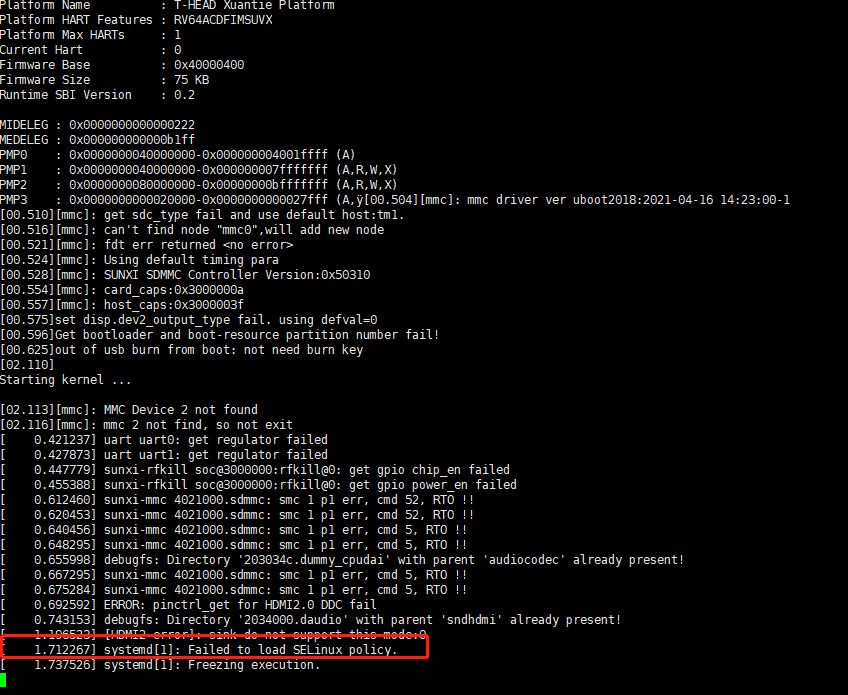

lxmenu-data-0.1.5 
libfm-extra-1.3.2 
menu-cache-1.1.0 
libfm-1.3.2 
PCManFM-1.3.2 
libwnck-2.30.7 
LXPanel-0.10.1 
LXAppearance-0.6.3 
LXSession-0.5.5 
lxde-common-0.99.2 

二刷的时候，第一次因为扩容没有成功导致安装一半没有空间；后来因为补全38个包的安装导致无法进入系统，又重刷镜像。后续需要注意不要再无法进入系统，按照之前的安装记录导致镜像问题的包很可能是selinux-policy 以及几个python打头的包：


```
二刷结论：还是没能正常进入lxde桌面。去掉已经安装的包，还有如下的包没有安装：

yum install vte  setools selinux-policy samba python-parameterized python-nose2 python-cov-core policycoreutils mozjs60 lxterminal lxtask lxinput libstoragemgmt  krb5 bind 

其中 selinux-policy  是高危包，2次安装后重启D1无法进入系统，导致系统重刷。建议后面的按照之前的安装日志，调整顺序后一个一个安装。避免无法进入系统的情况。
```


### 三刷


1、安装上述的顺序依次安装包

yum install lxmenu-data libfm-devel menu-cache libfm pcmanfm libwnck lxpanel lxappearance lxsession  lxde-common


```
echo 'install LXDE Desktop 10 packages'
yum -y install lxmenu-data  2>&1|tee -a lxde-yum-install.log
yum -y install libfm-devel  2>&1|tee -a lxde-yum-install.log
yum -y install menu-cache  2>&1|tee -a lxde-yum-install.log
yum -y install libfm  2>&1|tee -a lxde-yum-install.log
yum -y install pcmanfm  2>&1|tee -a lxde-yum-install.log
yum -y install libwnck  2>&1|tee -a lxde-yum-install.log
yum -y install lxpanel  2>&1|tee -a lxde-yum-install.log
yum -y install lxappearance  2>&1|tee -a lxde-yum-install.log
yum -y install lxsession    2>&1|tee -a lxde-yum-install.log
yum -y install lxde-common  2>&1|tee -a lxde-yum-install.log


echo 'install LXDE Applications 7 packages'
#yum -y install gpicview 2>&1|tee -a lxde-yum-install.log
#yum -y install lxappearance-obconf 2>&1|tee -a lxde-yum-install.log
yum -y install lxinput 2>&1|tee -a lxde-yum-install.log
#yum -y install lxrandr 2>&1|tee -a lxde-yum-install.log
yum -y install lxtask 2>&1|tee -a lxde-yum-install.log
yum -y install vte  2>&1|tee -a lxde-yum-install.log
yum -y install lxterminal 2>&1|tee -a lxde-yum-install.log

注释掉的3个包没有安装成功；
```


2、重启D1后发现没有进入桌面，再次补齐38个包中其余的包

yum install wireless-tools vte volume_key userspace-rcu udisks2 setools selinux-policy samba python-parameterized python-nose2 python-cov-core policycoreutils pcmanfm openbox openEuler-menus ndctl mozjs60 menu-cache lxterminal lxtask lxsession lxpanel lxmenu-data lxinput lxde-common lxappearance libwnck libtdb libtalloc libstoragemgmt libldb libfm-extra libfm krb5 json-c imlib2 gnome-online-accounts bind 


检查之后，发现有：setools  samba  policycoreutils mozjs60 krb5  bind python-parameterized  python-cov-core  python-nose2 libstoragemgmt  selinux-policy

这几个包没有被安装。说明以上这些包lxde桌面不需要，可以从obs-lxde列表中移除。


重启D1，还是命令行界面，没有进入可视化界面。——》可能是因为有3个包没有安装成功，尝试安装。


https://admin.fedoraproject.org/mirrormanager/mirrors/Fedora/16/x86_64

```
[fedora34]
name=fedora34
baseurl=http://pubmirror1.math.uh.edu/fedora-buffet/fedora/linux/releases/34/Everything/aarch64/os/
enabled=1
gpgcheck=0
不行不行
```

找到了riscv64 fedora的repo地址：

```
[fedora]
name=fedora
baseurl=http://fedora.riscv.rocks/repos/f33-build/latest/riscv64/
enabled=1
gpgcheck=0
```

安装成功：gpicview lxappearance-obconf lxrandr

可安装：setools  samba  policycoreutils mozjs60 krb5  bind 

会报错：python-parameterized  python-cov-core  python-nose2 libstoragemgmt  selinux-policy

这样网站上要求的lxde的包都安装成功了，重启看是否能够进入可视化桌面。——》依然是命令行


#### 再试

安装成功：setools  samba  policycoreutils mozjs60 krb5  bind 

重启看是否能够进入可视化桌面。——》依然是命令行


继续：

- [x] python-parameterized   python-nose2   

- [ ] python-cov-core ——》包名修改为：python3-cov-core ——》python3-gpgme-1.13.1-5.oe1.riscv64——》python(abi) = 3.7

- [ ] libstoragemgmt  ——》python3-libstoragemgmt——》python(abi) = 3.8

- [x] python3-gpgme

- [x] selinux-policy





待解决问题：

1. yum install的时候，总是提示：/sbin/ldconfig: /lib64/lp64d/libhunspell-1.6.so.0 is not a symbolic link

2. 明明系统中已经安装了python2.7和python3.7.4  ，且python3-gpgme也安装成功；但是安装python3-cov-core 的时候，依然报错：

   ```
   [root@openEuler-RISCV-rare ~]# python --version
   Python 2.7.16
   [root@openEuler-RISCV-rare ~]# python3 --version
   Python 3.7.4
   [root@openEuler-RISCV-rare ~]# yum install python3-gpgme  2>&1|tee -a lxde-yum-install-1.log
   Last metadata expiration check: 0:44:34 ago on Tue Oct 26 13:15:23 2021.
   Package python3-gpgme-1.13.1-5.oe1.riscv64 is already installed.
   Dependencies resolved.
   ================================================================================
    Package              Architecture   Version              Repository       Size
   ================================================================================
   Upgrading:
    gpgme                riscv64        1.15.1-1.oe1         mainline        327 k
    python3-gpgme        riscv64        1.15.1-1.oe1         mainline        228 k
   
   Transaction Summary
   ================================================================================
   Upgrade  2 Packages
   
   Total download size: 556 k
   Is this ok [y/N]: y
   Downloading Packages:
   (1/2): python3-gpgme-1.15.1-1.oe1.riscv64.rpm   913 kB/s | 228 kB     00:00    
   (2/2): gpgme-1.15.1-1.oe1.riscv64.rpm           1.1 MB/s | 327 kB     00:00    
   --------------------------------------------------------------------------------
   Total                                           1.7 MB/s | 556 kB     00:00     
   Running transaction check
   Transaction check succeeded.
   Running transaction test
   Transaction test succeeded.
   Running transaction
     Preparing        :                                                        1/1 
     Upgrading        : gpgme-1.15.1-1.oe1.riscv64                             1/4 
     Upgrading        : python3-gpgme-1.15.1-1.oe1.riscv64                     2/4 
     Cleanup          : python3-gpgme-1.13.1-5.oe1.riscv64                     3/4 
     Cleanup          : gpgme-1.13.1-5.oe1.riscv64                             4/4 
     Running scriptlet: gpgme-1.13.1-5.oe1.riscv64                             4/4 
   /sbin/ldconfig: /lib64/lp64d/libhunspell-1.6.so.0 is not a symbolic link
   
   
   /sbin/ldconfig: /lib64/lp64d/libhunspell-1.6.so.0 is not a symbolic link
   
   
     Verifying        : gpgme-1.15.1-1.oe1.riscv64                             1/4 
     Verifying        : gpgme-1.13.1-5.oe1.riscv64                             2/4 
     Verifying        : python3-gpgme-1.15.1-1.oe1.riscv64                     3/4 
     Verifying        : python3-gpgme-1.13.1-5.oe1.riscv64                     4/4 
   
   Upgraded:
     gpgme-1.15.1-1.oe1.riscv64         python3-gpgme-1.15.1-1.oe1.riscv64        
   
   Complete!
   
   
   
   
   
   [root@openEuler-RISCV-rare ~]# yum install python3-cov-core  2>&1|tee -a lxde-yum-install-1.log
   Last metadata expiration check: 0:46:31 ago on Tue Oct 26 13:15:23 2021.
   Package python3-cov-core-1.15.0-1.oe1.noarch is already installed.
   Error: 
    Problem: problem with installed package python3-gpgme-1.15.1-1.oe1.riscv64
     - package python3-gpgme-1.15.1-1.oe1.riscv64 requires python(abi) = 3.7, but none of the providers can be installed
     - package python3-gpgme-1.13.1-5.oe1.riscv64 requires python(abi) = 3.7, but none of the providers can be installed
     - package python3-gpgme-1.13.1-5.riscv64 requires python(abi) = 3.7, but none of the providers can be installed
     - cannot install both python3-3.9.7-1.0.riscv64.fc33.riscv64 and python3-3.7.4-8.riscv64
     - package python3-cov-core-1.15.0-20.fc33.noarch requires python(abi) = 3.9, but none of the providers can be installed
     - cannot install the best candidate for the job
   (try to add '--allowerasing' to command line to replace conflicting packages or '--skip-broken' to skip uninstallable packages or '--nobest' to use not only best candidate packages)
   ```

   

尝试指定环境变量为python3？

python(abi) 就是指python么？


日志：

- lxde-yum-install.log  17个lxde包的安装日志，可以用来查包的安装依赖；
- lxde-yum-install-1.log   后续排查38-17等一些包的日志，零碎，备忘。

