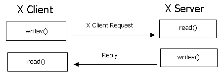
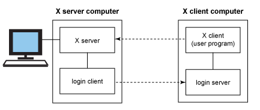
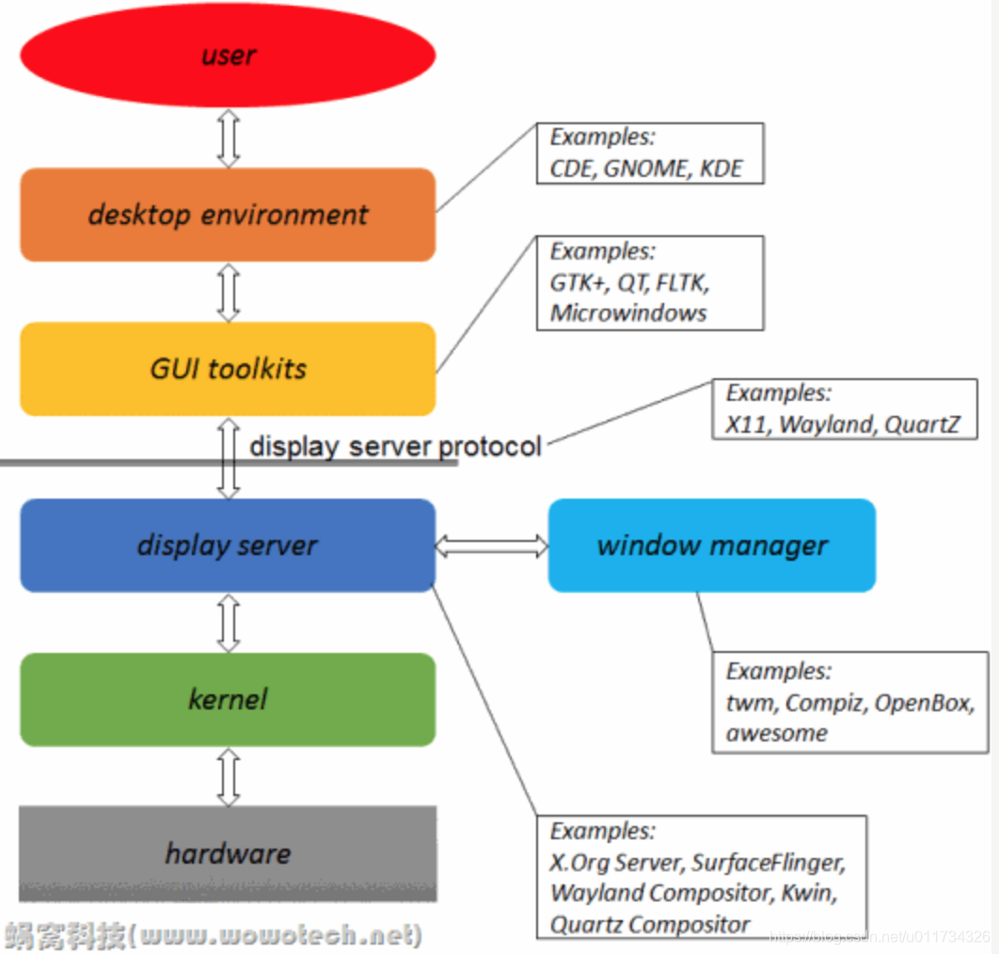

### 什么是x11

https://www.cnblogs.com/yuanqiangfei/p/11612815.html

# 1 **背景描述**

有些LINUX服务器出于性能和效率的考虑，通常都是没有安装图形化界面的，那么图形化程序在服务器上压根儿就跑不起来，或者无法直接显示出来，这就很尴尬了！那么如何解决这个问题呢？可以基于X11 Forwarding技术 + MobaXterm 工具，就可以轻松搞定，似不似很简单？

# 2 **原理介绍**

## 2.1 **X协议**

 

 

Linux 本身是没有图形化界面的，所谓的图形化界面系统只不过中 Linux 下的应用程序。这一点和 Windows 不一样。Windows 从Windows 95 开始，图形界面就直接在系统内核中实现了，是操作系统不可或缺的一部分。Linux 的图形化界面，底层都是基于 X 协议。

X 协议由 X server 和 X client 组成：

l X server 管理主机上与显示相关的硬件设置（如显卡、硬盘、鼠标等），它负责屏幕画面的绘制与显示，以及将输入设置（如键盘、鼠标）的动作告知 X client。

l X client (即 X 应用程序) 则主要负责事件的处理（即程序的逻辑）。

举个例子，如果用户点击了鼠标左键，因为鼠标归 X server 管理，于是 X server 就捕捉到了鼠标点击这个动作，然后它将这个动作告诉 X client，因为 X client 负责程序逻辑，于是 X client 就根据程序预先设定的逻辑（例如画一个圆），告诉 X server说：“请在鼠标点击的位置，画一个圆”。最后，X server 就响应 X client 的请求，在鼠标点击的位置，绘制并显示出一个圆。

## 2.2 **X11 Forwarding**

 

 

这么绕，有啥意义呢？当然有！

许多时候 X server 和 X client 在同一台主机上，这看起来没什么。但是， X server 和 X client 完全可以运行在不同的机器上，只要彼此通过 X 协议通信即可。于是，我们就可以做一些“神奇”的事情，比如像本文开头谈到的，在本地显示 (X server)，运行在服务器上的 GUI 程序 (X client)。这样的操作可以通过 SSH X11 Forwarding (转发) 来实现。

X11 中的 X 指的就是 X 协议，11 指的是采用 X 协议的第 11 个版本。

### linux图形界面基本知识

https://blog.csdn.net/zhangxinrun/article/details/7332049

https://blog.csdn.net/u011734326/article/details/90598788/?utm_medium=distribute.pc_relevant.none-task-blog-2~default~baidujs_title~default-4.no_search_link&spm=1001.2101.3001.4242.3

- https://wizardforcel.gitbooks.io/vbird-linux-basic-4e/content/202.html
- x协议官网：X.org  
- https://www.xfce.org/?lang=zh_CN 

### x11安装

参考：

https://blog.csdn.net/yanggleyang/article/details/104727065

