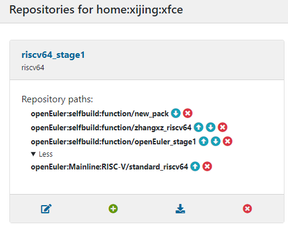
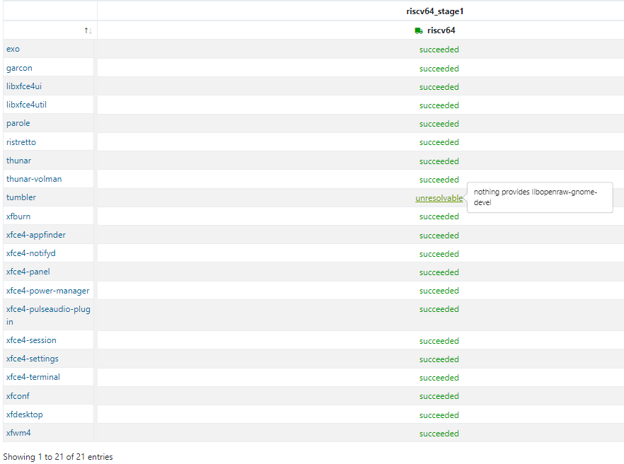
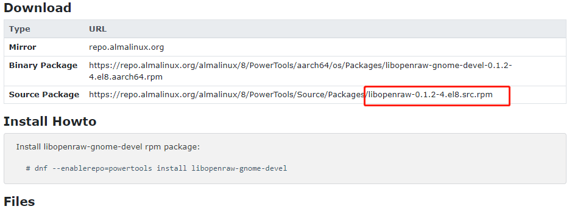
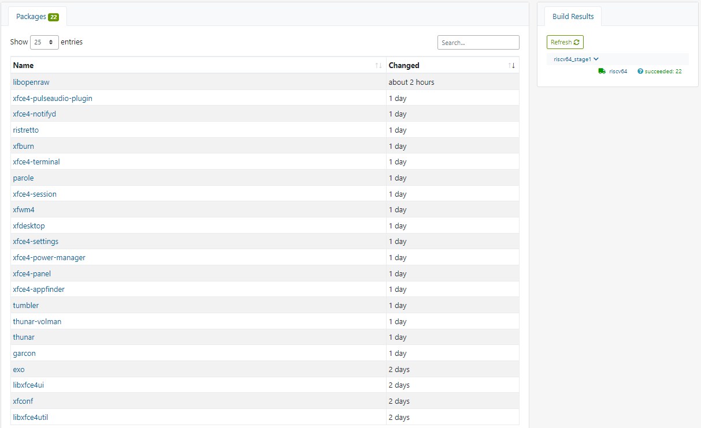

文档内容：流水账式的工作日志。

文档目的：由于当前还处于边做边学习的过程中，需要对一些操作、结果进行记录，方便后续对比变更；此外如果出现问题，方便直接给出本文档以深度交流；如果没有太大问题，也可以作为后续项目文档的主要素材和新人的参考。

## xfce

### 目标：

1. 对xfce所需的包进行梳理，整理一个xfce包list出来
2. 对xfce软件包所需的依赖包进行梳理，对obs main工程中的包进行查缺补漏
3. 检验xfce是否能够安装成功，安装后使用的简单测试

### 测试

D1上测试：https://github.com/plctlab/openEuler-riscv/issues/181

### obs xfce

1. 一个一个按照https://www.linuxfromscratch.org/blfs/view/svn/index.html 在D1上进行安装，最后21包全部安装成功，但是重启D1没能进入到图形界面。

2. 同时，为了同步管理obs xfce，自己也新建了一个project：xfce，并一个一个加入（create package，而不是从其它工程branch）了上述的21个包，在obs上构建：

   - 第一次：忘记加了哪些依赖仓了，1个都没能成功

   - 第二次：按照https://build.openeuler.org/repositories/home:pandora:xfce4 设置依赖仓（不确定是否在此基础上有删减）

     - home:pandora/openEuler_stage1

     - openEuler:selfbuild:function/subprjdep

     - openEuler:Mainline:RISC-V/standard_riscv64

       这次好像成功了4个，反正没有达到预期

   - 第三次：删除了所有的依赖仓，重新按照https://build.openeuler.org/project/show/openEuler:Mainline:RISC-V 的依赖仓进行设置，同时把mainline本身也加入了xfce的依赖仓：

     - openEuler:selfbuild:function/new_pack 

     - openEuler:selfbuild:function/zhangxz_riscv64 

     - openEuler:selfbuild:function/openEuler_stage1 

       

       这次构建成功率大大提高：

       

   - 针对上述的[tumbler](https://build.openeuler.org/package/show/home:xijing:xfce/tumbler) 包进行解决：nothing provides libopenraw-gnome-devel

     - src-openeuler+obs mainline riscv：没有源码包libopenraw-gnome-devel   openraw-gnome等相似

       - [libopenraw](https://gitee.com/src-openeuler/libopenraw)  这个是么？
       
     - google：linux libopenraw-gnome-devel rpm

       - 找到 https://almalinux.pkgs.org/8/almalinux-powertools-aarch64/libopenraw-gnome-devel-0.1.2-4.el8.aarch64.rpm.html  中的一些信息，发现：

         

         证实了：libopenraw-gnome-devel ====libopenraw

     - 接着，把libopenraw 包加入到xfce中：

       - 问题：当包名出现不一致的时候，obs中新建的包应该取什么名呢？叫[libopenraw](https://gitee.com/src-openeuler/libopenraw)  还是 libopenraw-gnome-devel ？？？——》先以src-openeuler为主，再看看构建这边是否能够成功

       - 将libopenraw加入obs xfce：等待构建结果（mainline中该包状态succeeded）

       - 观测libopenraw在xfce中构建成功后，是否会自动触发tumbler 包，并使之构建成功：——》成功

         

     - 

   - 对x11研究后，发现src-openeuler中已经有了很多的xorg包；随即也在源码仓中查询了一下xfce相关包，也有很多：

     - 既然上游社区已经对xfce进行了包的梳理，姑且先相信上游社区包梳理到位，我们直接统计一下，拿来直接使用：

       - gitee仓库查询接口：https://gitee.com/api/v5/swagger#/getV5SearchRepositories 

       - 写了个脚本：根据name查询gitee中的repo：searchRepobyname.py

       - xorg相关的包有：共计29个

         | name                   | ssh_url                                                | sha                                      |
         | ---------------------- | ------------------------------------------------------ | ---------------------------------------- |
         | xorg-x11-fonts         | git@gitee.com:src-openeuler/xorg-x11-fonts.git         | 0e09bf231b796270e7cc3c70b504940b1d84ceb8 |
         | xorg-x11-font-utils    | git@gitee.com:src-openeuler/xorg-x11-font-utils.git    | 4ded409aac4d59232444f51d9cb79bda866d378d |
         | xorg-x11-server-utils  | git@gitee.com:src-openeuler/xorg-x11-server-utils.git  | 55062b185f8e01398dba099340916cc02d558d9f |
         | xorg-x11-xkb-utils     | git@gitee.com:src-openeuler/xorg-x11-xkb-utils.git     | 7a5ec815b88f7d69e97e858e3f30e6b8a0abf699 |
         | xorg-x11-drivers       | git@gitee.com:src-openeuler/xorg-x11-drivers.git       | 3ad0a91627d46781f41b4df48e0cff7d7ce0887f |
         | xorg-x11-drv-ati       | git@gitee.com:src-openeuler/xorg-x11-drv-ati.git       | 9d13cff62fc31f746235fa34104a04184958ea7f |
         | xorg-x11-drv-dummy     | git@gitee.com:src-openeuler/xorg-x11-drv-dummy.git     | 94961160019bb15f30d50666aa0cf74e2c5b3807 |
         | xorg-x11-drv-evdev     | git@gitee.com:src-openeuler/xorg-x11-drv-evdev.git     | 5376869e9392a866c420d348a789506ba7cd38ed |
         | xorg-x11-drv-fbdev     | git@gitee.com:src-openeuler/xorg-x11-drv-fbdev.git     | 19e3d9ac6ae0c24314bd5b176327c9dc995b5679 |
         | xorg-x11-drv-libinput  | git@gitee.com:src-openeuler/xorg-x11-drv-libinput.git  | c9a8121042b717eb573fddecd6c6218d44078cfe |
         | xorg-x11-drv-nouveau   | git@gitee.com:src-openeuler/xorg-x11-drv-nouveau.git   | 33499d9b837c171d25f50db5889ac70172b60eac |
         | xorg-x11-drv-wacom     | git@gitee.com:src-openeuler/xorg-x11-drv-wacom.git     | 25447c00f310da8af1656cc16df348805960babf |
         | xorg-x11-xauth         | git@gitee.com:src-openeuler/xorg-x11-xauth.git         | c3fec5af8d3cd0fac5e13fc85f13f6f3d23be890 |
         | xorg-x11-drv-v4l       | git@gitee.com:src-openeuler/xorg-x11-drv-v4l.git       | 4d282d136f41f9d09d9633043e1623173e7f306a |
         | xorg-x11-xinit         | git@gitee.com:src-openeuler/xorg-x11-xinit.git         | 8352b932c77507fc17a448c9c6aa8dcd155a8be7 |
         | xorg-x11-proto-devel   | git@gitee.com:src-openeuler/xorg-x11-proto-devel.git   | 2f972cbc9352e435e07bdbde8924b357172ad193 |
         | xorg-x11-apps          | git@gitee.com:src-openeuler/xorg-x11-apps.git          | 141ba2f6c29d729fa7519cb4773234f91bb60b8e |
         | xorg-x11-util-macros   | git@gitee.com:src-openeuler/xorg-x11-util-macros.git   | b969ff1ab6f372c7c03f600b98712eb737488389 |
         | xorg-x11-utils         | git@gitee.com:src-openeuler/xorg-x11-utils.git         | 6b8bbc79f55e2334ca14315c9d0e0aee922f04b7 |
         | xorg-x11-xbitmaps      | git@gitee.com:src-openeuler/xorg-x11-xbitmaps.git      | 037a61fa235d144152947a32b65b39000d8348da |
         | xorg-x11-xtrans-devel  | git@gitee.com:src-openeuler/xorg-x11-xtrans-devel.git  | 98f0c14505525aaaf1a9e176592d6ff0448d7433 |
         | xorg-x11-server        | git@gitee.com:src-openeuler/xorg-x11-server.git        | bc69f569d9bfa2de92ed76ace6bd6339ba267e7d |
         | xorg-x11-docs          | git@gitee.com:src-openeuler/xorg-x11-docs.git          | 1b36898f00c9610e4553946f9fee5c2284746e4a |
         | xorg-x11-drv-armsoc    | git@gitee.com:src-openeuler/xorg-x11-drv-armsoc.git    | f8e81075cf7485af9b94629df546ae4c87f2632a |
         | xorg-x11-drv-qxl       | git@gitee.com:src-openeuler/xorg-x11-drv-qxl.git       | ba761473a504ffe9df413c6e986ba089bea8c05a |
         | xorg-x11-drv-intel     | git@gitee.com:src-openeuler/xorg-x11-drv-intel.git     | c1b27177b0d40e3f3c45dd2e3a073c3d4f639eb8 |
         | xorg-x11-drv-vesa      | git@gitee.com:src-openeuler/xorg-x11-drv-vesa.git      | 9c5a8c3ca57613aca59b543ddc98a22d5360d38a |
         | xorg-x11-drv-vmware    | git@gitee.com:src-openeuler/xorg-x11-drv-vmware.git    | 33f00627af7ecdf0b371bdce915c50b4bf2430a6 |
         | xorg-x11-drv-synaptics | git@gitee.com:src-openeuler/xorg-x11-drv-synaptics.git | 628881b770286d3767614d74713e1fd0858f2001 |

       - 

     - 

   - 

### x11

之前在D1上安装了21个xfce desktop包，但是还是没能看到图形界面，经俊强指导，可能是x11没有安装的问题。

查了资料，对x11有了一定的了解。简单说：

Linux 本身是没有图形化界面的，所谓的图形化界面系统只不过中 Linux 下的应用程序。这一点和 Windows 不一样。Windows 从Windows 95 开始，图形界面就直接在系统内核中实现了，是操作系统不可或缺的一部分。Linux 的图形化界面，底层都是基于 X 协议。

X 协议由 X server 和 X client 组成：

- X server 管理主机上与显示相关的硬件设置（如显卡、硬盘、鼠标等），它负责屏幕画面的绘制与显示，以及将输入设置（如键盘、鼠标）的动作告知 X client。

- X client (即 X 应用程序) 则主要负责事件的处理（即程序的逻辑）。

那么，x client一般应该是在desktop的软件中实现，比如xfce；先看看 X server 有哪些包，这些包obs中（src-openeuler）中是否已经有了：

- X server 有哪些包：

  - x协议已经更新到x11R6了（X11R6 实际上是 X Protocol version 11 Release 6，X协议第11版第六次发行的意思，就是说目前用的X协议是第11版的，然后经过了6次小的修正.不同版本的X协议是不能通信的.就象我们现在IPV4和IPV6不能通信一样，不过不用担心，现在的X服务器软件和X应用程序都遵循X11R6）——》最新的已经到X11R7了

  - 而且实现这个协议的常用服务器有Xfree86 ，Xorg ，Xnest等

    - [src-openEuler](https://gitee.com/src-openeuler) ：有且只有xorg系列的包，一共29个

    - obs：xorg 26个

      | obs包列表                                                    | gitee列表              |
      | ------------------------------------------------------------ | ---------------------- |
      | [xorg-x11-apps](https://build.openeuler.org/package/show/openEuler:Mainline:RISC-V/xorg-x11-apps) | xorg-x11-xtrans-devel  |
      | [xorg-x11-drivers](https://build.openeuler.org/package/show/openEuler:Mainline:RISC-V/xorg-x11-drivers) | xorg-x11-xkb-utils     |
      | [xorg-x11-drv-ati](https://build.openeuler.org/package/show/openEuler:Mainline:RISC-V/xorg-x11-drv-ati) | xorg-x11-xinit         |
      | [xorg-x11-drv-dummy](https://build.openeuler.org/package/show/openEuler:Mainline:RISC-V/xorg-x11-drv-dummy) | xorg-x11-xbitmaps      |
      | [xorg-x11-drv-evdev](https://build.openeuler.org/package/show/openEuler:Mainline:RISC-V/xorg-x11-drv-evdev) | xorg-x11-xauth         |
      | [xorg-x11-drv-fbdev](https://build.openeuler.org/package/show/openEuler:Mainline:RISC-V/xorg-x11-drv-fbdev) | xorg-x11-utils         |
      | [xorg-x11-drv-intel](https://build.openeuler.org/package/show/openEuler:Mainline:RISC-V/xorg-x11-drv-intel) | xorg-x11-util-macros   |
      | [xorg-x11-drv-libinput](https://build.openeuler.org/package/show/openEuler:Mainline:RISC-V/xorg-x11-drv-libinput) | xorg-x11-server-utils  |
      | [xorg-x11-drv-nouveau](https://build.openeuler.org/package/show/openEuler:Mainline:RISC-V/xorg-x11-drv-nouveau) | xorg-x11-server        |
      | [xorg-x11-drv-qxl](https://build.openeuler.org/package/show/openEuler:Mainline:RISC-V/xorg-x11-drv-qxl) | xorg-x11-proto-devel   |
      | [xorg-x11-drv-v4l](https://build.openeuler.org/package/show/openEuler:Mainline:RISC-V/xorg-x11-drv-v4l) | xorg-x11-fonts         |
      | [xorg-x11-drv-vesa](https://build.openeuler.org/package/show/openEuler:Mainline:RISC-V/xorg-x11-drv-vesa) | xorg-x11-font-utils    |
      | [xorg-x11-drv-vmware](https://build.openeuler.org/package/show/openEuler:Mainline:RISC-V/xorg-x11-drv-vmware) | xorg-x11-drv-wacom     |
      | [xorg-x11-drv-wacom](https://build.openeuler.org/package/show/openEuler:Mainline:RISC-V/xorg-x11-drv-wacom) | xorg-x11-drv-vmware    |
      | [xorg-x11-font-utils](https://build.openeuler.org/package/show/openEuler:Mainline:RISC-V/xorg-x11-font-utils) | xorg-x11-drv-vesa      |
      | [xorg-x11-fonts](https://build.openeuler.org/package/show/openEuler:Mainline:RISC-V/xorg-x11-fonts) | xorg-x11-drv-v4l       |
      | [xorg-x11-proto-devel](https://build.openeuler.org/package/show/openEuler:Mainline:RISC-V/xorg-x11-proto-devel) | xorg-x11-drv-qxl       |
      | [xorg-x11-server](https://build.openeuler.org/package/show/openEuler:Mainline:RISC-V/xorg-x11-server) | xorg-x11-drv-nouveau   |
      | [xorg-x11-server-utils](https://build.openeuler.org/package/show/openEuler:Mainline:RISC-V/xorg-x11-server-utils) | xorg-x11-drv-libinput  |
      | [xorg-x11-util-macros](https://build.openeuler.org/package/show/openEuler:Mainline:RISC-V/xorg-x11-util-macros) | xorg-x11-drv-intel     |
      | [xorg-x11-utils](https://build.openeuler.org/package/show/openEuler:Mainline:RISC-V/xorg-x11-utils) | xorg-x11-drv-fbdev     |
      | [xorg-x11-xauth](https://build.openeuler.org/package/show/openEuler:Mainline:RISC-V/xorg-x11-xauth) | xorg-x11-drv-evdev     |
      | [xorg-x11-xbitmaps](https://build.openeuler.org/package/show/openEuler:Mainline:RISC-V/xorg-x11-xbitmaps) | xorg-x11-drv-dummy     |
      | [xorg-x11-xinit](https://build.openeuler.org/package/show/openEuler:Mainline:RISC-V/xorg-x11-xinit) | xorg-x11-drv-ati       |
      | [xorg-x11-xkb-utils](https://build.openeuler.org/package/show/openEuler:Mainline:RISC-V/xorg-x11-xkb-utils) | xorg-x11-drivers       |
      | [xorg-x11-xtrans-devel](https://build.openeuler.org/package/show/openEuler:Mainline:RISC-V/xorg-x11-xtrans-devel) | xorg-x11-apps          |
      |                                                              | xorg-x11-drv-synaptics |
      |                                                              | xorg-x11-drv-armsoc    |
      |                                                              | xorg-x11-docs          |

    xorg-x11-drv-synaptics、  xorg-x11-drv-armsoc、xorg-x11-docs是差异项

  - 结合 https://www.linuxfromscratch.org/blfs/view/svn/x/x.html  中的相关章节：

  - 

- 

