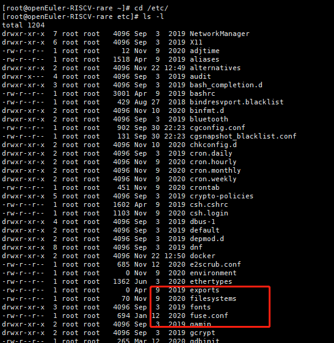
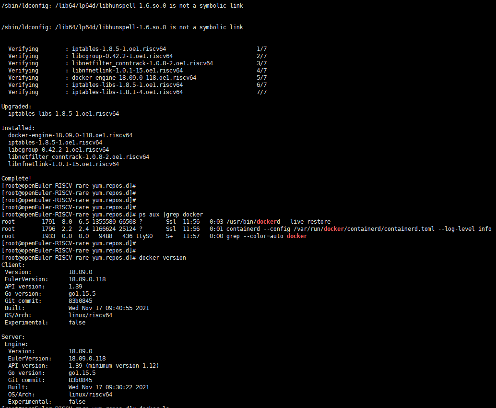
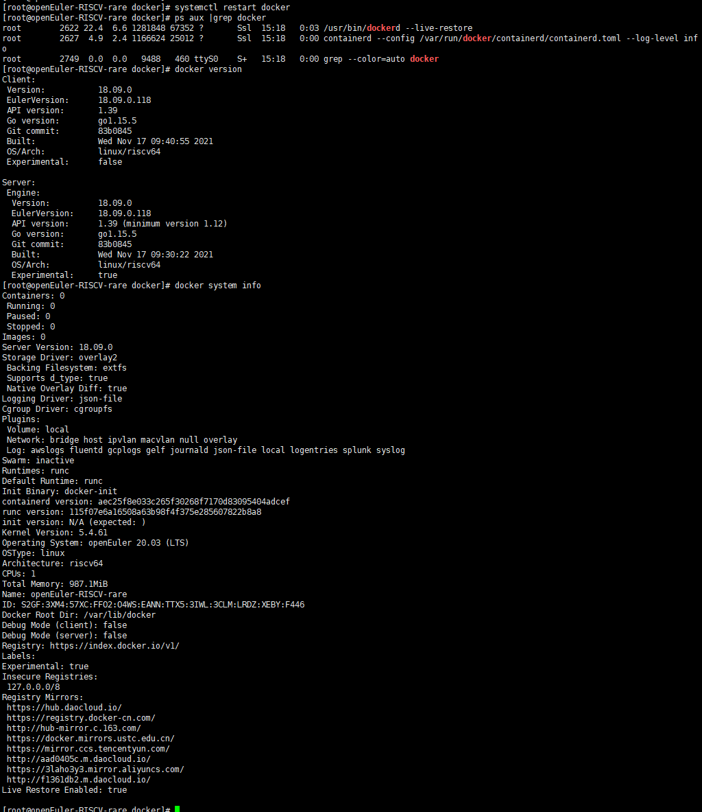
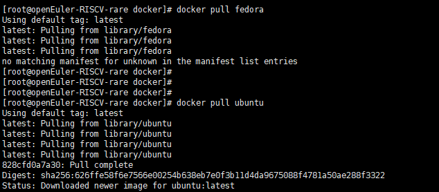
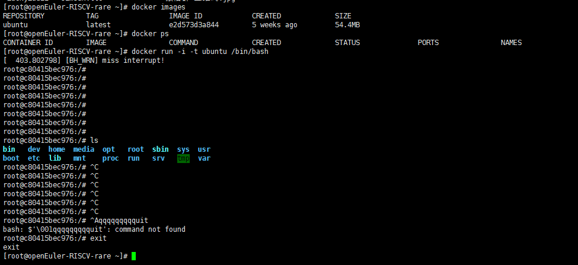

## qemu oerv64中测docker

### qemu中启动oe-rv64

参考：https://gitee.com/openeuler/RISC-V/blob/master/documents/Installing_qemu5.md

### oe-rv64配置

1. 配置日期

2. yum源

   ```
   [obs]
   name=obs
   baseurl=http://119.3.219.20:82/openEuler:/Mainline:/RISC-V/standard_riscv64/
   enabled=1
   gpgcheck=0
   
   [pandora]
   name=pandora
   baseurl=http://121.36.3.168:82/home:/pandora/openEuler_stage1/
   enabled=1
   gpgcheck=0
   
   [docker]
   name=docker
   baseurl=http://121.36.3.168:82/home:/pandora:/docker/standard_riscv64/
   enabled=1
   gpgcheck=0
   ```

   


### 安装

```
[root@openEuler-RISCV-rare yum.repos.d]# yum install docker
obs                                             5.9 MB/s | 9.7 MB     00:01    
pandora                                         3.0 MB/s | 1.2 MB     00:00    
docker                                          182 kB/s |  38 kB     00:00    
Last metadata expiration check: 0:00:01 ago on Mon Nov 22 12:48:56 2021.
Dependencies resolved.
================================================================================
 Package                    Arch        Version                Repository  Size
================================================================================
Installing:
 docker-engine              riscv64     18.09.0-118.oe1        docker      32 M
Upgrading:
 iptables-libs              riscv64     1.8.5-1.oe1            obs        234 k
Installing dependencies:
 iptables                   riscv64     1.8.5-1.oe1            obs         72 k
 libcgroup                  riscv64     0.42.2-1.oe1           obs         95 k
 libmnl                     riscv64     1.0.4-10.oe1           obs         25 k
 libnetfilter_conntrack     riscv64     1.0.8-2.oe1            obs         50 k
 libnfnetlink               riscv64     1.0.1-15.oe1           obs         26 k

Transaction Summary
================================================================================
Install  6 Packages
Upgrade  1 Package

Total download size: 32 M
Is this ok [y/N]: y
Downloading Packages:
(1/7): libmnl-1.0.4-10.oe1.riscv64.rpm          264 kB/s |  25 kB     00:00    
(2/7): iptables-1.8.5-1.oe1.riscv64.rpm         524 kB/s |  72 kB     00:00    
(3/7): libcgroup-0.42.2-1.oe1.riscv64.rpm       582 kB/s |  95 kB     00:00    
(4/7): libnetfilter_conntrack-1.0.8-2.oe1.riscv 711 kB/s |  50 kB     00:00    
(5/7): libnfnetlink-1.0.1-15.oe1.riscv64.rpm    532 kB/s |  26 kB     00:00    
(6/7): iptables-libs-1.8.5-1.oe1.riscv64.rpm    2.2 MB/s | 234 kB     00:00    
(7/7): docker-engine-18.09.0-118.oe1.riscv64.rp 6.2 MB/s |  32 MB     00:05    
--------------------------------------------------------------------------------
Total                                           6.0 MB/s |  32 MB     00:05     
Running transaction check
Transaction check succeeded.
Running transaction test
Transaction test succeeded.
Running transaction
  Preparing        :                                                        1/1 
  Installing       : libnfnetlink-1.0.1-15.oe1.riscv64                      1/8 
  Installing       : libmnl-1.0.4-10.oe1.riscv64                            2/8 
  Running scriptlet: libmnl-1.0.4-10.oe1.riscv64                            2/8 
  Installing       : libnetfilter_conntrack-1.0.8-2.oe1.riscv64             3/8 
  Running scriptlet: libnetfilter_conntrack-1.0.8-2.oe1.riscv64             3/8 
  Upgrading        : iptables-libs-1.8.5-1.oe1.riscv64                      4/8 
  Installing       : iptables-1.8.5-1.oe1.riscv64                           5/8 
  Running scriptlet: iptables-1.8.5-1.oe1.riscv64                           5/8 
  Running scriptlet: libcgroup-0.42.2-1.oe1.riscv64                         6/8 
  Installing       : libcgroup-0.42.2-1.oe1.riscv64                         6/8 
  Running scriptlet: libcgroup-0.42.2-1.oe1.riscv64                         6/8 
  Installing       : docker-engine-18.09.0-118.oe1.riscv64                  7/8 
  Running scriptlet: docker-engine-18.09.0-118.oe1.riscv64                  7/8 
[  632.667789] systemd-rc-local-generator[1190]: /etc/rc.d/rc.local is not marked executable, skipping.
Created symlink /etc/systemd/system/multi-user.target.wants/docker.service → /usr/lib/systemd/system/docker.service.
Job for docker.service failed because the control process exited with error code.
See "systemctl status docker.service" and "journalctl -xe" for details.

  Cleanup          : iptables-libs-1.8.1-4.oe1.riscv64                      8/8 
  Running scriptlet: iptables-libs-1.8.1-4.oe1.riscv64                      8/8 
[  644.432993] systemd-rc-local-generator[1245]: /etc/rc.d/rc.local is not marked executable, skipping.
  Verifying        : iptables-1.8.5-1.oe1.riscv64                           1/8 
  Verifying        : libcgroup-0.42.2-1.oe1.riscv64                         2/8 
  Verifying        : libmnl-1.0.4-10.oe1.riscv64                            3/8 
  Verifying        : libnetfilter_conntrack-1.0.8-2.oe1.riscv64             4/8 
  Verifying        : libnfnetlink-1.0.1-15.oe1.riscv64                      5/8 
  Verifying        : docker-engine-18.09.0-118.oe1.riscv64                  6/8 
  Verifying        : iptables-libs-1.8.5-1.oe1.riscv64                      7/8 
  Verifying        : iptables-libs-1.8.1-4.oe1.riscv64                      8/8 

Upgraded:
  iptables-libs-1.8.5-1.oe1.riscv64                                             

Installed:
  docker-engine-18.09.0-118.oe1.riscv64       iptables-1.8.5-1.oe1.riscv64      
  libcgroup-0.42.2-1.oe1.riscv64              libmnl-1.0.4-10.oe1.riscv64       
  libnetfilter_conntrack-1.0.8-2.oe1.riscv64  libnfnetlink-1.0.1-15.oe1.riscv64 

Complete!

```


### docker使用

```
# 启动docker
[root@openEuler-RISCV-rare ~]# systemctl enable docker
[ 3810.563881] systemd-rc-local-generator[1478]: /etc/rc.d/rc.local is not marked executable, skipping.


# 根据错误提示检查：
[root@openEuler-RISCV-rare ~]# ls  -l /etc/rc.d/rc.local 
-rw-r--r-- 1 root root 473 Nov 10  2020 /etc/rc.d/rc.local
[root@openEuler-RISCV-rare ~]# chmod +x /etc/rc.d/rc.local 
[root@openEuler-RISCV-rare ~]# ls  -l /etc/rc.d/rc.local 
-rwxr-xr-x 1 root root 473 Nov 10  2020 /etc/rc.d/rc.local


[root@openEuler-RISCV-rare ~]# systemctl enable docker


[root@openEuler-RISCV-rare ~]# systemctl start  docker
Job for docker.service failed because the control process exited with error code.
See "systemctl status docker.service" and "journalctl -xe" for details.

# 按照提示信息执行：
[root@openEuler-RISCV-rare ~]# systemctl status docker.service 2>&1|tee -a ~/docker.log
● docker.service - Docker Application Container Engine
   Loaded: loaded (/usr/lib/systemd/system/docker.service; enabled; vendor preset: disabled)
   Active: failed (Result: exit-code) since Mon 2021-11-22 15:13:26 UTC; 10min ago
     Docs: https://docs.docker.com
  Process: 1673 ExecStart=/usr/bin/dockerd $OPTIONS $DOCKER_STORAGE_OPTIONS $DOCKER_NETWORK_OPTIONS $INSECURE_REGISTRY (code=exited, status=1/FAILURE)
 Main PID: 1673 (code=exited, status=1/FAILURE)

Nov 22 15:13:25 openEuler-RISCV-rare dockerd[1673]: time="2021-11-22T15:13:25.854854600Z" level=warning msg="mountpoint for pids not found"
Nov 22 15:13:25 openEuler-RISCV-rare dockerd[1673]: time="2021-11-22T15:13:25.855505700Z" level=warning msg="mountpoint for files not found"
Nov 22 15:13:25 openEuler-RISCV-rare dockerd[1673]: time="2021-11-22T15:13:25.868851800Z" level=info msg="stopping healthcheck following graceful shutdown" module=libcontainerd
Nov 22 15:13:25 openEuler-RISCV-rare dockerd[1673]: time="2021-11-22T15:13:25.869595800Z" level=info msg="stopping event stream following graceful shutdown" error="context canceled" module=libcontainerd namespace=plugins.moby
Nov 22 15:13:25 openEuler-RISCV-rare dockerd[1673]: time="2021-11-22T15:13:25.878442500Z" level=info msg="pickfirstBalancer: HandleSubConnStateChange: 0x3fa01170e0, TRANSIENT_FAILURE" module=grpc
Nov 22 15:13:25 openEuler-RISCV-rare dockerd[1673]: time="2021-11-22T15:13:25.878866600Z" level=info msg="pickfirstBalancer: HandleSubConnStateChange: 0x3fa01170e0, CONNECTING" module=grpc
Nov 22 15:13:26 openEuler-RISCV-rare dockerd[1673]: Error starting daemon: Devices cgroup isn't mounted
Nov 22 15:13:26 openEuler-RISCV-rare systemd[1]: docker.service: Main process exited, code=exited, status=1/FAILURE
Nov 22 15:13:26 openEuler-RISCV-rare systemd[1]: docker.service: Failed with result 'exit-code'.
Nov 22 15:13:26 openEuler-RISCV-rare systemd[1]: Failed to start Docker Application Container Engine.


# [root@openEuler-RISCV-rare ~]# journalctl -xe
   输出节选：
Nov 22 14:03:59 openEuler-RISCV-rare dockerd[1570]: time="2021-11-22T14:03:59.997198900Z" level=info msg="pickfirstBalancer: HandleSubConnStateCha
nge: 0x3fa08549b0, CONNECTING" module=grpc
Nov 22 14:04:00 openEuler-RISCV-rare dockerd[1570]: Error starting daemon: Devices cgroup isn't mounted
Nov 22 14:04:01 openEuler-RISCV-rare systemd[1]: docker.service: Main process exited, code=exited, status=1/FAILURE
-- Subject: Unit process exited
-- Defined-By: systemd
-- Support: https://lists.freedesktop.org/mailman/listinfo/systemd-devel
-- 
-- An ExecStart= process belonging to unit docker.service has exited.
-- 
-- The process' exit code is 'exited' and its exit status is 1.
Nov 22 14:04:01 openEuler-RISCV-rare systemd[1]: docker.service: Failed with result 'exit-code'.
-- Subject: Unit failed
-- Defined-By: systemd
-- Support: https://lists.freedesktop.org/mailman/listinfo/systemd-devel
-- 
-- The unit docker.service has entered the 'failed' state with result 'exit-code'.
Nov 22 14:04:01 openEuler-RISCV-rare systemd[1]: Failed to start Docker Application Container Engine.
-- Subject: A start job for unit docker.service has failed
-- Defined-By: systemd
-- Support: https://lists.freedesktop.org/mailman/listinfo/systemd-devel
-- 
-- A start job for unit docker.service has finished with a failure.
-- 
-- The job identifier is 637 and the job result is failed.
Nov 22 14:07:46 openEuler-RISCV-rare systemd[1]: Starting Docker Application Container Engine...
-- Subject: A start job for unit docker.service has begun execution
-- Defined-By: systemd
-- Support: https://lists.freedesktop.org/mailman/listinfo/systemd-devel
-- 
-- A start job for unit docker.service has begun execution.


```

错误：Error starting daemon: Devices cgroup isn't mounted


按照网上的提示：此问题很可能是cgroup没有挂载导致的，因为cgroup没有挂载，所以无法工作。我们可以直接挂载即可。

```
set -e   
# 这句是告诉bash如何有任何语句执行结果不为ture，就应该退出。 

if grep -v '^#' /etc/fstab | grep -q cgroup; then
	echo 'cgroups mounted from fstab, not mounting /sys/fs/cgroup'
	exit 0
fi

# kernel provides cgroups?
if [ ! -e /proc/cgroups ]; then
	exit 0
fi

# 确保目录存在
if [ ! -d /sys/fs/cgroup ]; then
	exit 0
fi

# mount /sys/fs/cgroup if not already done
if ! mountpoint -q /sys/fs/cgroup; then
	mount -t tmpfs -o uid=0,gid=0,mode=0755 cgroup /sys/fs/cgroup
fi

cd /sys/fs/cgroup

# get/mount list of enabled cgroup controllers
for sys in $(awk '!/^#/ { if ($4 == 1) print $1 }' /proc/cgroups); do
	mkdir -p $sys
	if ! mountpoint -q $sys; then
		if ! mount -n -t cgroup -o $sys cgroup $sys; then
			rmdir $sys || true
		fi
	fi
done


exit 0
————————————————
版权声明：本文为CSDN博主「互联网老辛」的原创文章，遵循CC 4.0 BY-SA版权协议，转载请附上原文出处链接及本声明。
原文链接：https://blog.csdn.net/xinshuzhan/article/details/118293022
```


执行上述脚本，发现没有/etc/fstab文件：



在linux中，/etc/fstab文件是磁盘挂载的问题，若该文件不小心给修改了，或者被删除了，那么就会导致系统无法重启。因为/etc/fstab文件是记录磁盘挂载的信息，若该文件出现了问题，那么对应的主目录（/）和（/boot）以及swap的磁盘将无法挂载，所以这个文件对于linux系统来说是相当重要的。


目前看来，测试镜像系统存在一些不完整。

https://blog.csdn.net/weixin_45496075/article/details/109123709


## D1上测试docker

换到D1上进行测试：





```
[root@openEuler-RISCV-rare yum.repos.d]# docker pull fedora
Using default tag: latest
latest: Pulling from library/fedora
no matching manifest for unknown in the manifest list entries
[root@openEuler-RISCV-rare yum.repos.d]# docker pull fedora:latest
latest: Pulling from library/fedora
no matching manifest for unknown in the manifest list entries

```

no matching manifest for unknown in the manifest list entries


daemon.json 文件是 docker 的配置参数，默认安装 docker 后是没有这个文件的，需要手动来创建：（[参考文档](https://blog.csdn.net/qq_35959573/article/details/84967562)）

> mkdir -p /etc/docker/daemon.json

在/etc/docker/daemon.json文件中添加 "experimental": true 配置：

/etc/docker/daemon.json原来的内容：

{
    "registry-mirrors": ["https://docker.mirrors.ustc.edu.cn"]
}
添加 "experimental": true 后：

{
    "registry-mirrors": ["https://docker.mirrors.ustc.edu.cn"],
    "experimental": true
}
然后重启docker服务：

sudo systemctl restart docker
————————————————
版权声明：本文为CSDN博主「季风」的原创文章，遵循CC 4.0 BY-SA版权协议，转载请附上原文出处链接及本声明。
原文链接：https://blog.csdn.net/dc3120/article/details/115274342

docker 国内镜像地址：https://www.cnblogs.com/sewen-H/p/13361452.html

```
[root@openEuler-RISCV-rare docker]# pwd
/etc/docker
[root@openEuler-RISCV-rare docker]# ls
key.json
[root@openEuler-RISCV-rare docker]# vim daemon.json

{
"registry-mirrors": [
"https://hub.daocloud.io/",
"https://registry.docker-cn.com",
"http://hub-mirror.c.163.com",
"https://docker.mirrors.ustc.edu.cn",
"https://mirror.ccs.tencentyun.com",
"https://registry.hub.docker.com/",
"http://aad0405c.m.daocloud.io",
"https://3laho3y3.mirror.aliyuncs.com",
"http://f1361db2.m.daocloud.io"
],
"experimental": true
}

[root@openEuler-RISCV-rare docker]# systemctl daemon-reload # 加载配置文件
[root@openEuler-RISCV-rare docker]# systemctl  restart docker # 重启docker生效
[root@openEuler-RISCV-rare docker]# docker version 
[root@openEuler-RISCV-rare docker]# docker system info

[root@openEuler-RISCV-rare docker]# docker pull fedora
Using default tag: latest
latest: Pulling from library/fedora
latest: Pulling from library/fedora
no matching manifest for unknown in the manifest list entries
[root@openEuler-RISCV-rare docker]# docker pull ubuntu


```





卡死了，重启



串口操作：启动docker之后非常卡顿，很长时间没有回显信息。


## 测试结论

基于openeuler源和 obs工程上构建出的docker 源：

docker安装：成功

docker运行：成功

> 附带：openeuler qemu 镜像可能由于一些原因，导致docker无法正常运行，需要进行一些额外配置（或者后续升级镜像）。这部分检查到缺少/etc/fstab 文件

