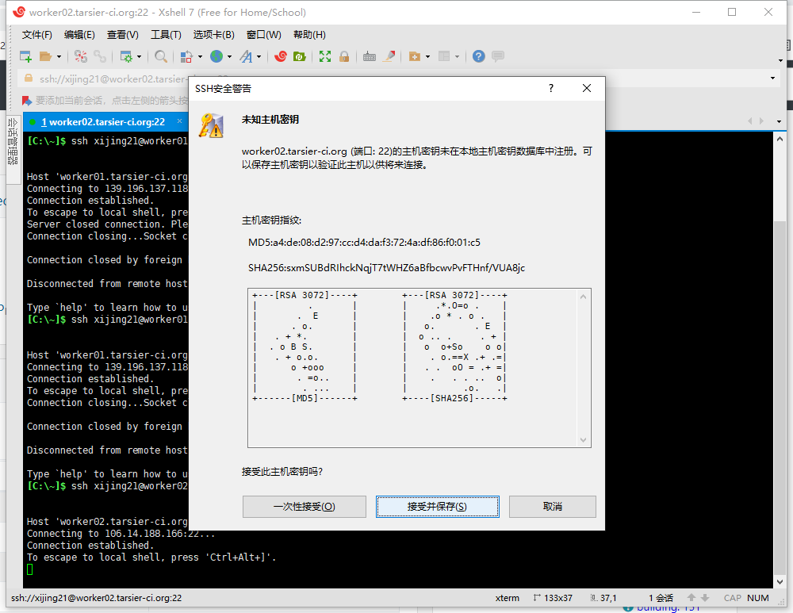

在服务器上搭建oE环境并安装osc


1.远程登录服务器

远程登录前提：已经生成ssh key并在github上上传了。且通知wuwei老师将ssh key拉取到了服务器上完成了授权。


```
$ ssh xijing21@worker02.tarsier-ci.org
```

我用xshell输入上述命令，会弹出下图，接收并保存。



```
xijing21@obs-worker-02:~$ uname -a
Linux obs-worker-02 5.4.0-77-generic #86-Ubuntu SMP Thu Jun 17 02:35:03 UTC 2021 x86_64 x86_64 x86_64 GNU/Linux
xijing21@obs-worker-02:~$ lsb_release -a 
LSB Version:    core-11.1.0ubuntu2-noarch:security-11.1.0ubuntu2-noarch
Distributor ID: Ubuntu
Description:    Ubuntu 20.04.2 LTS
Release:        20.04
Codename:       focal

$ tmux new -s xj   #新建tmux会话
$ tmux detach      #分离回话
$ tmux ls		   #ls 所有回话
$ tmux a -t xj	   #进入session
```


2.下载oE镜像

```
$ mkdir download   #新建文件夹,用于存放下载文件
$ wget https://mirror.iscas.ac.cn/plct/openEuler_SMP32-20210821.tar.bz2  #下载openEuler镜像加速版
$ tar -jxvf openEuler_SMP32-20210821.tar.bz2  #解压
```

压缩包内容：

```
xijing21@obs-worker-02:~/downloads/openEuler_SMP32$ ll
total 232244
drwxrwxr-x 2 xijing21 xijing21      4096 Aug 22 16:56 ./
drwxrwxr-x 3 xijing21 xijing21      4096 Aug 31 22:14 ../
-rw-r--r-- 1 xijing21 xijing21 217799323 Aug 20 22:57 oE-smp32.7z
-rw-rw-r-- 1 xijing21 xijing21  19998454 Aug 21 10:02 qemu.tar.gz
-rw-rw-r-- 1 xijing21 xijing21      1539 Aug 21 10:51 README.md
-rwxrwxr-x 1 xijing21 xijing21       559 Aug 21 10:24 run_smp32_oe.sh*
```

run_smp32_oe.sh 脚本内容：

```
#!/bin/bash

qemu/bin/qemu-system-riscv64 \
  -nographic -M virt \
  -bios fw_jump.elf \
  -smp 32 -m 16G \
  -kernel u-boot.bin -device loader,file=Image,addr=0x84000000 \
  -drive file=rootfs.img,format=raw,id=hd0 \
  -object rng-random,filename=/dev/urandom,id=rng0 \
  -device virtio-rng-device,rng=rng0 \
  -device virtio-blk-device,drive=hd0 \
  -device virtio-net-device,netdev=usernet \
  -netdev user,id=usernet,hostfwd=tcp::12055-:22 \
  -append 'root=/dev/vda1 rw console=ttyS0 systemd.default_timeout_start_sec=600 selinux=0 highres=off earlycon'

```

README.md 内容：

```
本镜像主要用加速openEuler编译构建

​```
oe_smp32.7z中
    fw_jump.elf 相应OpenSBI ELF文件
    u-boot.bin  修改后支持-smp 32的uboot
    Image   支持-smp 32 的
    rootfs.img openEuler的精简构建文件系统
    start.sh简单测试脚本

qemu.tar.gz 支持-smp 32 的riscv qemu 版本二进制文件

run_smp32_oe.sh  系统启动示例脚本
​```

获取新的镜像和qemu后几件事（普通用户角度）

0.替换root 密码

    默认用户名/密码： root/openEuler12#$
    设置自己密码
    #passwd root

1.切换时区

     $ cp /usr/share/zoneinfo/Asia/Shanghai /etc/localtime

2.按需切换repo 源地址

3.img扩容
​```
        $qemu-img resize rootfs.img +30G
         进入虚拟机
         fdisk /dev/vda
         进行命令交互

```


通过验证，以上压缩包是openEuler镜像，用于在qemu中启动的压缩包。

```
~/downloads/openEuler_SMP32$ 7z x oE-smp32.7z 
tar -zxvf qemu.tar.gz
```


3.配置环境变量

```
$ vim ~/.bashrc 
在文末添加：将QEMU_HOME路径替换为--prefix定义的路径
#export QEMU_HOME=/home/xijing21/program/riscv64-qemu
export QEMU_HOME=/home/xijing21/downloads/openEuler_SMP32/qemu
export PATH=$QEMU_HOME/bin:$PATH

$ source ~/.bashrc 
$ echo $PATH

xijing21@obs-worker-02:~/downloads/openEuler_SMP32/qemu/bin$ echo $PATH
/home/xijing21/downloads/openEuler_SMP32/qemu/bin:/home/xijing21/program/riscv64-qemu/bin:/usr/local/sbin:/usr/local/bin:/usr/sbin:/usr/bin:/sbin:/bin:/usr/games:/usr/local/games:/snap/bin
xijing21@obs-worker-02:~/downloads/openEuler_SMP32/qemu/bin$ qemu-system-riscv64 --version
qemu-system-riscv64: error while loading shared libraries: libvirglrenderer.so.0: cannot open shared object file: No such file or directory
xijing21@obs-worker-02:~/downloads/openEuler_SMP32/qemu/bin$ 

```


4.用qemu启动openEuler

```
xijing21@obs-worker-02:~/downloads/openEuler_SMP32/qemu$ ./bin/qemu-system-riscv64 qemu/bin/qemu-system-riscv64 \
>   -nographic -M virt \
>   -bios fw_jump.elf \
>   -smp 32 -m 16G \
>   -kernel u-boot.bin -device loader,file=Image,addr=0x84000000 \
>   -drive file=rootfs.img,format=raw,id=hd0 \
>   -object rng-random,filename=/dev/urandom,id=rng0 \
>   -device virtio-rng-device,rng=rng0 \
>   -device virtio-blk-device,drive=hd0 \
>   -device virtio-net-device,netdev=usernet \
>   -netdev user,id=usernet,hostfwd=tcp::12055-:22 \
>   -append 'root=/dev/vda1 rw console=ttyS0 systemd.default_timeout_start_sec=600 selinux=0 highres=off earlycon'
./bin/qemu-system-riscv64: error while loading shared libraries: libvirglrenderer.so.0: cannot open shared object file: No such file or directory
xijing21@obs-worker-02:~/downloads/openEuler_SMP32/qemu$ 

```


按照提示https://github.com/plctlab/openEuler-riscv/issues/29 

```
# when you on 2004
find /usr/lib -name 'libvirglrenderer*'
cd /usr/lib/x86_64-linux-gnu/
sudo ln -s libvirglrenderer.so.1 libvirglrenderer.so.0
```

```


xijing21@obs-worker-02:~/downloads/openEuler_SMP32/qemu$ ldd ./bin/qemu-system-riscv64
        linux-vdso.so.1 (0x00007fff19fd6000)
        libepoxy.so.0 => /lib/x86_64-linux-gnu/libepoxy.so.0 (0x00007f4133d6c000)
        libpixman-1.so.0 => /lib/x86_64-linux-gnu/libpixman-1.so.0 (0x00007f4133cc5000)
        libpulse.so.0 => /lib/x86_64-linux-gnu/libpulse.so.0 (0x00007f4133c70000)
        libSDL2-2.0.so.0 => /lib/x86_64-linux-gnu/libSDL2-2.0.so.0 (0x00007f4133b1b000)
        libvirglrenderer.so.0 => not found
        libz.so.1 => /lib/x86_64-linux-gnu/libz.so.1 (0x00007f4133aff000)
        libpng16.so.16 => /lib/x86_64-linux-gnu/libpng16.so.16 (0x00007f4133ac5000)
        libX11.so.6 => /lib/x86_64-linux-gnu/libX11.so.6 (0x00007f4133988000)
        libsasl2.so.2 => /lib/x86_64-linux-gnu/libsasl2.so.2 (0x00007f413396b000)
        libudev.so.1 => /lib/x86_64-linux-gnu/libudev.so.1 (0x00007f413393e000)
        libgbm.so.1 => /lib/x86_64-linux-gnu/libgbm.so.1 (0x00007f413392d000)
        libusb-1.0.so.0 => /lib/x86_64-linux-gnu/libusb-1.0.so.0 (0x00007f4133911000)
        libgmodule-2.0.so.0 => /lib/x86_64-linux-gnu/libgmodule-2.0.so.0 (0x00007f4133909000)
        libglib-2.0.so.0 => /lib/x86_64-linux-gnu/libglib-2.0.so.0 (0x00007f41337e0000)
        libgio-2.0.so.0 => /lib/x86_64-linux-gnu/libgio-2.0.so.0 (0x00007f41335ff000)
        libgobject-2.0.so.0 => /lib/x86_64-linux-gnu/libgobject-2.0.so.0 (0x00007f413359f000)
        libgtk-3.so.0 => /lib/x86_64-linux-gnu/libgtk-3.so.0 (0x00007f4132dee000)
        libgdk-3.so.0 => /lib/x86_64-linux-gnu/libgdk-3.so.0 (0x00007f4132ce9000)
        libcairo.so.2 => /lib/x86_64-linux-gnu/libcairo.so.2 (0x00007f4132bc4000)
        libgdk_pixbuf-2.0.so.0 => /lib/x86_64-linux-gnu/libgdk_pixbuf-2.0.so.0 (0x00007f4132b9c000)
        libutil.so.1 => /lib/x86_64-linux-gnu/libutil.so.1 (0x00007f4132b97000)
        libaio.so.1 => /lib/x86_64-linux-gnu/libaio.so.1 (0x00007f4132b92000)
        libm.so.6 => /lib/x86_64-linux-gnu/libm.so.6 (0x00007f4132a43000)
        libgcc_s.so.1 => /lib/x86_64-linux-gnu/libgcc_s.so.1 (0x00007f4132a28000)
        libpthread.so.0 => /lib/x86_64-linux-gnu/libpthread.so.0 (0x00007f4132a03000)
        libc.so.6 => /lib/x86_64-linux-gnu/libc.so.6 (0x00007f4132811000)
        /lib64/ld-linux-x86-64.so.2 (0x00007f4135074000)
        libdl.so.2 => /lib/x86_64-linux-gnu/libdl.so.2 (0x00007f413280b000)
        libpulsecommon-13.99.so => /usr/lib/x86_64-linux-gnu/pulseaudio/libpulsecommon-13.99.so (0x00007f4132789000)
        libdbus-1.so.3 => /lib/x86_64-linux-gnu/libdbus-1.so.3 (0x00007f4132738000)
        libasound.so.2 => /lib/x86_64-linux-gnu/libasound.so.2 (0x00007f413263b000)
        libXext.so.6 => /lib/x86_64-linux-gnu/libXext.so.6 (0x00007f4132626000)
        libXcursor.so.1 => /lib/x86_64-linux-gnu/libXcursor.so.1 (0x00007f4132619000)
        libXinerama.so.1 => /lib/x86_64-linux-gnu/libXinerama.so.1 (0x00007f4132614000)
        libXi.so.6 => /lib/x86_64-linux-gnu/libXi.so.6 (0x00007f4132602000)
        libXrandr.so.2 => /lib/x86_64-linux-gnu/libXrandr.so.2 (0x00007f41325f5000)
        libXss.so.1 => /lib/x86_64-linux-gnu/libXss.so.1 (0x00007f41325ee000)
        libXxf86vm.so.1 => /lib/x86_64-linux-gnu/libXxf86vm.so.1 (0x00007f41325e7000)
        libwayland-egl.so.1 => /lib/x86_64-linux-gnu/libwayland-egl.so.1 (0x00007f41325e2000)
        libwayland-client.so.0 => /lib/x86_64-linux-gnu/libwayland-client.so.0 (0x00007f41325d1000)
        libwayland-cursor.so.0 => /lib/x86_64-linux-gnu/libwayland-cursor.so.0 (0x00007f41325c6000)
        libxkbcommon.so.0 => /lib/x86_64-linux-gnu/libxkbcommon.so.0 (0x00007f4132584000)
        libxcb.so.1 => /lib/x86_64-linux-gnu/libxcb.so.1 (0x00007f4132558000)
        libdrm.so.2 => /lib/x86_64-linux-gnu/libdrm.so.2 (0x00007f4132544000)
        libwayland-server.so.0 => /lib/x86_64-linux-gnu/libwayland-server.so.0 (0x00007f413252e000)
        libexpat.so.1 => /lib/x86_64-linux-gnu/libexpat.so.1 (0x00007f4132500000)
        libpcre.so.3 => /lib/x86_64-linux-gnu/libpcre.so.3 (0x00007f413248d000)
        libmount.so.1 => /lib/x86_64-linux-gnu/libmount.so.1 (0x00007f413242b000)
        libselinux.so.1 => /lib/x86_64-linux-gnu/libselinux.so.1 (0x00007f4132400000)
        libresolv.so.2 => /lib/x86_64-linux-gnu/libresolv.so.2 (0x00007f41323e4000)
        libffi.so.7 => /lib/x86_64-linux-gnu/libffi.so.7 (0x00007f41323d8000)
        libpangocairo-1.0.so.0 => /lib/x86_64-linux-gnu/libpangocairo-1.0.so.0 (0x00007f41323c6000)
        libXfixes.so.3 => /lib/x86_64-linux-gnu/libXfixes.so.3 (0x00007f41323be000)
        libcairo-gobject.so.2 => /lib/x86_64-linux-gnu/libcairo-gobject.so.2 (0x00007f41323b0000)
        libatk-1.0.so.0 => /lib/x86_64-linux-gnu/libatk-1.0.so.0 (0x00007f4132386000)
        libatk-bridge-2.0.so.0 => /lib/x86_64-linux-gnu/libatk-bridge-2.0.so.0 (0x00007f413234f000)
        libfribidi.so.0 => /lib/x86_64-linux-gnu/libfribidi.so.0 (0x00007f4132332000)
        libpangoft2-1.0.so.0 => /lib/x86_64-linux-gnu/libpangoft2-1.0.so.0 (0x00007f4132319000)
        libpango-1.0.so.0 => /lib/x86_64-linux-gnu/libpango-1.0.so.0 (0x00007f41322ca000)
        libharfbuzz.so.0 => /lib/x86_64-linux-gnu/libharfbuzz.so.0 (0x00007f41321c3000)
        libfontconfig.so.1 => /lib/x86_64-linux-gnu/libfontconfig.so.1 (0x00007f413217c000)
        libfreetype.so.6 => /lib/x86_64-linux-gnu/libfreetype.so.6 (0x00007f41320bd000)
        libXcomposite.so.1 => /lib/x86_64-linux-gnu/libXcomposite.so.1 (0x00007f41320b8000)
        libXdamage.so.1 => /lib/x86_64-linux-gnu/libXdamage.so.1 (0x00007f41320b3000)
        librt.so.1 => /lib/x86_64-linux-gnu/librt.so.1 (0x00007f41320a6000)
        libxcb-shm.so.0 => /lib/x86_64-linux-gnu/libxcb-shm.so.0 (0x00007f41320a1000)
        libxcb-render.so.0 => /lib/x86_64-linux-gnu/libxcb-render.so.0 (0x00007f4132092000)
        libXrender.so.1 => /lib/x86_64-linux-gnu/libXrender.so.1 (0x00007f4131e88000)
        libsystemd.so.0 => /lib/x86_64-linux-gnu/libsystemd.so.0 (0x00007f4131dd9000)
        libwrap.so.0 => /lib/x86_64-linux-gnu/libwrap.so.0 (0x00007f4131dcd000)
        libsndfile.so.1 => /lib/x86_64-linux-gnu/libsndfile.so.1 (0x00007f4131d4d000)
        libasyncns.so.0 => /lib/x86_64-linux-gnu/libasyncns.so.0 (0x00007f4131b47000)
        libapparmor.so.1 => /lib/x86_64-linux-gnu/libapparmor.so.1 (0x00007f4131b32000)
        libXau.so.6 => /lib/x86_64-linux-gnu/libXau.so.6 (0x00007f4131b2c000)
        libXdmcp.so.6 => /lib/x86_64-linux-gnu/libXdmcp.so.6 (0x00007f4131b24000)
        libblkid.so.1 => /lib/x86_64-linux-gnu/libblkid.so.1 (0x00007f4131acb000)
        libpcre2-8.so.0 => /lib/x86_64-linux-gnu/libpcre2-8.so.0 (0x00007f4131a3b000)
        libatspi.so.0 => /lib/x86_64-linux-gnu/libatspi.so.0 (0x00007f4131a04000)
        libthai.so.0 => /lib/x86_64-linux-gnu/libthai.so.0 (0x00007f41319f9000)
        libgraphite2.so.3 => /lib/x86_64-linux-gnu/libgraphite2.so.3 (0x00007f41319cc000)
        libuuid.so.1 => /lib/x86_64-linux-gnu/libuuid.so.1 (0x00007f41319c1000)
        liblzma.so.5 => /lib/x86_64-linux-gnu/liblzma.so.5 (0x00007f4131998000)
        liblz4.so.1 => /lib/x86_64-linux-gnu/liblz4.so.1 (0x00007f4131977000)
        libgcrypt.so.20 => /lib/x86_64-linux-gnu/libgcrypt.so.20 (0x00007f4131859000)
        libnsl.so.1 => /lib/x86_64-linux-gnu/libnsl.so.1 (0x00007f413183c000)
        libFLAC.so.8 => /lib/x86_64-linux-gnu/libFLAC.so.8 (0x00007f41317fc000)
        libogg.so.0 => /lib/x86_64-linux-gnu/libogg.so.0 (0x00007f41317ef000)
        libvorbis.so.0 => /lib/x86_64-linux-gnu/libvorbis.so.0 (0x00007f41317c1000)
        libvorbisenc.so.2 => /lib/x86_64-linux-gnu/libvorbisenc.so.2 (0x00007f4131716000)
        libbsd.so.0 => /lib/x86_64-linux-gnu/libbsd.so.0 (0x00007f41316fc000)
        libdatrie.so.1 => /lib/x86_64-linux-gnu/libdatrie.so.1 (0x00007f41316f0000)
        libgpg-error.so.0 => /lib/x86_64-linux-gnu/libgpg-error.so.0 (0x00007f41316cd000)


xijing21@obs-worker-02:/usr/lib/x86_64-linux-gnu$ find /usr/lib -name 'libvirglrenderer*'
/usr/lib/x86_64-linux-gnu/libvirglrenderer.so.1.4.2
/usr/lib/x86_64-linux-gnu/libvirglrenderer.so.1

xijing21@obs-worker-02:/usr/lib/x86_64-linux-gnu$ cd /usr/lib/x86_64-linux-gnu/

xijing21@obs-worker-02:/usr/lib/x86_64-linux-gnu$ sudo ln -s libvirglrenderer.so.1 libvirglrenderer.so.1
[sudo] password for xijing21: 
```


一般用户服务器上禁止sudo；


脚本上面加入export LD_LIBRARY_PATH=你那个库 

在~/.bashrc 中配置；或者在run_smp32_oe.sh 上面加入：
export LD_LIBRARY_PATH=/usr/lib/x86_64-linux-gnu:$LD_LIBRARY_PATH
export LD_LIBRARY_PATH=/usr/lib:$LD_LIBRARY_PATH

export LD_LIBRARY_PATH=/usr/lib/x86_64-linux-gnu/libvirglrenderer.so.1:$LD_LIBRARY_PATH

依然报错：

xijing21@obs-worker-02:~/downloads/openEuler_SMP32$ ./run_smp32_oe_xj.sh 
qemu/bin/qemu-system-riscv64: error while loading shared libraries: libvirglrenderer.so.0: cannot open shared object file: No such file or directory

