# unmatched上刷openEuler镜像

## 0. 组装准备

### 设备组装

对照官方文档：https://sifive.cdn.prismic.io/sifive/98a429b9-0774-4357-bb78-17c9b45daaf7_HiFive+Unmatched+Product+Brief+%28released%29.pdf

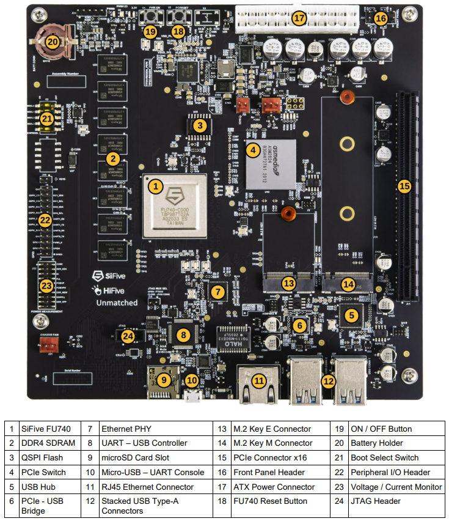

上图中，14、13、15、17、9是需要安装的位置。组装好的效果如下图：

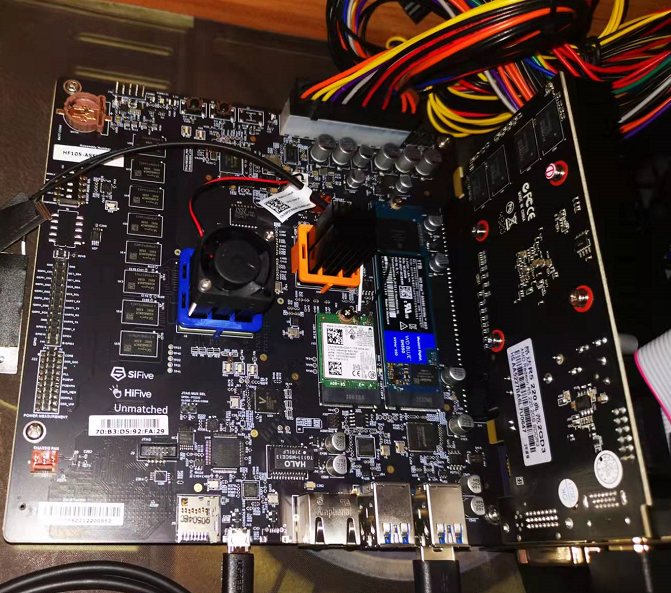


1. SSD卡接入

   SSD卡一端插入卡槽，另一端用螺丝固定（螺丝孔初始有黄色塑料圆片遮挡，需要揭掉）

2. 显卡接入

   直接对着卡槽插入

3. 电源接入

   电源排线，直接对准unmatched的电源接口插入

4. [可选]无线模组接入

   据说无线模块是另外配置的。

   同SSD一样，一端插入卡槽，另一端需要用螺丝固定（螺丝孔初始有黄色塑料圆片遮挡，需要揭掉）

5. SD卡插入卡槽

   

### 外设接入

如图：

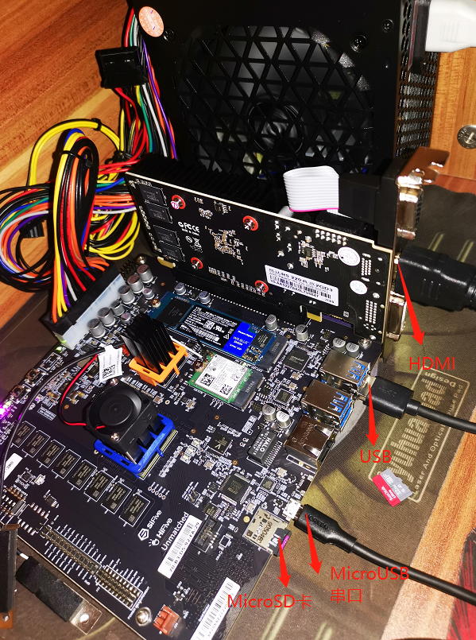

1. 显卡HDMI接显示器

2. USB接鼠标键盘

3. Micro-USB接标配的黑色数据线（串口，可以通过开启串口通信 作为查看烧录和启动是否有异常的辅助方式，当有烧录和启动系统出问题的时候不至于什么都不知道）

   用标配的黑色的连接线，micro-usb口接SD卡槽旁边的micro-usb口；另一端接pc电脑的usb口即可。

4. SD卡槽：SD卡通过读卡器在linux系统pc上烧录成功后，再插入到unmatched上的SD卡槽上


### 开机启动

unmatched包装盒中附带的SD Card中预装了SiFive Freedom-U-SDK Linux发行版。安装上述的方式组装后，点击开机按钮，是能够正常进入系统的。

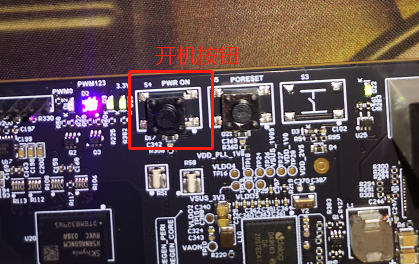


### 串口设置

串口这边主要是为了在unmatched上刷其他的系统，或者做一些验证性的测试所需要的。


1. 打开一个串口连接会话：我用的是win10和xshell，注意串口用的是COM5（在设备管理器——》端口中查询到COM4和COM5，但是只有COM5有信息回传），注意设置波特率为：

   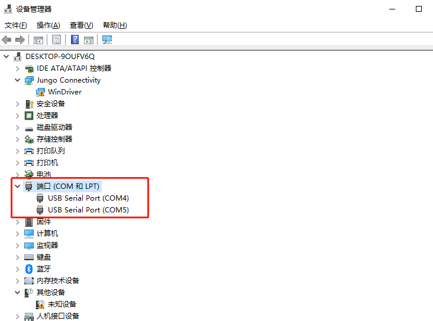

   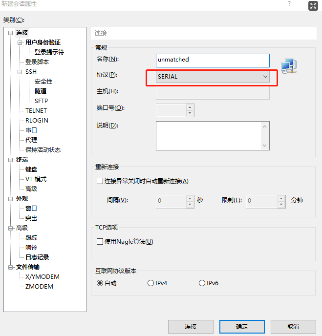

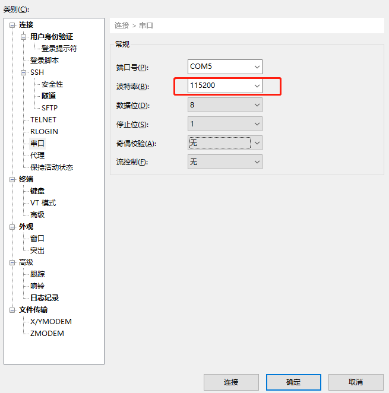

2. 打开串口会话，显示Connected；

   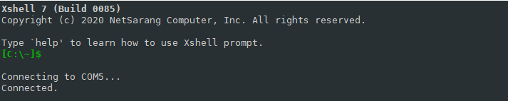


说明，这里**可能**还需要在win10上安装串口驱动，很久之前我电脑上按照全志D1提供的驱动已经安装好了，如果串口会话不能连接成功，可以尝试安装串口驱动程序：https://d1.docs.aw-ol.com/source/2_gettools/

我使用的是【串口线驱动FT232R（串口线供应商提供版本）】https://www.aw-ol.com/downloads/resources/35

不会操作的还可以参考这篇博文：https://zhuanlan.zhihu.com/p/406132856


## 1. 镜像烧录

```
$ lsb_release -a
```

在ubuntu20.04下，执行sudo fdisk -l查看TF卡盘符

```
$ sudo fdisk -l
```

a. 将TF卡放入读卡器，连接上ubuntu20.04_x86主机。

b. 下载或者拷贝oE镜像到ubuntu20.04上：

```
wget https://mirror.iscas.ac.cn/plct/openEuler-unmatched.img.bz2
```


c. 使用`sudo fdisk -l`通过磁盘大小可以识别出TF卡的盘符，假设是/dev/sda。

d. 使用dd命令将镜像烧录到TF卡：

```
$ bzcat openEuler-unmatched.img.bz2 | sudo dd of=/dev/sda bs=1M iflag=fullblock oflag=direct conv=fsync status=progress
```


## 2.分区扩容

执行sudo fdisk /dev/sda，对TF卡中的最后一个分区进行扩容

```
$ sudo fdisk -l

$ sudo fdisk /dev/sda

欢迎使用 fdisk (util-linux 2.34)。
更改将停留在内存中，直到您决定将更改写入磁盘。
使用写入命令前请三思。

GPT PMBR size mismatch (60456959 != 121634815) will be corrected by write.
备份 GPT 表损坏，但主表似乎正常，将使用它。
The backup GPT table is not on the end of the device. This problem will be corrected by write.

命令(输入 m 获取帮助)： p

Disk /dev/sda：58 GiB，62277025792 字节，121634816 个扇区
Disk model: Storage Device  
单元：扇区 / 1 * 512 = 512 字节
扇区大小(逻辑/物理)：512 字节 / 512 字节
I/O 大小(最小/最佳)：512 字节 / 512 字节
磁盘标签类型：gpt
磁盘标识符：4D142FCA-FC54-44BB-96F7-163057FEE8D0

设备        起点     末尾     扇区  大小 类型
/dev/sda1     34     2081     2048    1M HiFive Unleashed FSBL
/dev/sda2   2082    10273     8192    4M HiFive Unleashed BBL
/dev/sda3  16384 10997679 10981296  5.2G Linux 文件系统

命令(输入 m 获取帮助)： d
分区号 (1-3, 默认  3): 

分区 3 已删除。

命令(输入 m 获取帮助)： n
分区号 (3-128, 默认  3): 
第一个扇区 (10274-121634782, 默认 12288): 16384
Last sector, +/-sectors or +/-size{K,M,G,T,P} (16384-121634782, 默认 121634782): 

创建了一个新分区 3，类型为“Linux filesystem”，大小为 58 GiB。
分区 #3 包含一个 ext4 签名。

您想移除该签名吗？ 是[Y]/否[N]： n

命令(输入 m 获取帮助)： w

分区表已调整。
将调用 ioctl() 来重新读分区表。
正在同步磁盘。

$ sudo fdisk -l

Disk /dev/sda：58 GiB，62277025792 字节，121634816 个扇区
Disk model: Storage Device  
单元：扇区 / 1 * 512 = 512 字节
扇区大小(逻辑/物理)：512 字节 / 512 字节
I/O 大小(最小/最佳)：512 字节 / 512 字节
磁盘标签类型：gpt
磁盘标识符：4D142FCA-FC54-44BB-96F7-163057FEE8D0

设备        起点      末尾      扇区 大小 类型
/dev/sda1     34      2081      2048   1M HiFive Unleashed FSBL
/dev/sda2   2082     10273      8192   4M HiFive Unleashed BBL
/dev/sda3  16384 121634782 121618399  58G Linux 文件系统

```


对最后一个分区执行resize2fs命令来调整分区大小

```
xijing@xijing-S1-Series:~/unmatched/openEuler-unmatched$ sudo resize2fs /dev/sda3
resize2fs 1.45.5 (07-Jan-2020)
请先运行“e2fsck -f /dev/sda3”。


xijing@xijing-S1-Series:~/unmatched/openEuler-unmatched$ sudo e2fsck -f /dev/sda3
e2fsck 1.45.5 (07-Jan-2020)
rootfs：正在修复日志
第 1 步：检查inode、块和大小
第 2 步：检查目录结构
第 3 步：检查目录连接性
第 4 步：检查引用计数
第 5 步：检查组概要信息
rootfs：105639/338016 文件（0.2% 为非连续的）， 1309093/1372662 块


xijing@xijing-S1-Series:~/unmatched/openEuler-unmatched$ sudo resize2fs /dev/sda3
resize2fs 1.45.5 (07-Jan-2020)
将 /dev/sda3 上的文件系统调整为 15202299 个块（每块 4k）。
/dev/sda3 上的文件系统现在为 15202299 个块（每块 4k）。


xijing@xijing-S1-Series:~/unmatched/openEuler-unmatched$ sudo fdisk -l

Disk /dev/sda：58 GiB，62277025792 字节，121634816 个扇区
Disk model: Storage Device  
单元：扇区 / 1 * 512 = 512 字节
扇区大小(逻辑/物理)：512 字节 / 512 字节
I/O 大小(最小/最佳)：512 字节 / 512 字节
磁盘标签类型：gpt
磁盘标识符：4D142FCA-FC54-44BB-96F7-163057FEE8D0

设备        起点      末尾      扇区 大小 类型
/dev/sda1     34      2081      2048   1M HiFive Unleashed FSBL
/dev/sda2   2082     10273      8192   4M HiFive Unleashed BBL
/dev/sda3  16384 121634782 121618399  58G Linux 文件系统

```

注意，resize2fs一次可能不起作用，可以把TF卡拔出重插，再使用`sudo fdisk -l`和`df -Th`查看磁盘大小，再次resize2fs一下，按照提示，也可能要求执行e2fsck -f .


## 3. 开机

1. 打开串口会话窗口。用于查看开机过程中的信息。
2. 按下unmatched上的开机按钮

3. 串口连接窗口上会显示回显信息，正常的情况下，最后会出现登录提示：

   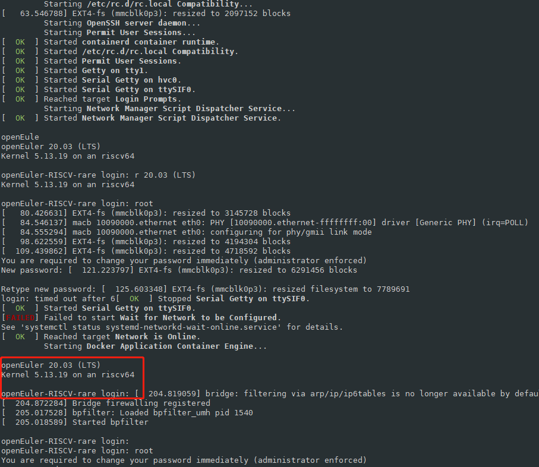

   同时，如果HDMI连接了显示器，显示器上也会出现登录提示：`openEuler-RISCV-rare login：`

4. 可以根据自己的选择，在串口会话窗口输入操作、或者接入unmatched的显示器+键鼠上直接操作。

   第一次我按照用户名`root`、密码`openEuler12#$ `输入好几次都没有成功，后来提示我设置新密码后能够登陆系统。

5. 进入系统后，就可以进行一些常规的操作了。


## 4. 使用系统

1. 网络设置：用nmtui 命令对wifi进行设置后，能够联网

   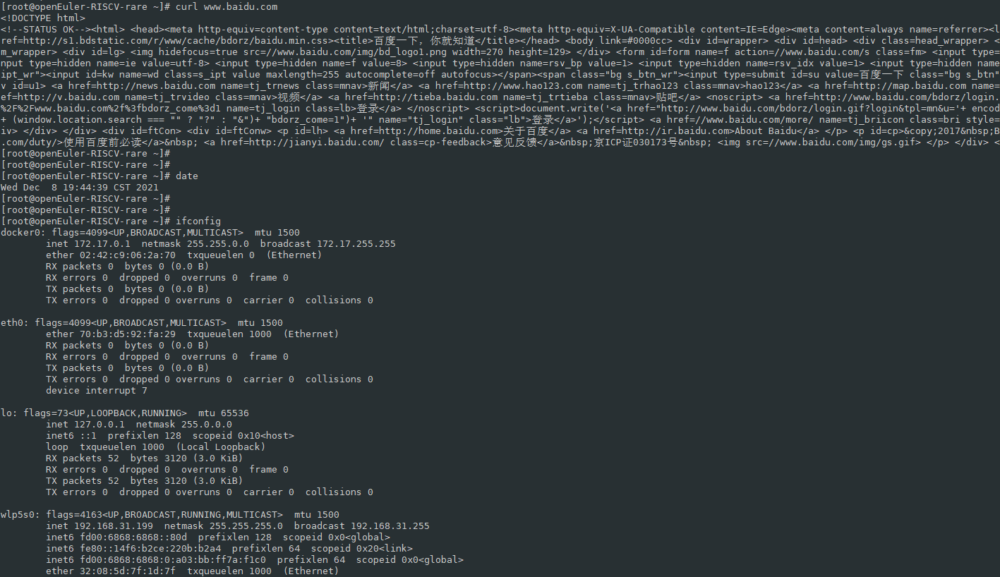

2. 看到ifconfig有docker信息，发现镜像已经内置了docker，测一下docker：
   修改/etc/docker/daemon.json
   添加内容：

   ```
   "registry-mirrors": [
   "https://hub.daocloud.io/",
   "https://registry.docker-cn.com",
   "http://hub-mirror.c.163.com",
   "https://docker.mirrors.ustc.edu.cn",
   "https://mirror.ccs.tencentyun.com",
   "https://registry.hub.docker.com/",
   "http://aad0405c.m.daocloud.io",
   "https://3laho3y3.mirror.aliyuncs.com",
   "http://f1361db2.m.daocloud.io"
   ],
   "experimental": true
   ```

   重启docker之后，拉取ubuntu镜像并启动ubuntu成功。

   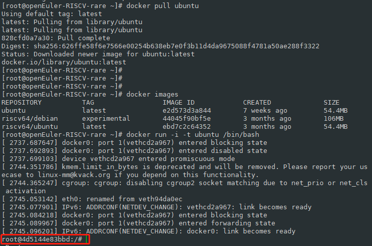

