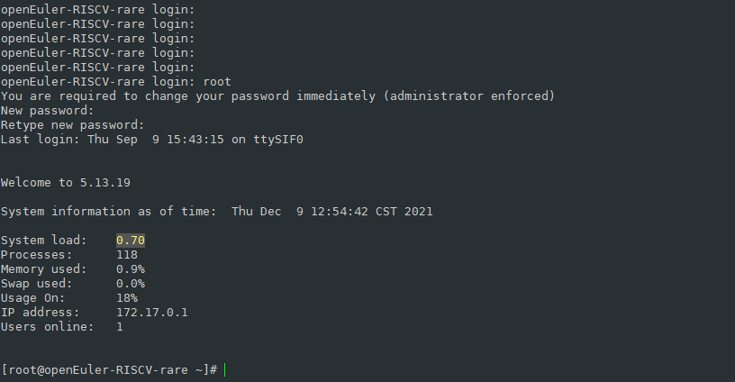
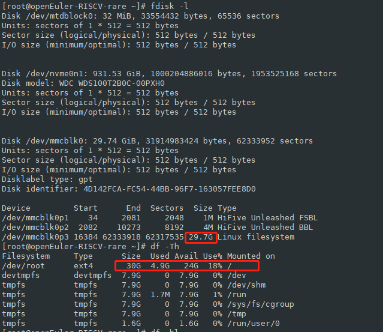

# unmatched上刷openEuler镜像

## 0. 组装准备

### 设备组装

对照官方文档：https://sifive.cdn.prismic.io/sifive/98a429b9-0774-4357-bb78-17c9b45daaf7_HiFive+Unmatched+Product+Brief+%28released%29.pdf


上图中，14、13、15、17、9是需要安装的位置。组装好的效果如下图：


1. SSD卡接入

   SSD卡一端插入卡槽，另一端用螺丝固定（螺丝孔初始有黄色塑料圆片遮挡，需要揭掉）

2. 显卡接入

   直接对着卡槽插入

3. 电源接入

   电源排线，直接对准unmatched的电源接口插入

4. [可选]无线模组接入

   据说无线模块是另外配置的。

   同SSD一样，一端插入卡槽，另一端需要用螺丝固定（螺丝孔初始有黄色塑料圆片遮挡，需要揭掉）

5. SD卡插入卡槽

   

### 外设接入

如图：


1. 显卡HDMI接显示器

2. USB接鼠标键盘

3. Micro-USB接标配的黑色数据线（串口，可以通过开启串口通信 作为查看烧录和启动是否有异常的辅助方式，当有烧录和启动系统出问题的时候不至于什么都不知道）

   用标配的黑色的连接线，micro-usb口接SD卡槽旁边的micro-usb口；另一端接pc电脑的usb口即可。

4. SD卡槽：SD卡通过读卡器在linux系统pc上烧录成功后，再插入到unmatched上的SD卡槽上


### 开机启动

unmatched包装盒中附带的SD Card中预装了SiFive Freedom-U-SDK Linux发行版。安装上述的方式组装后，点击开机按钮，是能够正常进入系统的。


### 串口设置

串口这边主要是为了在unmatched上刷其他的系统，或者做一些验证性的测试所需要的。


1. 打开一个串口连接会话：我用的是win10和xshell，注意串口用的是COM5（在设备管理器——》端口中查询到COM4和COM5，但是只有COM5有信息回传），注意设置波特率为：

   

   


2. 打开串口会话，显示Connected；

   


说明，这里**可能**还需要在win10上安装串口驱动，很久之前我电脑上按照全志D1提供的驱动已经安装好了，如果串口会话不能连接成功，可以尝试安装串口驱动程序：https://d1.docs.aw-ol.com/source/2_gettools/

我使用的是【串口线驱动FT232R（串口线供应商提供版本）】https://www.aw-ol.com/downloads/resources/35

不会操作的还可以参考这篇博文：https://zhuanlan.zhihu.com/p/406132856


## 1. 镜像烧录

```
$ lsb_release -a
```

在ubuntu20.04下，执行sudo fdisk -l查看TF卡盘符

```
$ sudo fdisk -l
```

a. 将TF卡放入读卡器，连接上ubuntu20.04_x86主机。

b. 下载或者拷贝oE镜像到ubuntu20.04上：

```
wget https://mirror.iscas.ac.cn/plct/openEuler-unmatched.img.bz2
```


c. 使用`sudo fdisk -l`通过磁盘大小可以识别出TF卡的盘符，假设是/dev/sda。

d. 使用dd命令将镜像烧录到TF卡：

```
$ bzcat openEuler-unmatched.img.bz2 | sudo dd of=/dev/sda bs=1M iflag=fullblock oflag=direct conv=fsync status=progress
```


## 2. 开机

1. 打开串口会话窗口。用于查看开机过程中的信息。

2. 按下unmatched上的开机按钮

3. 串口连接窗口上会显示回显信息，正常的情况下，最后会出现登录提示：

   

   同时，如果HDMI连接了显示器，显示器上也会出现登录提示：`openEuler-RISCV-rare login：`

4. 可以根据自己的选择，在串口会话窗口输入操作、或者接入unmatched的显示器+键鼠上直接操作。

   按照提示输入用户名，并设置密码：

   

5. 进入系统后，就可以进行一些常规的操作了。

   检查下磁盘空间：（鉴于D1上安装openeulr需要进行扩容处理，在unmatched上检查下，貌似不存在问题了）

   


## 3. 使用系统

1. 网络设置：用nmtui 命令对wifi进行设置后，能够联网

   

2. 看到ifconfig有docker信息，发现镜像已经内置了docker，测一下docker：
   vim  /etc/docker/daemon.json  添加内容：
   
   ```
   "registry-mirrors": [
   "https://hub.daocloud.io/",
   "https://registry.docker-cn.com",
   "http://hub-mirror.c.163.com",
   "https://docker.mirrors.ustc.edu.cn",
   "https://mirror.ccs.tencentyun.com",
   "https://registry.hub.docker.com/",
   "http://aad0405c.m.daocloud.io",
   "https://3laho3y3.mirror.aliyuncs.com",
   "http://f1361db2.m.daocloud.io"
   ],
   "experimental": true
   ```
   
   重启docker：
   
   ```
   $ systemctl daemon-reload # 加载配置文件
   $ systemctl  restart docker # 重启docker生效
   $ ps aux | grep docker 
   $ docker version 
   $ docker system info
   $ docker pull ubuntu
   $ docker images
   $ docker run -i -t ubuntu /bin/bash
   ```
   
   
   
   拉取ubuntu镜像并启动ubuntu成功。
   
   

